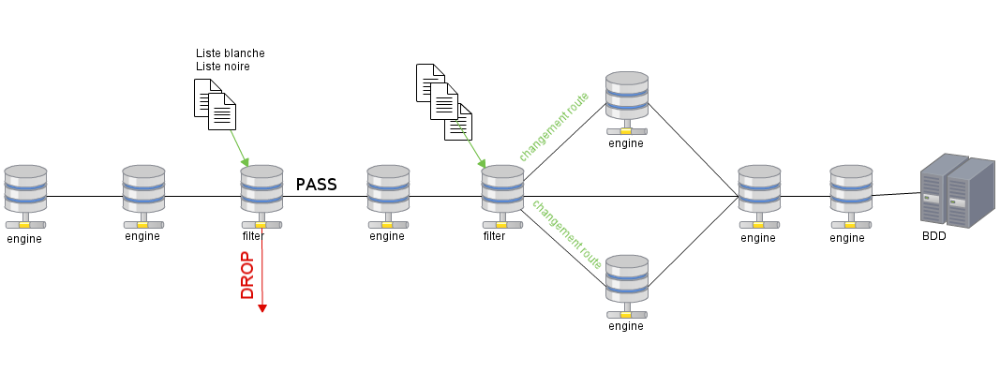

.. _user-engines-filter:

Event Filter
============

Engines filter can be placed anywhere in the processing chain and there can be several engines filters working in parallel, or one after the other, to speed up the processing of the events.

Every instance of filter engines loads a set of rules, defined by its name, to apply to events it handles.
This set of rules is defined by the user in the web app.

The user can create a filter and declare one, or several, action(s) to apply to any event matching the said filter.

Actions
-------

The following actions are available to the user :

* `pass`
* `drop`
* `override`
* `route`
* `remove`

Features
--------

The following features are available in the filter engine :

:Handles whitelist / blacklist *(pass and drop actions)*:

  According a set of rules, events are either 'pass' to the next engine (whitelist) or 'drop' out of the processing chain (blacklist).

:Addition, modification and deletion of fields *(override and remove actions)*:

  Events can have fields added at runtime (périmètre, domaine, ...), changed (status, criticité, ...), or deleted (whole fields, single tag, perfdata, ...).

:Route event to other engines *(route action)*:

  Events can be sent to a different engine from the one defined by default in the Canopsis configuration files.
  This action allows the user to have complete control of the processing chain and to avoid sending events in engines that do not interact with them.

Each rule can contain several actions and thus allows the user to, at the same time, add a field, change a field, and change the destination of an event.
All of this according to a filter defined by the user.

The rules are stocked in the db and can be later changed or removed.

Bellow is a simple schema of a basic processing chain.

