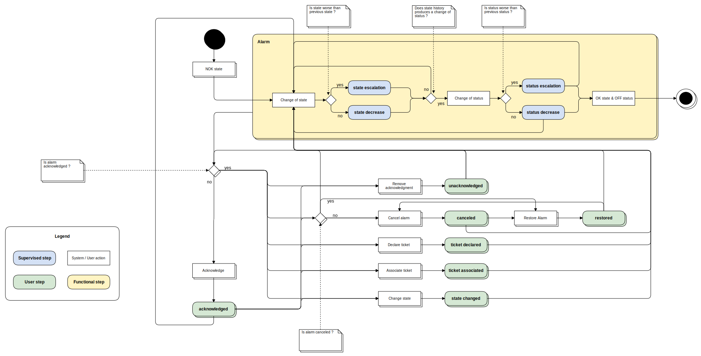

.. _FR__Alarm:

================
Alarm management
================

This document describes the alarm management feature of Canopsis.

.. contents::
   :depth: 3

References
==========

List of referenced functional requirements:

 - :ref:`FR::Event <FR__Event>`
 - :ref:`FR::Context <FR__Context>`

Updates
=======

.. csv-table::
   :header: "Author(s)", "Date", "Version", "Summary", "Accepted by"

   "David Delassus", "2015/10/22", "0.1", "Document creation", ""

Contents
========

.. _FR__Alarm__Desc:

Description
-----------

An alarm is described by a set of :ref:`events <FR__Event>`:

 - a :ref:`check event <FR__Event__Check>` with a non-OK state, starting the alarm
 - a check event, with an OK state, ending the alarm
 - eventually one or more check events with distinct non-OK state
 - eventually one or more :ref:`acknowledgment events <FR__Event__Ack>`
 - eventually a :ref:`ticket declaration event <FR__Event__Declareticket>` or a :ref:`ticket association event <FR__Event__Assocticket>`
 - eventually a :ref:`changing state event <FR__Event__Changestate>`
 - eventually an :ref:`alarm canceling event <FR__Event__Cancel>`
 - eventually an :ref:`alarm restoring event <FR__Event__Uncancel>`

This set of events is called, in Canopsis, an *alarm cycle* and is associated to
a :ref:`contextual entity <FR__Context__Entity>`.

.. _FR__Alarm__Step:

Alarm step
----------

The *alarm cycle* may not be ended yet. It **MUST** have a current state, which
is called the *alarm step*, telling that:

 - the alarm is *on going*
 - the alarm is *flapping*
 - the alarm is *stealthy*
 - the alarm has been acknowledged
 - the alarm has been associated to a ticket
 - a ticket has been declared for the alarm
 - the alarm has been canceled
 - the alarm has been restored from its canceled state
 - the alarm escalated
 - the alarm decreased
 - the alarm ended

Each step **MUST** be historized in its corresponding *alarm cycle*.
And once the alarm ended, the cycle **SHOULD** be closed, and archived.

.. _FR__Alarm__Step__Supervised:

Supervised step
~~~~~~~~~~~~~~~

A *supervised step* is an alarm step emitted by the incoming Canopsis events.

.. _FR__Alarm__Step__User:

User step
~~~~~~~~~

A *user step* is an alarm step emitted by a Canopsis user. It **MUST** provides
the author of this step change, and a message explaining why the change has been
made.

Functional test
---------------

Alarms cycle **MUST** respect the following schema:

Status **MUST** be computed in respect of the following schema:

.. figure:: ../_static/images/alarm/status.svg