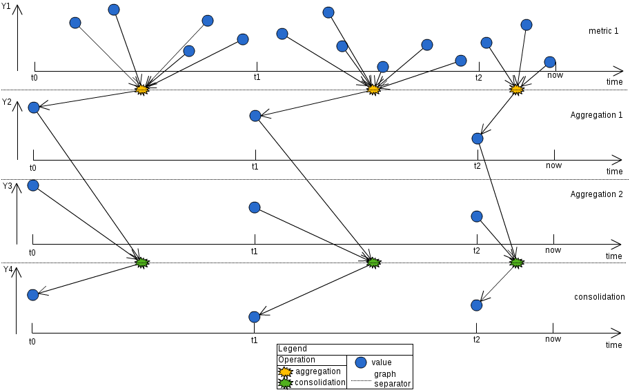

.. _FR__Serie:

=====
Serie
=====

This document describes the series in Canopsis.

.. contents::
   :depth: 3

References
==========

List of referenced functional requirements:

 - :ref:`FR::Metric <FR__Metric>`

Updates
=======

.. csv-table::
   :header: "Author(s)", "Date", "Version", "Summary", "Accepted by"

   "David Delassus", "2015/10/15", "0.1", "Document creation", ""

Contents
========

.. _FR__Serie__Desc:

Description
-----------

A serie in Canopsis is composed of:

 - an aggregation: reducing :ref:`perfdata <FR__Metric__PerfData>` over a period of time, in a single point, using an operator
 - a consolidation: reducing many aggregated :ref:`metrics <FR__Metric>` in a single point, using a formula

.. _FR__Serie__Operators:

Operators
---------

Canopsis provides some operators usable for aggregation or in consolidation formulas:

.. csv-table::
   :header: Operator, Action

   first, First value of period
   last, Last value of period
   average, Arithmetic mean of values in period
   min, Minimal value of period
   max, Maximal value of period
   sum, Sum of values in period
   sub, Subtraction of values in period
   mul, Multiplication of values in period
   div, Division of values in period

.. _FR__Serie__Selection:

Metric Selection
----------------

The metrics involved in a serie are selected using regular expressions on:

 - component
 - resource
 - metric's name

For example: ``co:mycmp.* re:myrsrc.* me:.*_count``

.. _FR__Serie__Aggregation:

Aggregation
-----------

With a configured interval, and one of the existing :ref:`operators <FR__Serie__Operators>`, :ref:`selected perfdata <FR__Serie__Selection>` will be reduced in a single point.

.. _FR__Serie__Formula:

Consolidation formula
---------------------

A formula will be represented as a mathematical expression which can use the existing :ref:`operators <FR__Serie__Operators>` as a function which takes a :ref:`regular expression <FR__Serie__Selection>` as parameter.

This regular expression will select metrics among the already selected metrics of the serie.

For example: ``SUM("co:.* re:.* me:ack_*") / SUM("co:.* re:.* me:.*")``

Using this formula, :ref:`aggregated points <FR__Serie__Aggregation>` will be reduced in a single point, which will be emitted in a metric.

.. _FR__Serie__Configuration:

Configuration
-------------

A :ref:`data schema <FR__Schema__Data>`, describing the configuration, will provide:

 - a ``name``, as a ``string``, which will be the produced metric's name
 - a ``metric_filter``, as a ``string``, representing the :ref:`regular expression <FR__Serie__Selection>` selecting metrics
 - an ``aggregation_interval``, as an ``integer``, representing the period of time used for :ref:`aggregation <FR__Serie__Aggregation>`
 - an ``aggregation_method``, as a ``string``, which is one of the existing :ref:`operators <FR__Serie__Operators>`
 - a ``formula``, as a ``string``, representing the :ref:`consolidation formula <FR__Serie__Formula>`
 - a ``create_metric``, as a ``boolean``, to differentiate series that produce a metric, from series that can be used by the frontend only

Functional tests
================

Frontend serie
--------------

Configure a new serie with ``create_metric`` set to ``False``, and make sure that:

 - you **SHOULD** be able to use the serie in every widget selecting series
 - the serie **SHOULD NOT** publish metrics
 - the results observed **MUST** be coherent with the expected results

Backend serie
-------------

Configure a new serie with ``create_metric`` set to ``True``, and make sure that:

 - you **SHOULD NOT** be able to use the serie in a widget selecting series
 - the serie **MUST** publish a metric on component ``canopsis``, resource ``serie``, with the serie's ``name`` as metric's name
 - the results observed **MUST** be coherent with the expected results
