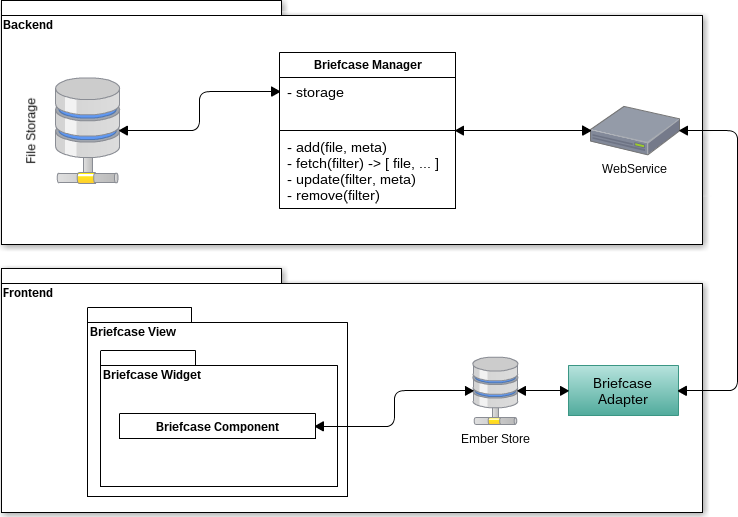

.. _TR__Briefcase:

=========
Birefcase
=========

This document describes the API provided by each parts of the Briefcase functionality.

.. contents::
   :depth: 2

References
==========

List of referenced functional and technical requirements...

- :ref:`FR::Briefcase <FR__Briefcase>`

Updates
=======

.. csv-table::
   :header: "Author(s)", "Date", "Version", "Summary", "Accepted by"

   "David Delassus", "2015/09/16", "0.1", "Document creation", ""

Contents
========

.. _TR__Briefcase__schema:

Briefcase data-flow through API
-------------------------------

