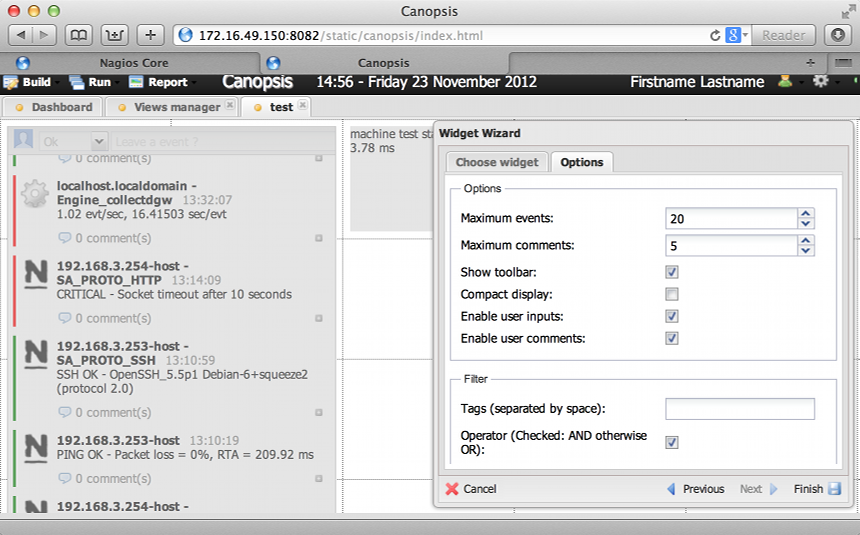

Stream
======

"Display the live stream of events."
The Stream widget displays in real time the components or resources sate changes.
This is taken from the AMQP exchange "canopsis.alert" which monitor the change of state of a given component or resource as defined by the event publishers (Nagios, Graylog, etc).
For example, if Nagios sees a state change (from 0 to 3) in an element it monitors, this event is pushed to `canopsis.alert` and end up being displayed in our stream widget.

