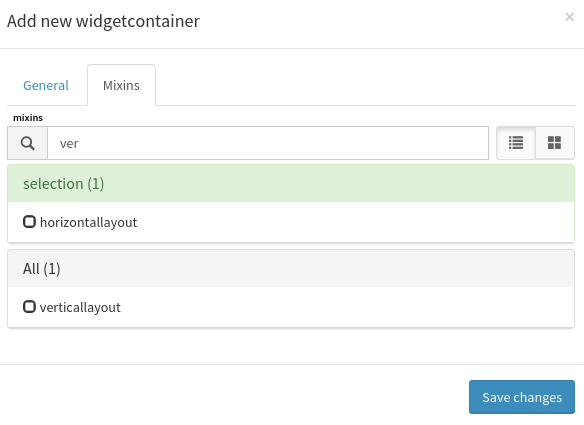

.. _user-ui-widgets-containers:

How to use Containers
=====================

Canopsis containers widgets allow users to embed widgets within a specific layout. This allows custom widget positionning for a better visual experience.

Creating a widget container is as simple as creating a new widget. Switch to edit mode then click insert widget and choose a widget container in the container section

.. image:: ../../../_static/images/widgets/container_select.png

Then choose a layout mixin in one of **horizontallayout, verticallayout, gridlayout**:

Containers widget in canopsis is a base layout on witch a mixin will change the behavior. There are many layout mixins that are appliable on the container widget. Their behavior are described bellow.

.. note::

   It is possible to edit container to change the layout mixin the widget uses after the widget and it's content is created. This allows easier view management. When swithching from grid layout to another layout, mixins informations are kept in case you want to switch back to grid layout.

Horizontal layout
-----------------

This layout makes each new embed widget to be put next to the previous from left to right.

.. image:: ../../../_static/images/widgets/horizontal_layout_default.png

Horizontal layout mixin options allow to specify the class each widget in the container will have. This leads to change how many widget are displayed on each line. see `bootstrap layout <http://getbootstrap.com/css/#grid-options>`_ for more information about these classes

.. image:: ../../../_static/images/widgets/horizontal_layout_options.png

Vertical layout
---------------

This layout makes each new embed widget to be put below the previous from top to down.

.. image:: ../../../_static/images/widgets/vertical_layout_default.png

Grid Layout
-----------

This layout allow custom position for all embeded widgets. It is possible to tell all widgets to follow rules from the container. Here the container defines small medium and large classes for widgets. Selectables values tell how many colmns each widget should use to render see `bootstrap layout <http://getbootstrap.com/css/#grid-options>`_ for more information about layout behaviors.

``offset`` value defines how many columns skip before the widget is displayed.

The **force legacy** option tells all widget in the container to reset it's grid options to the container's values.

.. image:: ../../../_static/images/widgets/gridlayout_options.png

But it is also possible to define these options at widget level. This way, it is possible to create custom layouts. when legacy layout is not used. That's how the following widget disposition is possible.

.. image:: ../../../_static/images/widgets/gridlayout_custom_display.png

