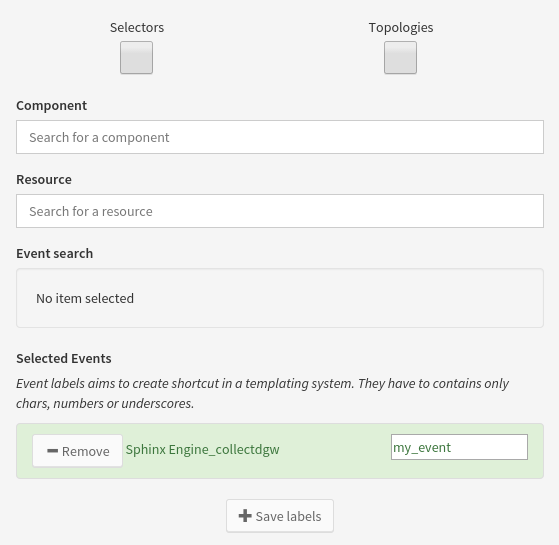

.. _user-ui-widgets-text:

How to use Text
===============

This widget's purpose is to display arbitrary information written by a Canopsis administrator.
Availables features in the widget text are:

 - display arbitrary html content
 - display computed metric values
 - display events information

Arbitrary html content display
------------------------------

When editing the widget text, it is possible to write custom HTML in the text editor. Using the editor buttons would make easier the html edition and it is also possible to write raw html directly.

.. image:: ../../../_static/images/widgets/text_html_edition.png

Metric display system
---------------------

The text widget edition allow selecting performance data series. For more information on how create series from metrics see `series <../../UI/serie.html>`_ .
Metrics displayed are the last value for the serie metric computation from the selected date interval witch is by default between **now** and **now - 300 seconds**. If no metric available in this interval, the template value will display `No metric available` as value in the render.

.. image:: ../../../_static/images/widgets/select_series.png

Once serie is selected, it is possible to display it's value in the text area by using the handlebars template system as long as the metric value is embed in the template rendering context under the `serie.serie_name` name.

The code bellow will allow the widget text to display the value of the serie1

.. code-block:: html

	Metric value for serie1 is : {{serie.serie1}}

Event display system
--------------------

Event display system in the widget text allow users to display event information content as text information.

Below an example of what it is possible to do with the event feature

.. image:: ../../../_static/images/widgets/text_event_edition.png

This can be done because in the widget text form editor, the event from collectd is registed (with the event selector editor) and is aliased with ``my_event`` value in the event selector panel as shown in the picture below. Don't forget while aliasing an event to click save button at the bottom.

The template created for this widget text is the one shown below. It displays events information from the ``event`` context thanks to an handlebars tag.Make reference to the selected event by using the ``my_event`` alias name in the handlebars tag. and then choose one property of the event that mainly can be one of:

 - id
 - component
 - resource
 - state
 - domain
 - perimeter
 - connector_name
 - connector

.. image:: ../../../_static/images/widgets/text_event_edition_2.png

Widget text helpers
-------------------

 - The helper **human readable** is available in the widget text. It is usefull when metric information deals with huge numbers and have to be displayed in a smarter way. It can be used as follow.

.. code-block:: html

   Space disk on the server X {{hr value=1000000000}}

This will result in the following output display : ``Space disk on the server X 1 M``. Of course, the value can be a variable from a serie and should then look like the following:

.. code-block:: html

   Space disk on the server X {{hr value=serie.diskSerie}}

