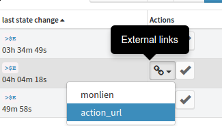

.. _user-engines-linklist:

Linklist
========

Overview
---------

Link list feature aims to associate links to Canopsis entities. This is done by different following ways:

 - Canopsis receive an event that contains a specific key such as **action_url** that may be equal to **http://canopsis.org**
 - A Canopsis user defines relations between Canopsis entities and some urls that have to be associated to them.

In the end, the final user will be able to see a list of link associated to an specific event as shown in the picture below:

.. image:: ../../_static/images/frontend/linklist_2.png

Rights
------

The linklist feature comes with a right management system. Link list actions are enabled if the user is allowed for the ``actionbutton_canediturlfield`` right. This right allow to schedule a new linklist computation task and to create a rule for link list computation.

How to associate links
----------------------

Link association can be done into the link list view, witch is reachable from the engine menu.

.. image:: ../../_static/images/frontend/linklist_3.png

Once in the link list configuration view, click ``create`` button.

In the form, select entities that have to be associated to the link list that you have to fill below by editing a filter.
A link is made of a **label** and an **url**.

.. image:: ../../_static/images/frontend/linklist_create_form.png

Once done, link list are ready to be computed. The only left action to perform is to trigger a link association computation thanks to the scheduled job system. for more information about the job system go to `scheduled jobs <scheduledjobs.html>`_

.. NOTE::

   TODO: a good link for a user guide for scheduled jobs
