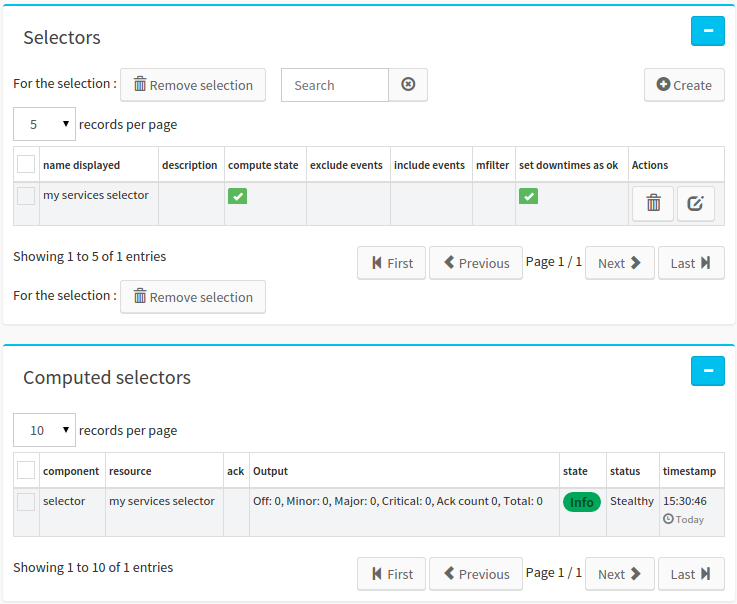
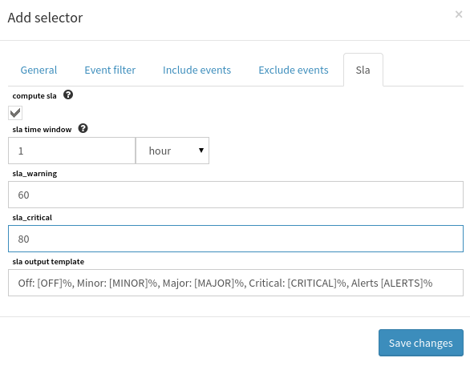

.. _selector:

Selector
========

Overview
--------

Selector engine aims to perform aggregation operation on many events,
providing this way a simple aggregated information.

Goals
-----

Allow user to define it's own aggregation information. For now, selector
allows to compute the worst state on an event set. Selectors takes care
of acknowlegement state in events when computed.

A Computed selector is computed from a user filter and will produce an
event as output. event rules computation are explained below.

Selector rules
--------------

Selector computation is done on active canopsis events that come from
external broker sources such as nagios or shinken. These events may
represent a large amount of information that it may be hard to understand
or synthetize.

Canopsis selectors aims to answer these aggregation problems by synthetizing
the amount of information provided by simple events. The solution given by
canopsis is to let user aggregate events information into a new single event.

Thus, Canopsis selectors are parametrized with database filters that will
match existing events into database. Those events have their own statement
and acknowlegement information that the selector engine will interpret to
produce the new event.

When a filter is defined by the user, many events are selected from database.
Once selected, selector engine computes the worst state on them with no care
about statements of acknowleged events by default. This way, the newly produced
event carries the worst state of all selected events and computes statistics
information in it's output field.

When all matched events by the user filter are acknowleged, then the produced
selector event is acknowleged too.

The selector view
-----------------

Selector management can be done with Engine management right level.
Please refer to the right management to get more.

Selector configuration can be reached from the engine menu as shown on
the picture below

.. image:: ../../_static/images/frontend/selector_configuration_1.png

Clicking on this menu item will lead to display the selector view. There
are two lists on this view: The selector configuration list at the top
and the produced events view at the bottom.

The selector configuration list displays configuration element that will
tell the canopsis backend selector engine to compute selector event and
statements.

The produced selector event list shows events in database that were
produced by the selector engine.

Create a selector in the canopsis UI
------------------------------------

First click on the create selector button which is in the scope of the
selector list at the top of the picture.

Then a form appears. This form tells the selector engine in the backend
how to behave.

.. image:: ../../_static/images/frontend/selector_configuration_2.png

All field are explained when the mouse is over the ask icon.

other tabs are:

-  a list of event id to **include**.
-  a list of event id to **exclude**.
-  a cfilter describing a filter which allows **custom** event selection.

Once saved, the selector engine loads the newly configured selector and
computes it in order to produce it's associated event.

SLA system
----------

It is possible to tell Canopsis to compute `Service Level Agreement <http://en.wikipedia.org/wiki/Service-level_agreement>`_ for selectors.

Computing SLA consists in the following rules:

- SLA computation can be done only if selector is **enabled** and **dostate** and **dosla** are activated.
- SLA are computed for the selector it is associated.
- SLA computes percent of time a selector spend in a given state for each of the following **info, minor, major, critical**.
- SLA produces an event where ``event_type`` is **sla** and witch resource is the selector name.
- SLA allows to choose a timewindow witch is a duration until now where SLA are computed.

SLA thresholds
--------------

SLA takes care of a warning and a critical percent level that defines what value the computed event state will be. These values have to be **between 0 and 100** percents and if the threshold of one of these value is reached, the event takes a special state.

For exemple, when a selector spend **90%** of it's time in alert in the given timewindow (one of minor, major or critical state) and the critical threshold value is 85, then the sla event will hold the critical state.

SLA minor state is reached when the alert percent value is greater than the warning threshold and lower than the warning threshold.

SLA configuration sample:

