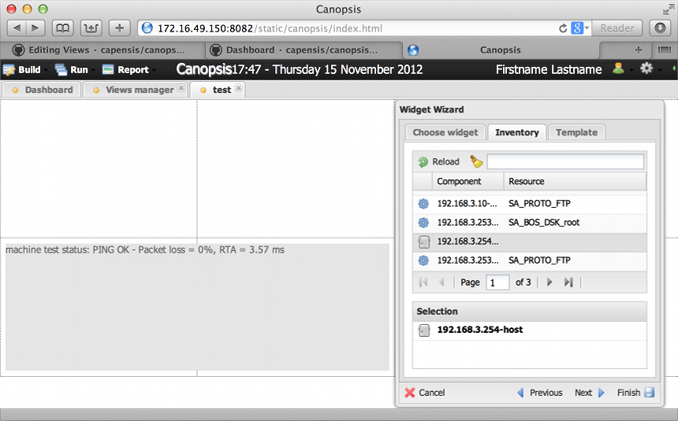
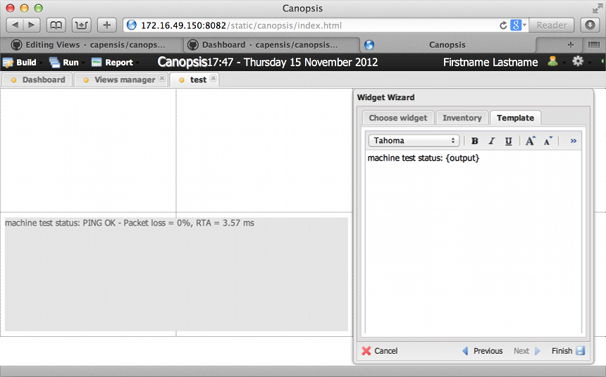

Text cell
=========

"Display a message with a html template."
This widget primary purpose is to display an arbitrary string of text.
It can also display html code and event variables. The list of variables can be seen on [Event specification](https://github.com/capensis/canopsis/wiki/Event-specification) page, Event structure paragraph. Possible uses of the text cell widget are: add labels on our custom Views, display some html frame (like twitter, icinga etc..) or print variables from the inventory tab as shown on the grabs below. You can use for example {output} to display output of a resource, or directly use {perfdata:%metric_name%:value} ( {perfdata:cps_sel_total:value} ) to display a specific perfdata.

