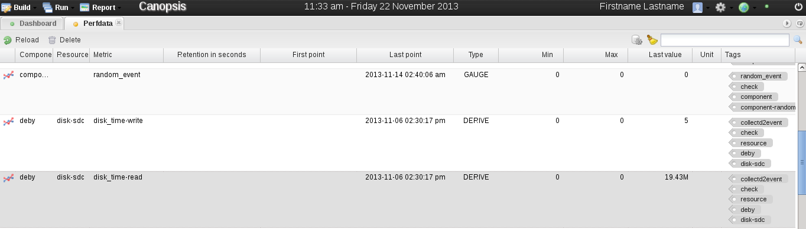

Internal metrics
================

Overview
--------

Internal metrics are produced to provide helpful informations about the Canopsis system.

List of internal metrics
------------------------

.. NOTE :: TODO
   Specify for which component/resource these metrics appears, their units, and their descriptions
   Internal metrics are produced periodicaly. So their values are updated though time.

.. csv-table:: Metric values matching
   :header: "State value", "Matching"
   :widths: 15, 15

	 0, ok
	 1, warning
	 2, critical
	 3, unknown

.. csv-table:: Metric descriptions
   :header: "Metric name", "Description"
   :widths: 15, 50

	"**Acknowlegement**", "This section contains metric information related to acknowlegement in Canopsis"
	"cps_alerts_ack", "Counts alerts beeing acknowleged. it is computed at global level and for each hostgroup."
	"cps_alerts_not_ack", "Counts alerts not yet acknowleged. it is computed at global level and for each hostgroup."
	"cps_alerts_ack_by_host", "Counts alerts witch is ack because it's related component has been acknowledged. it is computed at global level and for each hostgroup."
	"ack_delay", "Measures elapsed time between an alert date and it's acknowlegement's date."
	"ack_solved_delay", "Measures elapsed time between an acknowlegement date and the alert change state to OK (0) date."

	"**Alerting**", "This section contains metric information related to alerting in Canopsis"
	"cps_statechange_hard", "Counts every  state change for a given event witch is in **hard** state, hard state is an event's state_type key equal to 0"
	"cps_statechange_soft", "Counts every state change for a given event witch is in **soft** state, soft state is an event's state_type key equal to 1"
	"cps_statechange", "Counts every  state change for a given event"
	"cps_statechange_nok", "Counts every  state change for a given event witch state goes from OK to NOK state. for instance state change from 0 to 1, 2 or 3"
	"cps_statechange_0", "Counts every  state change for a given event witch state goes from 1, 2, 3 state to 0 state"
	"cps_statechange_1", "Counts every  state change for a given event witch state goes from 0, 2, 3 state to 1 state"
	"cps_statechange_2", "Counts every  state change for a given event witch state goes from 0, 1, 3 state to 2 state"
	"cps_statechange_3", "Counts every  state change for a given event witch state goes from 0, 1, 2 state to 3 state"

	"**Information**", "This section contains metric information related to Canopsis system"
	"cps_evt_per_sec", "Average events count being threaten each second by an engine. Resource of this metric is the engine name"
	"cps_sec_per_evt", "Counts how long does an event last in each engine"
	"cps_queue_size", "This is the size of the Canopsis queue"

View metric values
------------------

Metric values can be viewed in |widgets| or in the
dedicated view accessible through the Canopsis menu: Build > Perfdata.

|image1|

The view perfdata shows an array of metric values.

|image2|

The array is organized by metric fields depending on the last processed
event.

Just above the array, from left to right, there are reload, delete and
display internals buttons and a research bar surrounded by cancel and
search buttons.

The reload button refresh the view whereas the delete button delete
selected metrics.

The display internals permits to display/hide internal
metrics in the view.

Finally, the research bar waits for simple string values separated by
spaces. Research values are of two types. If they are preceded by the
'#' character, research value concern tag research with same name,
otherwise research value is applied on all metric fields where the value
contains research value.

If several research values are given, then only metrics which match with
all research values will be displayed in the perfdata view.

Here are examples of Research:

-  "cps\_ state" > display all metrics where fields contain "cps\_" and
   "state" values. Some internal metrics match with this filter, but the
   display internal metrics button has to be selected in order to
   display them.
-  "#engine" > display all metrics which contain the tag "engine".
-  "#engine #filter" > display all metrics which contain the tags
   "engine" and "filter". In other word, it's a solution to get all
   metrics from the filter engine .

.. |image1| image:: ../_static/metrics/perfdata_menu.png

