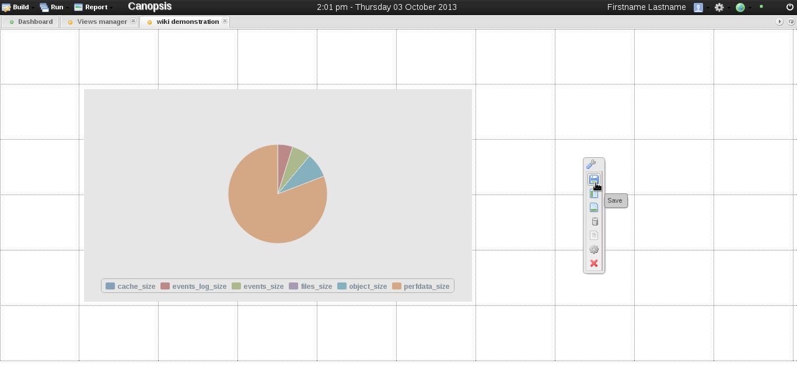

.. _views:

Views
=====

.. include:: ../link.rst

From the |Dashboard| , Views allow to monitor supervisors
and administer resources through |widgets| .

How to add, remove and modify views
-----------------------------------

Content shown in Canopsis can be customised. |widgets| can
be added, removed and modified. To achieve this, new Views need to be
created. From the Canopsis menu bar click on Run > Views manager. Figure
1 and 2 below shows how to open the Views manager.

.. |link| replace:: `figure 1 <../_static/Views/run_manager.png>`__
.. |link2| replace:: `figure 2 <../_static/Views/view_manager.png>`__

+-----------------+------------------+
| |run_manager|   | |view_manager|   |
+=================+==================+
| |link|          | |link2|          |
+-----------------+------------------+

Once in Views manager click on the "Add view" button in the toolbar, a
dialog window should popup, fill in a name for the new view (see Fig 3).

.. |link3| replace:: `figure 3 <../_static/Views/view_name.png>`__

+-------------+
| |view_name| | 
+=============+
| |link3|     |
+-------------+

Once you click Ok, you should enter the new view in edit mode like shown
below in Figure 4. To add a new |widgets| , with the mouse
click and select an empty area over the dashboard then release the
button. (see Fig 5).

.. |link4| replace:: `figure 4 <../_static/Views/edit_new_view.png>`__
.. |link5| replace:: `figure 5 <../_static/Views/select_widget_area.png>`__

+------------------+-----------------------+
| |edit_new_view|  | |select_widget_area|  |
+==================+=======================+
| |link4|          | |link5|               |
+------------------+-----------------------+

Upon releasing the mouse button, a "new widget wizard" should popup and
ask for the kind of |widgets| you'd like to add. Below I
show how to add a Pie widget representing sizes of data base tables.
Fill in the information through normal configuration steps (see Fig 6,
7, 8 and 9) and optionally check advanced parameters such as visual
properties or information details in the advanced configuration (see Fig
10). Finally, click save button on the lower right corner of the dialog
(see Fig 11).

.. |link6| replace:: `figure 6 <../_static/Views/widget_wizard1.png>`__
.. |link7| replace:: `figure 7 <../_static/Views/widget_wizard2.png>`__
.. |link8| replace:: `figure 8 <../_static/Views/widget_wizard3.png>`__
.. |link9| replace:: `figure 9 <../_static/Views/widget_wizard4.png>`__
.. |link10| replace:: `figure 10 <../_static/Views/widget_wizard5.png>`__
.. |link11| replace:: `figure 11 <../_static/Views/widget_wizard6.png>`__

+-------------------+-------------------+-------------------+
| |widget_wizard1|  | |widget_wizard2|  | |widget_wizard3|  |
+===================+===================+===================+
| |link6|           | |link7|           |  |link8|          |
+-------------------+-------------------+-------------------+
| |widget_wizard4|  | |widget_wizard5|  | |widget_wizard6|  |
+-------------------+-------------------+-------------------+
| |link9|           | |link10|          |  |link11|         |
+-------------------+-------------------+-------------------+

Figure 12 shows the result: a new pie chart widget representing sizes of
data base tables. You can modify, duplicate or delete it by pressing the
secondary mouse button, or click the floppy disk icon on the floating
toolbox (see Fig 13) in order to save the changes to the View so far
(see Fig 14).

.. |link12| replace:: `figure 12 <../_static/Views/new_widget.png>`__
.. |link13| replace:: `figure 13 <../_static/Views/new_widget2.png>`__
.. |link14| replace:: `figure 14 <../_static/Views/new_widget3.png>`__

+---------------+----------------+----------------+
| |new_widget|  | |new_widget2|  | |new_widget3|  |
+===============+================+================+
| |link12|      | |link13|       |  |link14|      |
+---------------+----------------+----------------+

Richer user experience
----------------------

In order to improve user experience, keyboard shortcuts and mouse tricks
are available.

Keyboard shortcuts
------------------

-  ctrl + e = edit active view
-  ctrl + s = save active view (have to be in edition mode)
-  ctrl + r = refresh active view

.. NOTE:: 
    Hide/Show the top black part: Hide it by double clicking on it. Show
    it in moving the cursor at the top of the dashboard.

   
.. |run_manager| image:: ../_static/Views/run_manager.png
	     :height: 100px
	     :width: 500 px
.. |view_manager| image:: ../_static/Views/view_manager.png
	     :height: 100px
	     :width: 500 px
.. |view_name| image:: ../_static/Views/view_name.png
	     :height: 100px
	     :width: 1010 px
.. |edit_new_view| image:: ../_static/Views/edit_new_view.png
	     :height: 100px
	     :width: 500 px
.. |select_widget_area| image:: ../_static/Views/select_widget_area.png
	     :height: 100px
	     :width: 500 px
.. |widget_wizard1| image:: ../_static/Views/widget_wizard1.png
	     :height: 100px
	     :width: 333 px
.. |widget_wizard2| image:: ../_static/Views/widget_wizard2.png
	     :height: 100px
	     :width: 333 px
.. |widget_wizard3| image:: ../_static/Views/widget_wizard3.png
	     :height: 100px
	     :width: 333 px
.. |widget_wizard4| image:: ../_static/Views/widget_wizard4.png
	     :height: 100px
	     :width: 333 px
.. |widget_wizard5| image:: ../_static/Views/widget_wizard5.png
	     :height: 100px
	     :width: 333 px
.. |widget_wizard6| image:: ../_static/Views/widget_wizard6.png
	     :height: 100px
	     :width: 333 px

.. |new_widget| image:: ../_static/Views/new_widget.png
	     :height: 100px
	     :width: 333 px

.. |new_widget3| image:: ../_static/Views/new_widget3.png
	     :height: 100px
	     :width: 333 px