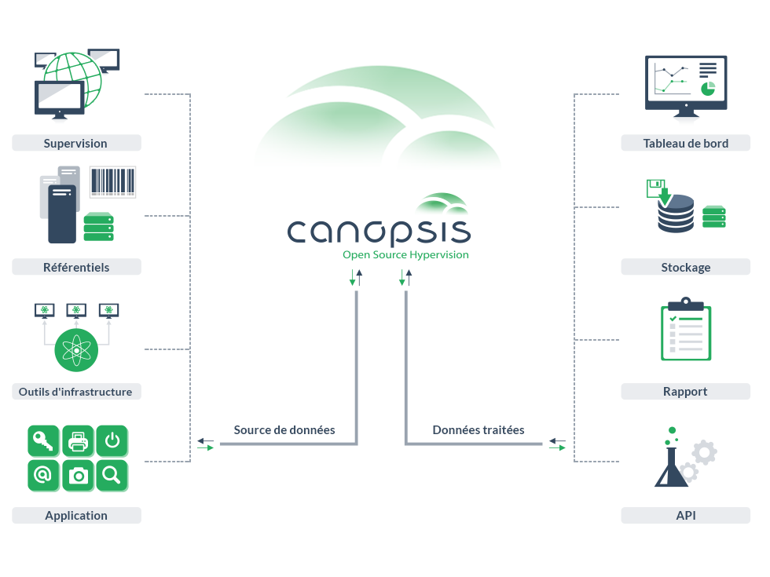

# Guide Administrateur

## Section : Architecture Interne

**TODO ?** Liste à puce pour la brique cache / SGBD (ce qu'elle contient, etc, ...)

### Fonctionnement général de Canopsis

Voici le schéma du fonctionnement général de Canopsis, vous y retrouverez les principales briques logicielles de l'hyperviseur ainsi que les moteurs faisant fonctionner Canopsis.  
Certains moteurs sont des moteurs propriétaires non disponibles dans la version communautaire de Canopsis.

### Schéma Macro

**Documentation des différentes parties :**

[Documentation connecteurs](/doc-ce/Guide%20Connecteur)  
[Documentation moteurs](/doc-ce/Guide%20Administrateur/Moteurs)  
[Documentation base de données](/doc-ce/Guide%20Administrateur/Troubleshooting/BDD%20:%20requ%C3%AAtes%20de%20base%20etc.md)  
[Documentation Web UI](/doc-ce/Guide%20Utilisateur/Interface)  

Plus de détails sur l'enchaînement des moteurs [disponible ici](/doc-ce/Guide%20Administrateur/Moteurs/Sch%C3%A9ma%20encha%C3%AEnement.md)