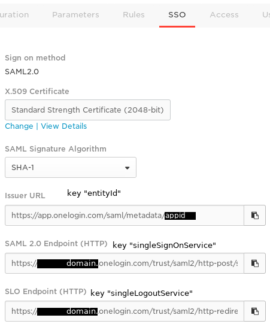

# Authentification

## Authentification LDAP

!!! attention
    Les fonctionnalités liées à LDAP sont en cours de développement. Toutes les fonctionnalités de LDAP ne sont pas encore implémentées.

L'authentification LDAP est actuellement fonctionnelle et est basée sur [python-ldap](https://python-ldap.readthedocs.io) qui utilise la *libldap* du projet [OpenLDAP](https://www.openldap.org/). Canopsis utilise la version 3 du protocole LDAP.

Sa configuration par l'interface web n'est pas prise en charge pour le moment.

Les fonctionnalités actuellement implémentées permettent l'authentification des utilisateurs sur n'importe quel annuaire LDAP, tant que celui-ci respecte la [RFC 4510](https://tools.ietf.org/html/rfc4510) et ses déclinaisons.

### Activation de LDAP

Pour activer l'authentification LDAP, le service doit être activé dans la configuration du serveur web.

Le fichier à modifier est `/opt/canopsis/etc/webserver.conf`, où `canopsis.auth.ldap` doit être ajouté aux mécanismes d'authentification.

```ini
[auth]
providers = canopsis.auth.authkey,canopsis.auth.ldap
```

Un redémarrage du serveur web est nécessaire.

### Configuration de LDAP

La configuration de l'authentification se fait au moyen d'une requête sur l’API. Vous devez préparer un fichier de configuration et l'envoyer sur l'API.

Voici la liste de paramètres nécessaires à la configuration LDAP :

| Attribut     | Description                                                                                                                                | Exemple                                                        |
|--------------|--------------------------------------------------------------------------------------------------------------------------------------------|----------------------------------------------------------------|
| ldap_uri     | Chaîne de connexion LDAP                                                                                                                   | ldaps://ldap.example.com                                       |
| host         | Adresse du serveur LDAP <br> *Attribut obsolète conservé pour la rétrocompatibilité des configurations*                                    | ldap.example.com                                               |
| port         | Port d'écoute du serveur LDAP <br> *Attribut obsolète conservé pour la rétrocompatibilité des configurations*                              | 389                                                            |
| admin_dn     | Bind DN : DN du compte utilisé pour lire l'annuaire                                                                                        | uid=svccanopsis,ou=Special,dc=example,dc=com                   |
| admin_passwd | Bind password : mot de passe pour authentifier le Bind DN sur l'annuaire                                                                   |                                                                |
| user_dn      | DN de base où rechercher les utilisateurs                                                                                                  | ou=People,dc=example,dc=com                                    |
| ufilter      | Filtre de recherche pour les utilisateurs <br> La valeur de l'utilisateur est présentée dans une variable notée `%s`                       | uid=%s                                                         |
| attrs        | Association d'attributs pour les infos de l'utilisateur <br> Un utilisateur Canopsis dispose des attributs `firstname`, `lastname`, `mail` | `{"mail": "mail", "firstname": "givenName", "lastname": "sn"}` |
| default_role | Rôle Canopsis par défaut au moment de la première connexion                                                                                | Visualisation                                                  |

La configuration se fait dans un fichier JSON : **ldapconfig.json**

```json
{
    "id": "cservice.ldapconfig",
    "crecord_type": "ldapconfig",
    "crecord_name": "ldapconfig",
    "ldap_uri": "ldap://ldap.example.com",
    "admin_dn": "uid=svccanopsis,ou=Special,dc=example,dc=com",
    "admin_passwd": "********",
    "user_dn": "ou=People,dc=example,dc=com",
    "ufilter": "uid=%s",
    "attrs": {
        "mail": "mail",
        "firstname": "givenName",
        "lastname": "sn"
    },
    "default_role": "Visualisation"
}
```

!!! Note
    Vous pouvez remplacer les attributs `host` et `port` par `ldap_uri`.

La requête suivante permet d'envoyer cette configuration :

```sh
curl -u root:root -X POST \
  -H "Content-type: application/json" -d @ldapconfig.json \
  'http://CANOPSIS_HOST:CANOPSIS_PORT/rest/object/ldapconfig/cservice.ldapconfig'
```

Le résultat renvoyé doit être de type :

```json
{"total": 1, "data": [{"..."}], "success": true}
```

### Utilisation de LDAP

À ce stade, vous êtes en mesure de vous authentifier sur l'interface de Canopsis. Le profil d'affectation sera celui spécifié dans la configuration.

## Authentification CAS

L'authentification CAS est fonctionnelle en UIv3 (uniquement) depuis **Canopsis 3.22.0**. Les versions antérieures de Canopsis ne disposaient d'une authentification CAS qu'en UIv2.

Sa configuration par l'interface web n'est pas prise en charge pour le moment.

Les fonctionnalités actuellement implémentées permettent l'authentification des utilisateurs via WebSSO.

### Activation de CAS

Pour activer l'authentification CAS, le service doit être activé dans la configuration du serveur web.

Le fichier à modifier est `/opt/canopsis/etc/webserver.conf`, où `canopsis.auth.cas` doit être ajouté aux mécanismes d'authentification.

```ini
[auth]
providers = canopsis.auth.authkey,canopsis.auth.cas
```

Un redémarrage du serveur web est nécessaire.

### Configuration de CAS

La configuration de l'authentification se fait au moyen d'un requête sur l’API. Vous devez préparer un fichier de configuration et l'envoyer sur l'API.

Voici un listing de paramètres nécessaires à la configuration CAS :

|   Attribut   |                    Description                     |            Exemple             |
| ------------ | -------------------------------------------------- | ------------------------------ |
|  `service`   |         URL de connexion pour le Canopsis          |   http://canopsis.info.local/  |
| `default_role` | Rôle par défaut au moment de la première connexion |         Visualisation          |
|   `title`    |        Label sur le formulaire de connexion        |           Connexion            |
|   `server`   |            Serveur de connexion WebSSO             | https://cas.info.local/websso/ |

La configuration se fait dans un fichier JSON : **casconfig.json**

```json
{
    "crecord_type": "cservice",
    "crecord_name": "casconfig",
    "_id": "cservice.casconfig",
    "enable": true,
    "service": "http://canopsis.info.local/",
    "default_role": "Visualisation",
    "title": "Connexion",
    "server": "https://cas.info.local/websso/"
}
```

La requête suivante permet d'envoyer cette configuration.

```sh
curl -X POST -H "Content-type: application/json" -d @casconfig.json 'http://user:mdp@IP_CANOPSIS:PORT_CANOPSIS/rest/object/casconfig/cservice.casconfig'
```

Le résultat renvoyé doit être de type :

```json
{"total": 1, "data": [{"..."}], "success": true}
```

### Utilisation de CAS

À ce stade, vous êtes en mesure de vous authentifier sur l'interface de Canopsis.
Le profil d'affectation sera celui spécifié dans la configuration.

## Authentification SAML2

Intégration de l’authentification avec SAML2

Nécessite l’installation de la brique CAT.

### Paramétrage IdP

*  ACS Consumer URL : `http[s]://canopsis.fqdn.tld/auth/saml2/acs/`
*  Single Logout URL : `http[s]://canopsis.fqdn.tld/auth/saml2/sls/`
*  Audience : `http[s]://canopsis.fqdn.tld/auth/saml2/metadata/`
*  Recipient : `http[s]://canopsis.fqdn.tld/auth/saml2/acs/`
*  RelayState : `http[s]://canopsis.fqdn.tld/`

L’IdP doit impérativement fournir dans les réponses d’authentification une valeur normalisée `NameID`. Il suffit de créer un *mapping* entre ce champ normalisé et une information unique dans le backend utilisé par l’IdP. Dans le cas contraire, l’authentification côté Canopsis **ne pourra pas fonctionner**.

Exemple de configuration OneLogin :


### Création du paramétrage - Côté Canopsis

**Travaillez dans un dossier temporaire accessible par l’utilisateur `canopsis`, par exemple `/opt/canopsis/tmp/saml2_setup`.**

Vous pouvez suivre cette documentation : https://github.com/onelogin/python-saml#knowing-the-toolkit

En particulier la génération des clefs et des paramètres :

```sh
mkdir certs
openssl req -new -x509 -days 3652 -nodes -out certs/sp.crt -keyout certs/sp.key
```

Écrire dans le fichier `settings.json` :

```json
{
    "strict": true,
    "debug": false,
    "sp": {
        "entityId": "CANOPSIS_BASE_URL/auth/saml2/metadata/",
        "assertionConsumerService": {
            "url": "CANOPSIS_BASE_URL/auth/saml2/acs/",
            "binding": "urn:oasis:names:tc:SAML:2.0:bindings:HTTP-POST"
        },
        "singleLogoutService": {
            "url": "CANOPSIS_BASE_URL/auth/saml2/sls/",
            "binding": "urn:oasis:names:tc:SAML:2.0:bindings:HTTP-Redirect"
        },
        "NameIDFormat": "urn:oasis:names:tc:SAML:1.1:nameid-format:emailAddress",
        "x509cert": "",
        "privateKey": ""
    },
    "idp": {
        "entityId": "https://app.onelogin.com/saml/metadata/appid",
        "singleSignOnService": {
            "url": "https://domain.onelogin.com/trust/saml2/http-post/sso/appid",
            "binding": "urn:oasis:names:tc:SAML:2.0:bindings:HTTP-Redirect"
        },
        "singleLogoutService": {
            "url": "https://domain.onelogin.com/trust/saml2/http-redirect/slo/appid",
            "binding": "urn:oasis:names:tc:SAML:2.0:bindings:HTTP-Redirect"
        },
        "x509cert": "CONTENU_CERTIFICAT_X509_IDP"
    }
}
```

En prenant ici pour exemple la configuration OneLogin :



Remplacer les occurrences des paramètres suivants :

*  Les URL `https://domain.onelogin.com...` sont à remplacer intégralement par les données de configuration de L'IdP sur lequel vous allez vous brancher ;
*  `CANOPSIS_BASE_URL` ; exemple : `https://canopsis.domain.tld/` **ATTENTION** Il faut **OBLIGATOIREMENT** que cette URL soit un `FQDN` ;
*  `CONTENU_CERTIFICAT_X509_IDP` avec le contenu au format PEM du certificat public de l’IdP.

Exemple de certificat fourni par l’IdP OneLogin :


Pour le certificat de l’IdP, téléchargez le, puis :

```sh
cat idp_cert.pem | grep -v "BEGIN CERTIFICATE" | grep -v "END CERTIFICATE" | tr '\n' ' ' | sed -e 's/ //g'
```

Écrire dans le fichier `advanced_settings.json` :

```json
{
    "security": {
        "nameIdEncrypted": false,
        "authnRequestsSigned": false,
        "logoutRequestSigned": false,
        "logoutResponseSigned": false,
        "signMetadata": false,
        "wantMessagesSigned": false,
        "wantAssertionsSigned": false,
        "wXoantNameId" : true,
        "wantNameIdEncrypted": false,
        "wantAssertionsEncrypted": false,
        "signatureAlgorithm": "http://www.w3.org/2000/09/xmldsig#rsa-sha1",
        "digestAlgorithm": "http://www.w3.org/2000/09/xmldsig#sha1"
    },
    "contactPerson": {
        "technical": {
            "givenName": "technical_name",
            "emailAddress": "technical@example.com"
        },
        "support": {
            "givenName": "support_name",
            "emailAddress": "support@example.com"
        }
    },
    "organization": {
        "en-US": {
            "name": "sp_test",
            "displayname": "SP test",
            "url": "http://sp.example.com"
        }
    }
}
```

Ces fichiers de configuration sont à adapter, il n’existe pas de configuration générique, cela dépend des paramètres de sécurité de l’IdP.

Créer le fichier de configuration de la correspondance Utilisateur Canopsis <-> Utilisateur IdP :

```json
{
        "userid": null,
        "firstname": null,
        "lastname": null,
        "mail": null
}
```

Dans le cas où toutes les valeurs sont à `null`, des paramètres par défaut seront appliqués.

Si vous voulez paramétrer vous-même la correspondance, mettez simplement une chaîne de caractères contenant le nom de l’attribut fourni par l’IdP. Exemple avec OneLogin :

```json
{
        "userid": "User.email",
        "firstname": "User.FirstName",
        "lastname": "User.LastName",
        "mail": "User.email"
}
```

### Intégration des paramètres en base

Créer cette structure :

```
saml2_setup/
    certs/
        sp.crt
        sp.key
    settings.json
    advanced_settings.json
    canopsis_user.json
    conf_path
    secret_key
```

Le fichier `conf_path` devra contenir le chemin de destination de la configuration SAML2 lorsqu’elle sera utilisée par le webserver de Canopsis. Exemple : `/opt/canopsis/tmp/saml2`.

Le fichier `secret_key` permettra de déchiffrer les données SAML2 en cas de chiffrement. Si vous n’activez pas le chiffrement, créez quand même ce fichier.

Ensuite, dans l’environnement Canopsis, exécutez ceci dans un shell :

```sh
python -c 'from canopsis_cat.saml2 import SAML2Conf; SAML2Conf.insert_conf("/opt/canopsis/tmp/saml2_setup", SAML2Conf.provide_default_collection())'
```

Vous pouvez relancer cette commande autant de fois que nécessaire : la configuration en place sera tout simplement écrasée intégralement.

Donc si vous voulez apporter une modification de la configuration, pas besoin de passer par la base de données : modifiez les fichiers "source" sur disque, exécutez la commande ; c’est fini.

### Activation de l’authentification SAML2

Éditer le fichier de configuration Canopsis `/opt/canopsis/etc/webserver.conf` :

```ini
[webservices]
; version pré-monopackage < 2.5.0
saml2 = 1
; version monopackage >= 2.5.0
canopsis_cat.webcore.services.saml2 = 1
```

Puis exécutez :

```sh
systemctl restart canopsis-webserver
```

### Tests et log

Le fichier de log `/opt/canopsis/var/log/saml2.log` contiendra les erreurs SAML2, s’il y en a.

Pour tester l’authentification :

*  Rendez-vous sur la page de login de Canopsis ;
*  Entrez un utilisateur autre que ceux présents dans Canopsis, et n’importe quoi en mot de passe (changements à venir) ;
*  Vous devez être redirigé vers la page de login de l’IdP SAML2 ;
*  Une fois authentifié via l’IdP, vous devez être redirigé vers Canopsis sans erreur.

### Troubleshooting

Observer les logs `/opt/canopsis/var/log/saml2.log` et `/opt/canopsis/var/log/webserver.log`.

#### FQDN

```
OneLogin_Saml2_Error: Invalid dict settings at the file: sp_acs_url_invalid,sp_sls_url_invalid
```

Vérifier que les URL `sp` sont toutes des FQDN.

#### Désynchro de configuration

```
[2018-03-01 10:47:30,220] [ERROR] [saml2] SAML Authentication errors: ['invalid_response'] | The response was received at http://canopsis.local:8082/auth/saml2/acs/ instead of http://canopsis:8082/auth/saml2/acs/
```

Ici, l’IdP est mal configurée. Assurez-vous que la configuration active dans le webserver soit conforme à ce qu’attend l’IdP et inversement.

Redémarrer le webserver si besoin afin d’être certain de la configuration actuellement utilisée.
