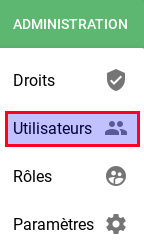
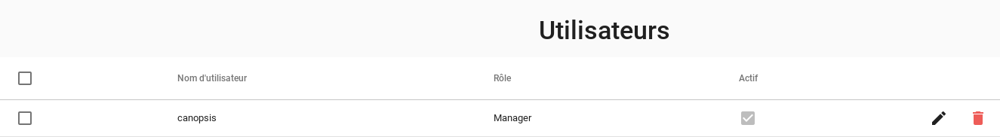
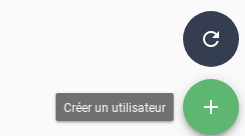
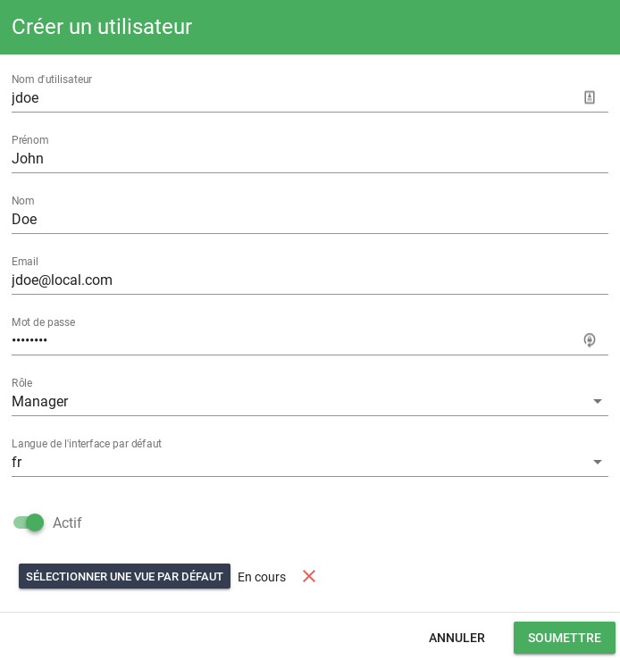
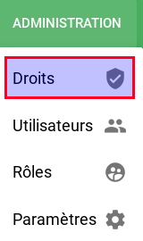
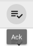

# Gestion des droits

## Introduction

Le système de droits de Canospis s'appuie sur 3 notions essentielles :

* L'Utilisateur
* Le Rôle
* Le Droit

Un rôle est constitué d'un ensemble de droits.  
Un Utilisateur est affecté à un rôle et hérite donc des droits de celui-ci.  

!!! Info
    Consultez le [système d'authentification](../administration-avancee/authentification/) pour plus d'informations concernant les utilisateurs.

Les droits sont regroupés en différentes catégories et sont également typés.  

| Catégorie         | Description                                                  |
| ----------------- | ------------------------------------------------------------ |
| Métier            | Il s'agit des droits liés à l'hypervision elle-même.  Actions de pilotage (ACK, Comportements périodiques, Filtres, etc.) |
| Vues utilisateurs | Il s'agit de la gestion des accès aux vues utilisateurs      |
| Technique         | Il s'agit de la gestion des droits liés à l'administration de certaines fonctions (Comportements périodiques, filtrage/enrichissement, etc.) à l'outil Canopsis lui-même |

| Type    | Description                                                  |
| ------- | ------------------------------------------------------------ |
| Default | Le type par défaut permet d'activer ou non une fonctionnalité/action (droit d'acquitter, de créer un filtre, etc.) |
| CRUD    | Ce type s'applique sur des objets pour lesquels il y a une édition possible (vues notamment) |

Enfin, l'affectation de *droits* à un *rôle* s'effectue au moyen d'une matrice depuis l'interface graphique.

## Objets de base

L'interface graphique vous permet d'agir sur les notions d'utilisateurs, de rôles, de droits, et d'assignation.

!!! Note
    Sachez que les rôles et assignations de droits peuvent être provisionnés de manière automatique.

### Rôles

Pour gérer les rôles, une vue d'administration est dédiée.

Vous obtenez par défaut la liste des rôles existants sur votre outil.

A ce stade vous avez accès aux opérations de création, édition, suppression de rôles.

Pour créer un rôle 

puis saisissez les informations relatives à ce rôle dont la vue par défaut des utilisateurs qui hériteront de celui-ci.

### Utilisateurs

Pour gérer les utilisateurs, une vue d'administration est dédiée.

Vous obtenez par défaut la liste des utilisateurs existants sur votre outil.

A ce stade vous avez accès aux opérations de création, édition, suppression des utilisateurs.  

!!! Info "Utiliateurs externes"
    Lorsque Canopsis utilise un système [d'authentification externe](../administration-avancee/authentification.md) (Ldap, SSO), la première authentification réussie créé l'utilisateur de manière automatique.

Pour créer un utilisateur 

puis saisissez les informations relatives à cet utilisateur.

### Droits

TODO

## Matrice des droits

La matrice des droits est accéssible par le menu suivant :  

Lorsqu'un droit de type *default* est disponible, le fait de cocher active le droit et le fait de décocher désactive le droit.  
Pour un droit de type *CRUD*, 4 coches sont disponibles :

* C / Create : Création de l'objet pointé (créer une vue, créer un comportement périodique)
* R / Replace : N/A
* U / Update : Possibilité de modifier l'objet pointé
* D / Delete : Suppression de l'objet pointé

## Liste des droits

Il s'agit ici de lister sous forme de tableau les droits existants et leur impact sur Canopsis

### Métier

| Widget        | Droit | Description                               | Signification                          |
| ------------- | ----- | ----------------------------------------- | -------------------------------------- |
| Bac à alarmes |       | Rights on listalarm: ack                  |  |
|               |       | Rights on listalarm: fast ack             |                                        |
|               |       | Rights on listalarm: cancel ack           |                                        |
|               |       | Rights on listalarm: declare an incident  |                                        |
|               |       | Rights on listalarm: assign ticket number |                                        |
|               |       | Rights on listalarm: pbehavior            |                                        |
|               |       | Rights on listalarm: remove alarm         |                                        |
|               |       | Rights on listalarm: change state         |                                        |
|               |       | Rights on listalarm: snooze alarm         |                                        |
|               |       | Rights on listalarm: list pbehavior       |                                        |
|               |       | Rights on listalarm: list filters         |                                        |
|               |       | Rights on listalarm: edit filters         |                                        |
|               |       | Rights on listalarm: add filter           |                                        |
|               |       | Rights on listalarm: User filter          |                                        |
|               |       | listalarm_links                           |                                        |

**Alarmes**
**Météo**

**Cas particulier des catégories de liens**

### Vues
Ici ca parait assez intuitif.
D'ailleurs on appelle cela *view* et je pense qu'on devrait préciser *User views* car dans l'onglet technical on a aussi des vues mais techniques cette fois-ci.  
Vos avis ?

### Technique

Pareil que les vues mais avec une orientation admin
