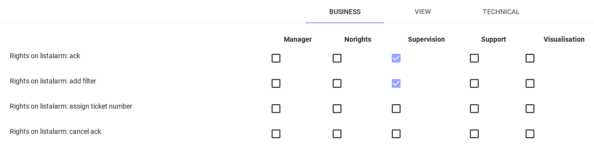
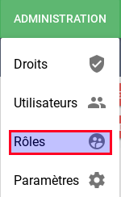
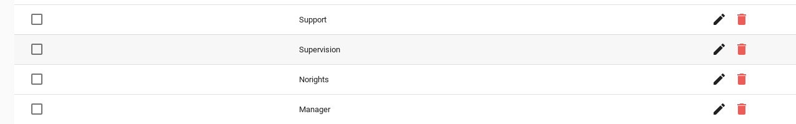
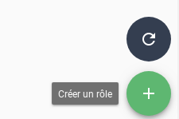
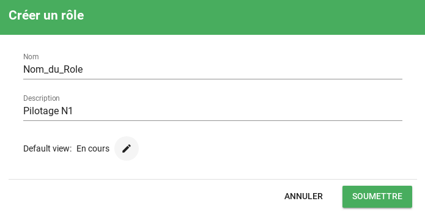

# Gestion des droits

## Introduction

Le système de droits de Canospis s'appuie sur 3 notions essentielles :

* L'Utilisateur
* Le Rôle
* Le Droit

Un rôle est constitué d'un ensemble de droits.  
Un Utilisateur est affecté à un rôle et hérite donc des droits de celui-ci.  

!!! Info
    Consultez le [système d'authentification](../administration-avancee/authentification/) pour plus d'informations concernant les utilisateurs.

Les droits sont regroupés en différentes catégories et sont également typés.  

| Catégorie         | Description                                                  |
| ----------------- | ------------------------------------------------------------ |
| Métier            | Il s'agit des droits liés à l'hypervision elle-même.  Actions de pilotage (ACK, Comportements périodiques, Filtres, etc.) |
| Vues utilisateurs | Il s'agit de la gestion des accès aux vues utilisateurs      |
| Technique         | Il s'agit de la gestion des droits liés à l'administration de certaines fonctions (Comportements périodiques, filtrage/enrichissement, etc.) à l'outil Canopsis lui-même |

| Type    | Description                                                  |
| ------- | ------------------------------------------------------------ |
| Default | Le type par défaut permet d'activer ou non une fonctionnalité/action (droit d'acquitter, de créer un filtre, etc.) |
| CRUD    | Ce type s'applique sur des objets pour lesquels il y a une édition possible (vues notamment) |

Enfin, l'affectation de *droits* à un *rôle* s'effectue au moyen d'une matrice depuis l'interface graphique.

## Interface graphique

L'interface graphique vous permet d'agir sur les notions d'utilisateurs, de rôles, de droits, et d'assignation.

!!! Note
    Sachez que les rôles et assignations de droits peuvent être provisionnés de manière automatique.

### Rôles

Pour gérer les rôles, une vue d'administration est dédiée.

Vous obtenez par défaut la liste des rôles existants sur votre outil.

A ce stade vous avez accès aux opérations de création, édition, suppression de rôles.

Pour créer un rôle 

puis saisissez les informations relatives à ce profil dont la vue par défaut des utilisateurs qui hériteront de celui-ci.

### Utilisateurs

### Droits

### Matrice des droits
Ici une explication de la partie affectation des droits de manière générale.

## Droits

Il s'agit ici de lister sous forme de tableau les droits existants et leur impact sur Canopsis

### Métier

Selon vous, quel pivot je dois prévoir ? 

* Par widget ?
* Par fonction ?
* Listing d'actions simple ?

**Alarmes**
**Météo**

**Cas particulier des catégories de liens**

### Vues
Ici ca parait assez intuitif.
D'ailleurs on appelle cela *view* et je pense qu'on devrait préciser *User views* car dans l'onglet technical on a aussi des vues mais techniques cette fois-ci.  
Vos avis ?

### Technique

Pareil que les vues mais avec une orientation admin
