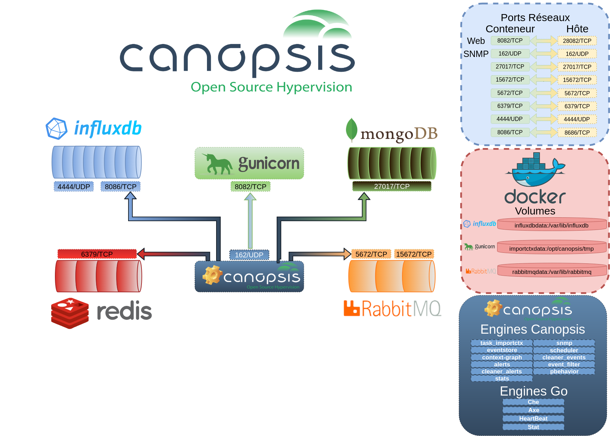

# Prérequis réseau et de sécurité pour l'installation de Canopsis

## Désactivation de SELinux

Les environnements SELinux ne sont pas pris en charge par Canopsis. Il est donc nécessaire de désactiver SELinux s'il est présent sur votre environnement.

Plus de détails dans [la documentation des différentes méthodes d'installation](index.md).

## Prérequis pare-feu (flux réseau)

Dans le cas où votre environnement nécessite l'ouverture explicite de ports sur un pare-feu, la matrice suivante vous permet de connaître les différents ports réseaux utilisés par une installation de Canopsis 3.

Pour plus de détails, consultez [le guide avancé de sécurité](../administration-avancee/configuration-parefeu-et-selinux.md).
