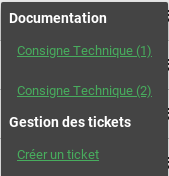
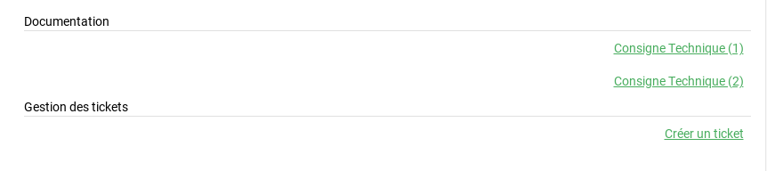
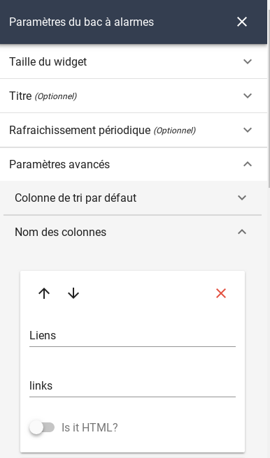
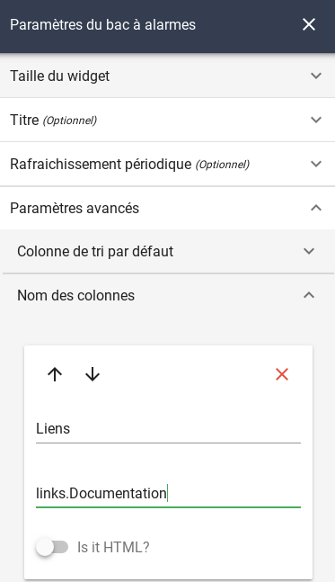
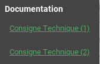
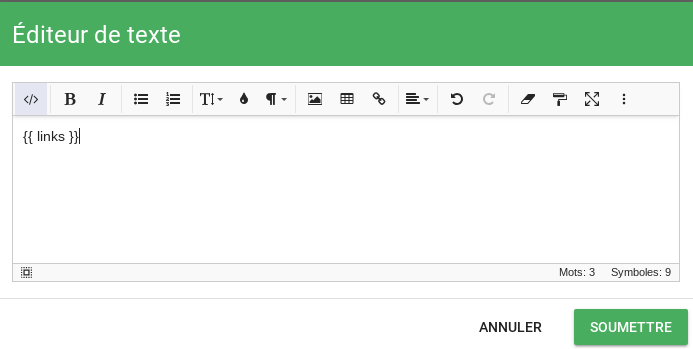
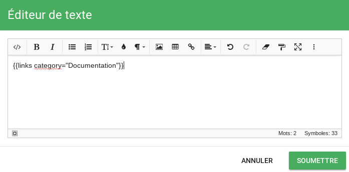
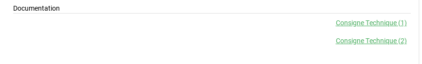

# Linkbuilder

## Objectif

L'objectif des linkbuilders est de mettre à disposition des liens hypertextes sur l'interface graphique Canopsis.  
Ces liens peuvent être visibles sur un bac à alarmes, une météo de services notamment.

Sur un bac à alarmes, les liens sont visibles de cette manière :



Sur une météo de services, les liens sont visibles de cette manière :




### Basic alarm link builder

La classe `basic_alarm_link_builder` permet de générer des liens avec des paramètres qui peuvent provenir soit :

* de l'alarme
* de l'entité sur laquelle porte l'alarme

Par exemple vous pouvez demander la génération d'un lien dont un paramètre est le nom du composant de l'alarme.  
La configuration de l'URL est dans ce cas :  
**http://uneurl.local/?composant={alarm.v.component}**

La variable **{alarm.v.component}** sera remplacée par le composant impacté par l'alarme.  
Vous avez également la possibilité d'utiliser une varibale en provenance de l'entité impactée par l'alarme.  

L'URL pourrait être de la forme :  
**http://uneurl.local/?composant={alarm.v.component}&environnement={infos.env.value}**

!!! Note
    Notez que les variables attachées à l'alarme sont préfixées avec *alarm* tandis que les variables attachées à l'entité ne le sont pas.

Pour aboutir à ce résultat, une configuration doit être insérée via l'API *associativetable*.

Voici la configuration adéquate pour l'exemple précédent.

```json
{
    "basic_alarm_link_builder" : {
        "base_url" : "http://uneurl.local/?composant={alarm.v.component}&environnement={infos.env.value}",
        "category" : "Consignes",
        "label" : "Procédure"
    }
}
```

* L'attribut **base_url** contient l'URL avec les variables souhaitée.  
* L'attribut **category** va permettre de regrouper des URLs entre elles
* L'attribut **label** permet de donner un nom au lien généré.


### Mise en œuvre backend

La configuration préalablement établie doit être postée sur l'API de Canopsis.

**Envoi de la configuration :**

```sh
curl -H "Content-Type: application/json" -X POST -d @basic_link_builder.json http://user:mdp@IP_Canopsis:Port_Canopsis/api/v2/associativetable/link_builders_settings
```

Si une configuration existe déjà en base, remplacez `POST` par `PUT`.

Notez qu'un redémarrage du moteur `webserver` est nécessaire.

!!! Warning
    Les liens sont générés à la volée et ne sont en aucun cas stockés. 

### Visualisation frontend

Les liens sont mis à disposition de l'inteface par l'intermédiaire du helper *links*.  
Il peut être appelé dans un bac à alarmes ou dans une météo de services.  


**Bac à alarmes**

Dans les paramètres du widget, vous devez ajouter une colonne *links*.  



Le fait d'utiliser *links* affcihera l'ensemble des liens disponibles regroupés par catégorie.  


Vous pouvez également ne demander l'affichage que d'une catégorie en la nommant.  



Le résultat :



**Météo des services**

Dans la météo des services, vous devez modifier vos templates et utiliser le helper *links*.  
Voici un exemple pour le template d'entité.  



Le fait d'utiliser *links* affcihera l'ensemble des liens disponibles regroupés par catégorie.  


Vous pouvez également ne demander l'affichage que d'une catégorie en la nommant.  



Le résultat :




