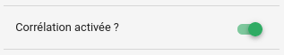
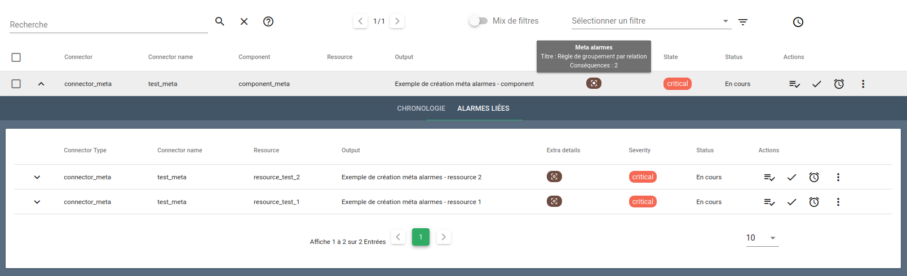
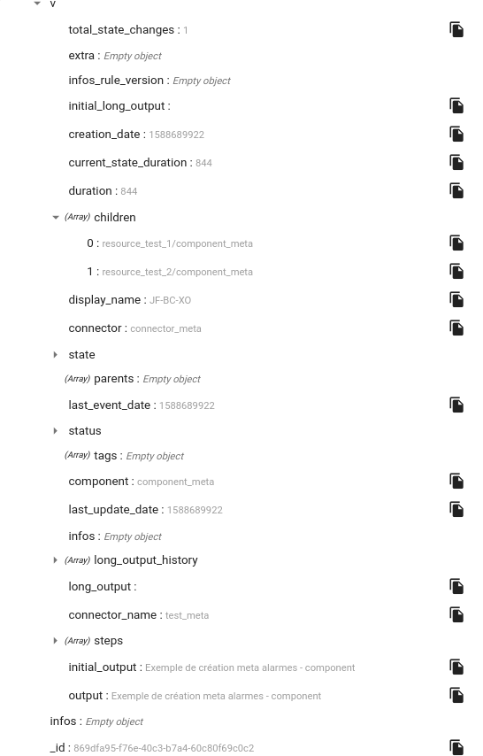

# Moteur `engine-correlation` (Go, Cat)

!!! note
    Ce moteur est disponible à partir de Canopsis 3.40.0.

Le moteur `engine-correlation` permet de créer des méta alarmes à partir de `règles de gestion`. Ces règles peuvent être ajoutées via l'[API méta alarmes](../../guide-developpement/api/api-v2-meta-alarm-rule.md).

Des exemples pratiques d'utilisation de la corrélation sont disponibles dans la partie [Exemples](#exemples).

## Utilisation


### Options du moteur

La commande `engine-correlation -help` liste toutes les options acceptées par le moteur.

```
  -consumeQueue string
    	Consume events from this queue. (default "Engine_correlation")
  -d	debug
  -printEventOnError
    	Print event on processing error
  -publishQueue string
    	Publish event to this queue. (default "Engine_watcher")
  -version
    	version infos
```

### Multi-instanciation

!!! note
    Cette fonctionnalité sera disponible à partir de Canopsis 3.42.0. Elle ne doit pas être utilisée sur les versions antérieures.

Il est possible, à partir de **Canopsis 3.42.0**, de lancer plusieurs instances du moteur `engine-correlation`, afin d'améliorer sa performance de traitement et sa résilience.

En environnement Docker, il vous suffit par exemple de lancer Docker Compose avec `docker-compose up -d --scale correlation=2` pour que le moteur `engine-correlation` soit lancé avec 2 instances.

Cette fonctionnalité sera aussi disponible en installation par paquets lors d'une prochaine mise à jour.

## Fonctionnement

Tous les événements qui circulent dans Canopsis sont transmis à la file `Engine_correlation` et seront donc lus par le moteur `engine-correlation`.

Le moteur va alors vérifier si une règle de corrélation doit s'appliquer et si c'est le cas, il générera ou modifiera une méta alarme.

Une méta alarme permet de grouper dynamiquement des alarmes selon des critères définis dans une règle.

Ces groupements d'alarmes permettent de visualiser rapidement les corrélations entre les différentes alarmes présentes dans le [bac à alarmes](../../guide-utilisation/interface/widgets/bac-a-alarmes/index.md).

### Activation de la corrélation

Passez votre bac à alarmes en mode édition (`CTRL + E`) pour accéder aux paramètres avancés et activez la corrélation.



Sauvegardez les changements et désactivez le mode édition.

### Types de groupements

Il existe plusieurs types de groupements pour corréler vos alarmes.

#### Groupement par relation parent-enfant

Il permet de regrouper les alarmes qui ont un lien de parenté. Par exemple, si un composant a provoqué une alarme, toutes les alarmes des ressources ayant le même composant seront regroupées dans une même méta alarme.

Exemple :
```json
{
  "name": "Règle de groupement par relation",
  "type": "relation"
}
```
Cette règle s'applique à toutes les entités.

#### Groupement par intervalle de temps

Ce type de méta alarme regroupe toutes les alarmes survenues dans un intervalle de temps donné. Par exemple toutes les alarmes apparues au cours de la même minute (à partir de la création de la première alarme) seront regroupées sous une même méta alarme.

Exemple :
```json
{
  "name": "Règle de groupement par intervalle de temps",
  "type": "timebased",
  "config": {
    "time_interval": 60
  }
}
```

#### Groupement par attribut

Ce type de groupement utilise les mêmes [patterns](moteur-che-event_filter.md#patterns) que les autres moteurs pour identifier un attribut dans l'évènement, dans l'entité ou dans l'alarme. Par exemple si on utilise un `event_pattern` qui vaut `component = srv001`, toutes les alarmes créées à partir d'un évènement dont le composant est égal à srv001 seront regroupées dans une méta alarme.

Exemple :
```json
{
  "name": "Règle de groupement par attribut",
  "type": "attribute",
  "config": {
    "alarm_patterns": [
      {
        "v": {
          "component": "srv001"
        }
      }
    ]
  }
}
```

#### Groupement complexe

C'est une combinaison de groupement par attribut et de groupement par intervalle de temps, il possède aussi une notion de seuil de déclenchement. Par exemple on pourra l'utiliser pour regrouper toutes les alarmes créées pour une même entité durant un intervalle de temps donné, seulement si le nombre d'alarmes créées dépasse un certain seuil.

Exemple :
```json
{
  "name": "Règle de groupement complexe",
  "type": "complex",
  "config": {
    "time_interval": 60,
    "threshold_count": 3,
    "alarm_patterns": [
      {
        "v": {
          "resource": "check"
        }
      }
    ]
  }
}
```
Cette règle s'applique si 3 alarmes ou plus, dont la ressource vaut `check`, ont été créées durant un intervalle de temps de 60 secondes.

### Processus de création d'une méta alarme

En reprenant l'exemple d'un groupement par relation parent-enfant la création d'une méta alarme se déroule de la façon suivante.

Une erreur se produit sur un composant `component_meta` qui envoie un évènement à Canopsis.

```json
{
  "event_type": "check",
  "connector": "connector_meta",
  "connector_name": "test_meta",
  "component": "component_meta",
  "source_type": "component",
  "author": "Canopsis",
  "state": 3,
  "debug": true,
  "output": "Exemple de création méta alarmes - component"
}
```

Une alarme sur le composant est créée et visible dans le bac à alarmes.


Comme le composant est en erreur, ses ressources envoient probablement elles aussi des évènements qui vont conduire à la création d'alarmes.

```json
{
  "event_type": "check",
  "connector": "connector_meta",
  "connector_name": "test_meta",
  "component": "component_meta",
  "resource": "resource_test_X",
  "source_type": "resource",
  "author": "Canopsis",
  "state": 3,
  "debug": true,
  "output": "Exemple de création méta alarmes - ressource X"
}
```

Le moteur corrélation détecte la relation et l'alarme sur le composant devient alors une méta alarme. Les alarmes sur les ressources sont vues comme des conséquences du dysfonctionnement du composant et sont regroupées dans la méta alarme.

Dans l'interface cela se traduit de la façon suivante :



Au passage de la souris sur l'icône de la colonne `Extra Details` une info-bulle apparaît et indique le nom de la règle qui a créé la méta alarme et le nombre d'alarmes liées.

Le détail des alarmes liées peut-être consulté en déroulant le détail de la méta alarme et en affichant l'onglet `Alarmes Liées`.

Dans le cas ci-dessus (groupement par relation parent-enfant) c'est l'alarme parent qui devient la méta alarme. Ses valeurs de `connector`, `connector_name` et `component` sont alors conservées. Pour les autres types de groupement une méta alarme est générée par Canopsis, celle-ci aura toujours les valeurs suivantes :

- connector : `engine`
- connector_name : `correlation`
- component : `metaalarm`

### Variables d'une méta alarme

La méta alarme a été enrichie avec de nouvelles variables.


- `consequences` : contient le nombre d'alarmes liées ainsi que les données de ces alarmes dans un tableau `data`.

- `metaalarm` : la valeur 1 indique qu'il s'agit d'une méta alarme.

- `rule` : contient l'`id` et le `name` de la règle qui a déclenché la création de cette méta alarme.



- `v.children` : embarque les `id` des entités liées.

- `v.parents` : est présent dans les variables mais ne sera renseigné que pour les alarmes liées à la méta alarme.

### Exemples

Vous avez 5 composants sur le site de Wasquehal et vous souhaitez que les alarmes soient groupées si au moins 4 d'entre eux présentent un dysfonctionnement sur une période de 10 minutes.

Au préalable vous aurez pris soin de renseigner le site dans les `infos` des composants concernés.

La règle à utiliser dans ce cas sera la suivante :

```json
{
  "name": "Groupement dysfonctionnement global site Wasquehal",
  "type": "complex",
  "config": {
    "time_interval": 600,
    "threshold_count": 4,
    "entity_patterns": [
      {
        "infos": {
            "site": {
                "value": "Wasquehal"
            }
        }
      }
    ]
  }
}
```

### Cas d'usage

Pour d'autres exemples d'utilisation de la corrélation vous pouvez consulter la [cette page](../../guide-utilisation/cas-d-usage/groupement-alarmes.md).

## Collection MongoDB associée

Les entités sont stockées dans la collection MongoDB `meta_alarm_rules`.

```json
{
	"_id" : "73da1ad7-058e-46af-8442-7ea3f246eb68",
	"patterns" : null,
	"config" : null,
	"name" : "Relation-composant-ressource",
	"type" : "relation"
}
```
