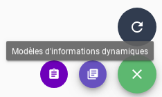
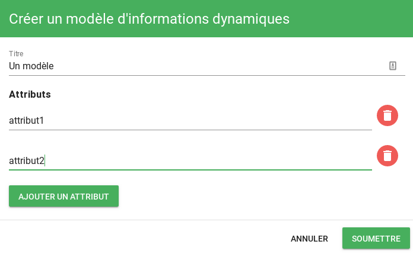

# Dynamic-infos

!!! info
    Disponible uniquement dans Canopsis CAT

!!! info
    Disponible à partir de Canopsis 3.34.0

Le moteur `dynamic-infos` permet d'ajouter des informations aux alarmes. Ces informations sont définies avec des règles indiquant dans quelles conditions une information doit être présente sur une alarme.

## Utilisation

Le moteur doit être placé en sortie du moteur [`watcher`](moteur-watcher.md).

Pour cela, il est nécessaire de lancer le moteur `watcher` avec l'option `-publishQueue Engine_dynamic_infos` pour qu'il publie dans la file du moteur `dynamic-infos`.

Si le moteur [`webhook`](moteur-webhook.md) est activé, le moteur `dynamic-infos` doit être lancé avec l'option `-publishQueue Engine_webhook` pour qu'il publie dans la file de ce moteur. Sinon, il publie dans la file du moteur [`action`](moteur-action.md).

### Options de l'engine-dynamic-infos

```
  -d	debug
  -printEventOnError
      Print event on processing error
  -publishQueue string
      Publish event to this queue. (default "Engine_action")
  -version
      version infos
```

## Fonctionnement

### Règles

Les règles sont définies dans la collection MongoDB `dynamic-infos`, et peuvent être ajoutées et modifiées avec l'[API Informations Dynamiques](../../guide-developpement/api/api-v2-dynamic-infos.md).

Une règle est représentée par un document JSON de la forme suivante :

```javascript
{
    // Un identifiant unique :
    "_id": "dynamic_infos_1",

    // Un nom et une description, qui sont affichés dans la vue d'exploitation :
    "name": "...",
    "description": "...",

    // Des patterns indiquant dans quelles conditions les informations doivent
    // être ajoutées, par exemple :
    "entity_patterns": [{
        "type": "resource",
    }],
    "alarm_patterns": [{
        "v": {
            "state": {
                "val": 3
            }
        }
    }],

    // une liste d'informations à ajouter, par exemple :
    "infos": [
        {"name": "type", "value": "url"},
        {"name": "url", "value": "http://help.local/zabbix-critical"}
    ]
}
```

Les informations définies dans `infos` sont ajoutées aux alarmes correspondant aux patterns `entity_patterns` et `alarm_patterns`, dans `v.infos.<rule_id>`. Par exemple, si la règle ci-dessus est définie, le champ `v.infos.dynamic_infos_1` des alarmes critiques sur des ressources contiendra :

```json
{
    "type": "url",
    "url": "http://help.local/zabbix-critical"
}
```

Ces informations seront présentes dans l'alarme tant qu'elle correspondra aux patterns `entity_patterns` et `alarm_patterns`. Dans l'exemple précédent, si une alarme passe d'un état critique à un état majeur, l'information `v.infos.dynamic_infos_1` est supprimée.


### Templates

!!! Info
    Disponible à partir de Canopsis 3.38.0

Les champs `value` sont personnalisables grâce aux templates. Les templates permettent de générer du texte en fonction de l'état de l'alarme ou de l'entité.  
Pour plus d'informations, vous pouvez consulter la [documentation sur les templates Golang](../architecture-interne/templates-golang.md).

Seules les fonctions suivantes sont disponibles dans les templates `dynamic-infos` :

* lowercase
* uppercase
* split
* trim


Un exemple concret d'utilisation du moteur `dynamic-infos` pour l'affichage de consignes techniques dans le bac à alarmes est disponible dans le [guide d'utilisation](../../guide-utilisation/cas-d-usage/affichage-de-consignes.md).

### Pré remplissage des attributs

!!! Info
    Disponible à partir de Canopsis 3.39.0

Lorsque vous devez saisir des règles d'informations dynamiques similaires, vous avez la possibilité de pré remplir les attributs de celles-ci pour n'avoir plus que la saisie des valeurs à effectuer.  

Pour cela, vous devez 

* Ajouter un `modèle` depuis l'interface graphique :  



* Appuyer sur le bouton `+` 


* Saisir un titre puis des attributs puis cliquer sur "Soumettre"



A ce stade, il vous reste à **instancier** le modèle avec vos valeurs


