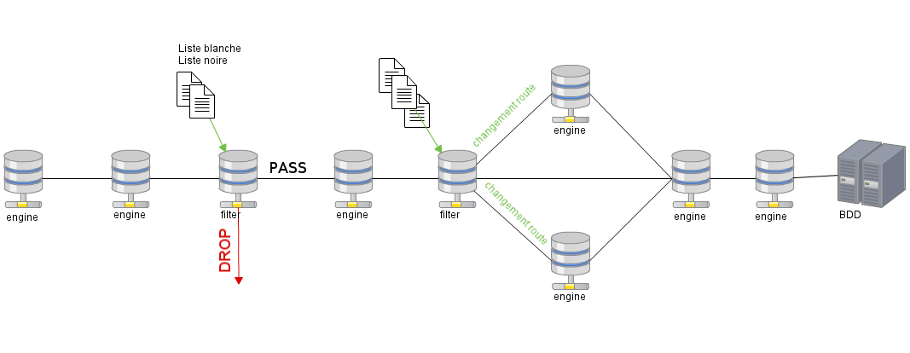

# Moteur event_filter

**TODO (DWU) :** ce moteur est un moteur programmable par les utilisateurs. Ça me paraît donc bon de garder cette doc ici.

Le moteur `event_filter` permet d'exécuter, sur des évènements, des actions prédéfinies par l'utilisateur.

Les filtres de moteurs peuvent être placés n'importe où dans la chaîne de traitement. Plusieurs filtres de moteurs fonctionnent en parallèle ou l'un après l'autre pour accélérer le traitement des événements.

Chaque instance de filtre charge un ensemble de règles à appliquer aux évènements qu'elle gère. Cet ensemble de règles peut être défini par l'utilisateur dans l'interface web.

L'utilisateur peut créer un filtre et déclarer des actions à appliquer à tout évènement correspondant à ce filtre.

## Actions

Les actions suivantes sont disponibles pour l'utilisateur :

*  `pass` (passer)
*  `drop` (laissez tomber)
*  `override` (passer outre)
*  `route` (router)
*  `remove` (retirer)

## Caractéristiques

Chaque règle peut contenir plusieurs actions et permet ainsi à l'utilisateur d'ajouter simultanément un champ, de modifier un champ et de modifier la destination d'un évènement. Tout cela selon un filtre défini par l'utilisateur.

Les règles sont enregistrées dans la base de données et peuvent être modifiées ou supprimées ultérieurement.   

Les fonctionnalités suivantes sont disponibles dans le moteur de filtrage.

### Listes blanches / listes noires

Actions de passe et de dépôt.

Selon un ensemble de règles, les évènements seront transférés au moteur suivant (liste blanche) ou « supprimés » de la chaîne de traitement (liste noire).

### Ajout, modification et suppression de champs

Actions de substitution et de suppression.

Les évènements peuvent avoir des champs :

*  ajoutés au moment de l'exécution (périmètre, domaine…) ;
*  modifiés (statut, criticité…) ;
*  ou supprimés (champs entiers, balise simple, perfdata…).

### Itinérance

Itinéraire de l'évènement vers d'autres moteurs.

Les évènements peuvent être envoyés à un moteur différent de celui défini par défaut dans les fichiers de configuration de Canopsis.

Cette action permet à l'utilisateur d'avoir un contrôle complet sur la chaîne de traitement et d'éviter l'envoi d'évènements dans des moteurs qui n'interagissent pas avec eux.

## Représentation
   
Ci-dessous est un schéma simple d'une chaîne de traitement de base.    

