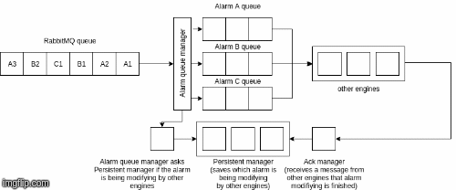
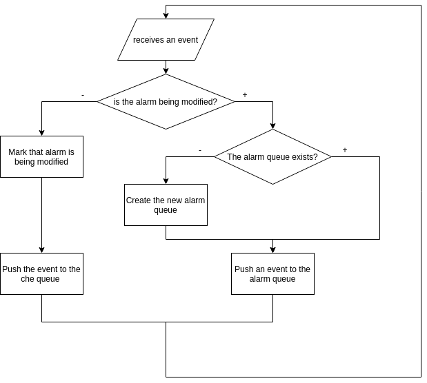
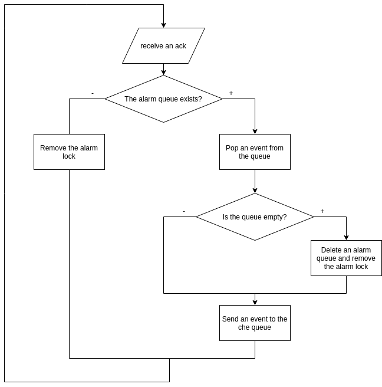

# Moteur `engine-fifo` (Go, Core)

!!! note
    Ce moteur est disponible à partir de Canopsis 3.39.0.

La possibilité de pouvoir démarrer plusieurs instances des moteurs [`engine-che`](moteur-che.md), [`engine-axe`](moteur-axe.md) et [`engine-correlation`](moteur-correlation.md) amène une problématique d'ordre de traitement des [événements](../../../guide-utilisation/vocabulaire/#evenement). Le moteur `engine-fifo` permet de répondre à cette problématique en conservant l'ordre des événements entrants.

## Utilisation

### Options du moteur

La commande `engine-fifo --help` liste toutes les options acceptées par le moteur.

```
  -consumeQueue string
    	Consume events from this queue. (default "Engine_fifo")
  -d	debug
  -enableMetaAlarmProcessing
    	Enable meta-alarm processing (default true)
  -lockTtl int
    	Redis lock ttl time in seconds (default 10)
  -printEventOnError
    	Print event on processing error
  -publishQueue string
    	Publish event to this queue. (default "Engine_che")
  -version
    	version infos
```

## Fonctionnement

A l'arrivée d'un événement le moteur `engine-fifo` en extrait l'entité. Il y a ensuite 2 cas de figure possibles :

**1. Il n'existe pas d'événement concernant cette même entité.**  
Dans ce cas, le moteur `engine-fifo` transmet l'événement directement au moteur `engine-che`.  

**2. Il existe déjà un événement pour cette même entité.**  
Dans ce cas, le moteur créé une file d'attente temporaire dans RabbitMQ et stocke l'événement dans cette file. A la fin de la chaîne de traitement les autres moteurs déposent un acquittement dans un `ack manager` géré par le moteur `engine-fifo`. Si cet acquittement concerne l'entité de l'événement stocké dans la file temporaire, celui-ci est libéré et transmis au moteur `engine-che`.

Dans les 2 cas, le moteur créé un verrou concernant l'entité en cours de traitement et le stocke dans Redis. C'est ce verrou qui lui permettra de savoir si un événement existe déjà pour cette entité. Le verrou est supprimé lors de la réception d'un acquittement ou après un certain délai. Ce délai est de 10 secondes par défaut et peut être configuré au moyen de l'option `-lockTtl` du moteur.

## Haute-disponibilité

Étant donné que ce moteur est le premier dans chaîne de traitement des événements il est nécessaire de pouvoir s'assurer qu'il est toujours disponible. Il est donc possible de démarrer 2 instances en parallèle. La première instance stocke un jeton dans Redis et effectue les tâches décrites ci-dessus. Le moteur [`engine-heartbeat`](moteur-heartbeat.md) vérifie périodiquement la présence du jeton dans Redis. Si celui-ci est absent la deuxième instance du moteur prend le relai.

### Exemple :

logs des moteurs lors de la bascule

Si vous souhaitez obtenir des informations plus techniques sur le fonctionnement de ce moteur vous pouvez consulter la section ci-dessous.

## Fonctionnement détaillé






