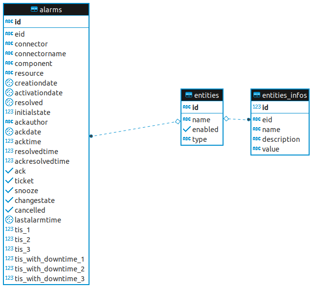

# KPI

!!! attention
    Ce moteur n'est disponible que dans l'édition CAT de Canopsis.

Le moteur `kpi` permet de synchroniser vers une base de donnée Postgresql des données utiles afin de réaliser des statistiques.


## Pré-requis

### Système

- disposer du paquet python-dev
- disposer du paquet libpq-dev

### Base de donnée

- disposer d'un serveur Postgresql > 9.6 sur le host correspondant à la configuration du moteur

  - Défaut
    - host : localhost

- disposer d'une base de donnée avec un user associé et correspondant à la configuration du moteur

  - Défaut

    - base de donnée : `canopsis`
    - user : `canopsis`
    - password : `canopsis`

  - Exemple

    ```
    CREATE DATABASE canopsis;
    CREATE USER canopsis WITH PASSWORD 'canopsis';
    GRANT ALL PRIVILEGES ON DATABASE canopsis to canopsis;
    ```

### Canopsis

- Ajouter le moteur au fichier de relation `moteurs -> queues `

  ```shell
  $ echo "" >> /opt/canopsis/etc/amqp2engines.conf
  $ echo "[engine:kpi]" >> /opt/canopsis/etc/amqp2engines.conf
  $ echo "beat_interval=3600" >> /opt/canopsis/etc/amqp2engines.conf
  ```

  

### Démarrage du moteur

```shell
$ systemctl start canopsis-engine@kpi-kpi.service
```

## Schéma base de donnée



## Exemple de requête

### Liste des entités avec le temps passé par état

```plsql
select e.id, e.name, step_with_duration.value as state, SUM(step_with_duration.duration)
from entities e
left join alarms a on (a.eid=e.id)
left join
(
select s.id, s.aid, s.type, s.author, s.messages, s.value, s.date as dt, MIN(nt.date) as next_dt, MIN(nt.date)-s.date as duration
from steps s
left join steps nt on (nt.aid = s.aid and nt.id > s.id and nt.type IN('stateinc', 'statedec') )
where s.type IN('stateinc', 'statedec')
group by s.id
order by s.id asc
) step_with_duration on (step_with_duration.aid = a.id)
group by e.id, e.name, step_with_duration.value
order by e.name ASC
```

### Liste des entités avec le temps passé par état + le temps passé en downtime

```plsql
select e.id, e.name, step_with_duration.value as state, SUM(step_with_duration.duration) as duration, SUM(step_with_duration.downtime_duration) as downtime_duration
from entities e
left join alarms a on (a.eid=e.id)
left join
(
select s.id, s.aid, s.value, s.startdate, s.enddate, s.duration, sum((case when d.id is not null then least(s.enddate, d.enddate) - greatest(s.startdate, d.startdate) else null end)) as downtime_duration
from (
select s.id, s.aid, s.value, s.date as startdate, MIN(nt.date) as enddate, MIN(nt.date)-s.date as duration
from steps s
left join steps nt on (nt.aid = s.aid and nt.id > s.id and nt.type IN('stateinc', 'statedec') )
where s.type IN('stateinc', 'statedec')
group by s.id
order by s.id asc
) s
left join entities_downtimes d on (s.startdate<=d.enddate and s.enddate>=d.startdate)
group by s.id, s.aid, s.value, s.startdate, s.enddate, s.duration
) step_with_duration on (step_with_duration.aid = a.id)
group by e.id, e.name, step_with_duration.value
order by e.name ASC
```

