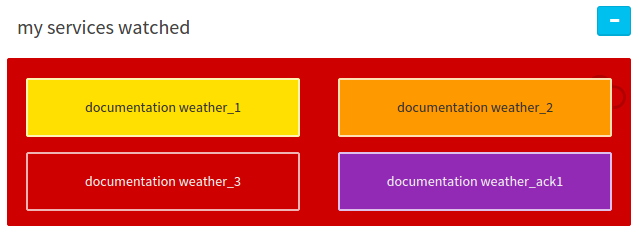
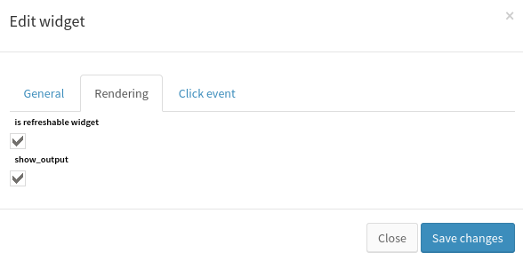
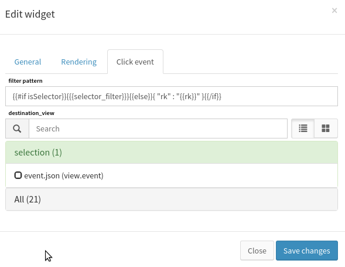

# Weather / Météo des services

**TODO (DWU) :** UIv2.

Le widget météo permet d'afficher l'état de l'évènement de manière esthétique.

Il est conçu pour obtenir un aperçu rapide des composants et des ressources.

## Créer une météo dans une vue

L'insertion d'un widget météo dans Canopsis nécessite des droits de gestion. Veuillez vous référer à la gestion des droits de Canopsis pour en savoir plus sur ce sujet (**TODO :** lien).

Tout d'abord, choisissez une vue où la météo des services sera insérée. Une fois terminé, passez en mode édition de widgets, choisissez la météo dans la liste et cliquez dessus. Le formulaire spécifique pour la météo est affiché et permet de saisir cette configuration de widget.

Il n'y a aucune information requise à remplir pour la météo. Cependant, ce widget nécessite des entrées pour afficher des informations lors du rendu. Voyons comment configurer une météo.

## Configuration générale du widget météo

La configuration principale du widget météo est constituée des paramètres suivants :

La météo configurée avec les informations ci-dessus sera rendue comme suit :

Nous avons d’abord donné un titre météo qui est affiché directement dans le rendu. Ensuite, nous avons choisi d’actualiser le widget toutes les minutes. Cela déclenchera l'actualisation de l'interface utilisateur avec les informations d'évènements à jour.

Le sélecteur d'évènements du formulaire permet de sélectionner les évènements à surveiller dans la base de données. Ces évènements peuvent être :
*  des évènements normaux ;
*  des événements de sélection ;
*  ou des évènements de topologie.

Le statuts de ces évènements sera affiché dans le rendu. Le rendu affiche tous les évènements sélectionnés avec des couleurs spécifiques. Le jeu de couleurs dépend de l'état de l'évènement, comme suit :
*  vert : **éteint** ;
*  jaune : **mineur** ;
*  orange : **majeur** ;
*  rouge : **critique** ;
*  violet : **reconnu**.

## Configuration du rendu

Dans ce panneau de configuration, « *is refreshable widget* » permet de choisir si le widget sera actualisé ou non dans le temps.

Lorsque cette case n'est pas cochée, le widget est actualisé uniquement lors du rendu (lorsque l'utilisateur demande l'affichage de la vue contenant la météo).

L'option « *show output* » permet de choisir si la sortie d'événement sera affichée lorsque la météo affiche un seul événement.

## Configuration de l'évènement au clic

Cette configuration permet une interaction avec la météo, chaque évènement représenté pouvant être cliqué, il redirige l'utilisateur vers l'évènement correspondant dans la vue sélectionnée avec le filtre généré.

L'option « *Filter pattern* » est une représentation d'un modèle du filtre utilisé lorsque l'utilisateur est redirigé vers la vue sélectionnée.

« *Destination view* » est la vue où le clic mène l'utilisateur avec le filtre personnalisé.