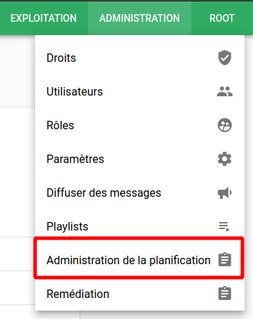
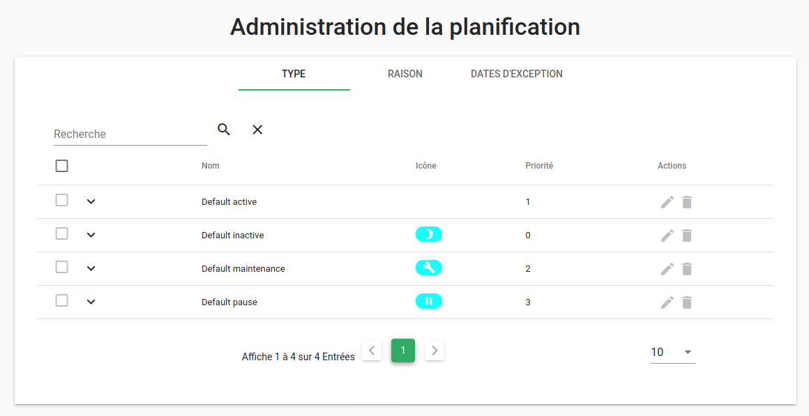
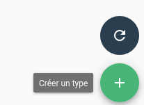
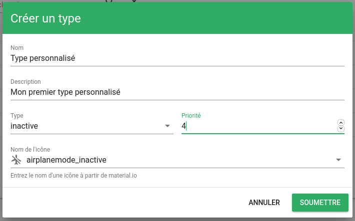
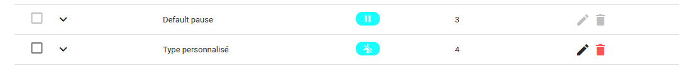
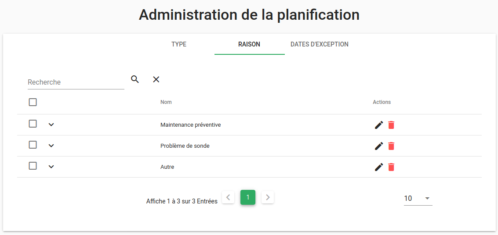
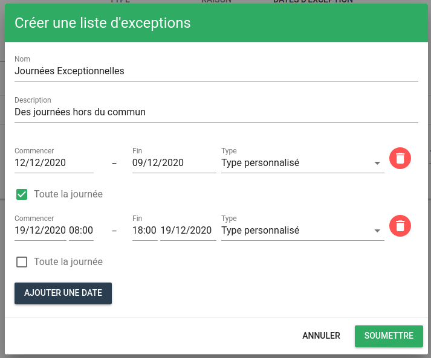

# Moteur `pbehavior` (Go, Core)

Les comportements périodiques (*pbehaviors*, pour *periodical behaviors*) sont des évènements de calendrier récurrents qui permettent de mettre en pause la surveillance d'une alarme pendant une période donnée (pour des maintenances ou des astreintes, par exemple).

Ils permettent de créer des « downtimes » et donc d'indiquer qu'une entité est en pause.

Les comportements sont définis dans la collection MongoDB `default_pbehavior`, et peuvent être ajoutés et modifiés avec l'[API PBehavior](../../guide-developpement/api/api-v2-pbehavior.md).

## Utilisation

### Options du moteur

La commande `engine-pbehavior -help` liste toutes les options acceptées par le moteur.

## Fonctionnement

Ce moteur doit toujours être présent. A partir de la v4 de Canopsis ce moteur est désormais écrit en langage Go.

Un comportement périodique est caractérisé par un type et une raison (voir ci-dessous). Il contient également un filtre (`filter`) qui est appliqué sur une entité.

A partir de la v4 de Canopsis, les comportements périodiques existants sont appliqués immédiatement sur les nouvelles alarmes. De la même façon, les comportements périodiques nouvellement créés sont appliqués immédiatement sur les alarmes existantes.

Ensuite, chaque minute, le moteur calcule les comportements périodiques et leur application sur les entités.

## Administration de la planification

La version 4 de Canopsis introduit une nouvelle interface dédiée à l'administration de la planification des comportements périodiques.

### Configuration des types de comportements périodiques

Rendez vous dans le menu Administration puis dans Administration de la planification.



Les types par défaut s'affichent à l'écran : `actif`, `inactif`, `maintenance` et `pause`. Ils ne peuvent être ni supprimés, ni modifiés. La priorité des types est gérée dans l'ordre croissant, c'est à dire, 0 est la priorité la plus faible et 3 est la plus forte et sera traitée avant les autres. Un seul type de comportement périodique peut être actif sur une entité à un moment donné.



### Création d'un type personnalisé

Cliquez sur le bouton `+` en bas à droite de la fenêtre pour ouvrir la fenêtre de création.



Renseignez les différents champs, choisissez un type parmi la liste et affectez lui une priorité et une icône.



Cliquez sur le bouton Soumettre et votre type personnalisé apparaît dans la liste.



### Configuration des raisons

Cliquez sur l'onglet Raison. Par défaut, la liste des raisons est vide. Comme pour les types vous pouvez cliquer sur le bouton `+` pour créer une nouvelle raison. Chaque raison doit avoir un nom et une description.

Voici, par exemple, une liste de raisons personnalisées :



## Configuration des dates d'exception

Il est également possible de configurer des dates d'exceptions dans l'onglet dédié. Pour cela cliquez de nouveau sur le bouton `+` pour créer une liste d'exceptions.

Vous pourrez alors renseigner un nom, une description et ajouter des dates dans la liste. A chaque date vous pourrez associer un des types existant.



## Définition d'un comportement périodique

Un comportement périodique se caractérise par les informations suivantes.

|   Champ    |  Type  |                                             Description                                              |     |
| ---------- | ------ | ---------------------------------------------------------------------------------------------------- | --- |
|   `_id`    | string |                   Identifiant unique du comportement, généré par MongoDB lui-même.                   |     |
|   `eids`   | liste  |                  Liste d'identifiants d'entité qui correspond au filtre précédent.                   |     |
|   `name`   | string |       Type de comportement périodique. `downtime` est la seule valeur acceptée.                      |     |
|  `author`  | string |              Auteur ou application ayant créé le comportement périodique.                            |     |
| `enabled`  |  bool  |    Activer ou désactiver le pbehavior, pour qu’il puisse être ignoré, même sur une plage active.     |     |
| `comments` | liste  |                                 `null` ou une liste de commentaires.                                 |     |
|  `rrule`   | string | Règle de récurrence, champ texte [défini par la RFC 2445](https://www.kanzaki.com/docs/ical/recur.html).  |   |
|  `tstart`  |  int   | Timestamp fournissant la date de départ, recalculée à partir de la `rrule` si présente.              |     |
|  `tstop`   |  int   |  Timestamp fournissant la date de fin, recalculée à partir de la `rrule` si présente.                |     |
|  `type_`   | string |             Optionnel. Type de comportement périodique (pause, maintenance…).                        |     |
|  `reason`  | string |                       Optionnel. Raison pour laquelle ce comportement périodique a été posé.         |     |
| `timezone` | string |                       Fuseau horaire dans lequel le comportement périodique doit s'exécuter.         |     |
|  `exdate`  | array  |                     La liste des occurrences à ignorer sous forme de timestamps                      |     |

Un exemple d'évènement `pbehavior` brut :
```js
{
   "_id" : string,
   "name" : string,
   "filter" : string,
   "comments" : [ {
       "_id": string,
       "author": string,
       "ts": timestamp,
       "message": string
   } ],
   "tstart" : timestamp,
   "tstop" : timestamp,
   "rrule" : string,
   "enabled" : boolean,
   "eids" : [ ],
   "connector" : string,
   "connector_name" : string,
   "author" : string,
   "timezone" : string,
   "exdate" : [
      timestamp
   ]
}
```

### Filtrage d'entités (`filter`)

Le champ `filter` permet de filtrer les entités sur lesquelles le comportement périodique est appliqué.

Il peut prendre en charge les conditions `or` et `and` mais nécessite de les échapper.

Exemple :

```json
{
	"author": "root",
	"name": "Pbehavior test 2",
	"tstart": 1567439123,
	"tstop": 1569599100,
	"filter": {
		"$or": [{
			"impact": {
				"$in": ["pbehavior_test_1"]
			}
		}, {
			"$and": [{
				"type": "component"
			}, {
				"name": "pbehavior_test_1"
			}]
		}]
	},
	"type_": "Hors plage horaire de surveillance",
	"reason": "Problème d'habilitation",
	"rrule": null,
	"comments": [],
	"exdate": []
}
```

C'est un filtre appliqué directement sur les champs des entités contenues dans la collection `default_entities` de MongoDB.

### Règles de récurrence (`rrule`)

C'est une règle de récurrence du comportement périodique.

Dans le cas où la `rrule` est absente, `tstart` et `tstop` font office de plage d’activation, sans récurrence.

Dans le cas où la `rrule` est présente, `tstart` et `tstop` seront recalculés afin de refléter la récurrence.

### Dates d'exclusion (`exdate`)

Il est possible d'empêcher l'exécution d'une occurrence d'un comportement périodique, à l'aide du champ `exdate`.

`exdate` est une liste de timestamps correspondant au début d'une occurrence à empêcher.

### Raison (`reason`)

Ce champ permet de préciser librement la raison qui motive la création de ce comportement périodique.

En revanche, lors de la création d'un comportement périodique par l'interface graphique, une liste de raisons prédéfinies est proposée à l'utilisateur.

Pour personnaliser cette liste vous devez insérer une configuration via l'API `associativetable`. Elle est stockée dans la collection `default_associativetable` de MongoDB. Par exemple :

```sh
curl -X POST -u root:root -H "Content-Type: application/json" -d '{
    "reasons" :
    [
        "Problème de sonde",
        "Problème de consigne",
        "Maintenance préventive",
        "Changement",
        "Période de congés",
        "Autre"
    ]
}' 'http://localhost:8082/api/v2/associativetable/pbehavior-reasons'
```

Si une configuration existe déjà en base, remplacez `POST` par `PUT`.

### Fuseau horaire (`timezone`)

L'exécution de chaque comportement périodique se fait dans un fuseau horaire particulier.

Lorsqu'un comportement périodique ne contient pas de champ `timezone`, le fuseau utilisé sera celui défini dans le fichier `/opt/canopsis/etc/pbehavior/manager.conf` sous le champ `default_timezone`.

Si le fichier de configuration n'existe pas ou si le champ `default_timezone` n'existe pas, le fuseau `Europe/Paris` sera utilisé.

Si le fuseau horaire choisi comporte des heures d'hiver et d'été, celles-ci seront respectées tout au long de l'année. Ainsi, un comportement périodique devant se déclencher à 16 heures s'exécutera à 16 heures en heure d'été et à 16 heures en heure d'hiver.

## Collection MongoDB associée

Les comportements périodiques sont stockés dans la collection MongoDB `default_pbehavior` (voir [API PBehavior](../../guide-developpement/api/api-v2-pbehavior.md)).

Un exemple de comportement périodique appliqué pour une plage de maintenance sans `rrule` avec la raison `Problème d'habilitation` et le type `Maintenance` aux alarmes dont le composant est `pbehavior_test_1`.

```json
{
    "_id" : "145331d4-d536-4c58-8e6d-229d5d8f3f10",
    "filter" : "{\"$or\": [{\"impact\": {\"$in\": [\"pbehavior_test_1\"]}}, {\"$and\": [{\"type\": \"component\"}, {\"name\": \"pbehavior_test_1\"}]}]}",
    "name" : "Pbehavior test 2",
    "author" : "root",
    "enabled" : true,
    "type_" : "Hors plage horaire de surveillance",
    "comments" : [],
    "connector" : "canopsis",
    "reason" : "Problème d'habilitation",
    "connector_name" : "canopsis",
    "eids" : [
        "pbehavior_test_1",
        "disk2/pbehavior_test_1"
    ],
    "tstart" : 1567439123,
    "tstop" : 1569599100,
    "timezone" : "Europe/Paris",
    "exdate" : [],
    "rrule" : null
}
```
