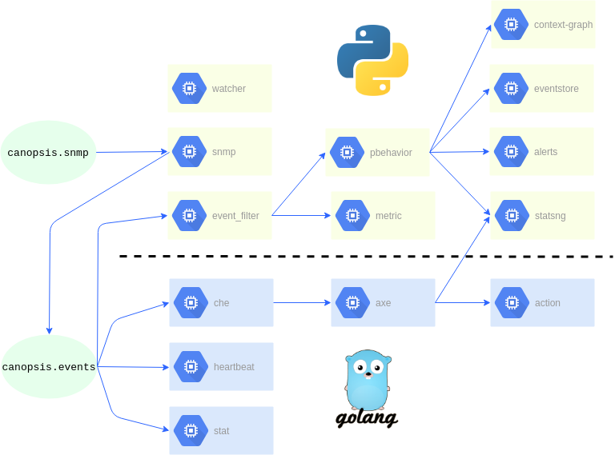

# Enchainement des moteurs

## Python

L'enchainement des moteurs Python de Canopsis se configure dans le fichier `/opt/canopsis/etc/amqp2engines.conf`.

De façon générique sur une stack Python, on aura :
```ini
[engine:nom_du_moteur]
event_processing = canopsis.[nom_du_moteur].process.event_processing
beat_processing = canopsis.[nom_du_moteur].process.beat_processing
next = [moteur_suivant],[moteur_suivant2]
```

Dans le fichier `amqp2engines.conf` il y a `event.processing` et `beat.processing` : le premier permet de lire les évènements, le second permet de configurer leur traitement périodique.

## Go

L'enchainement des moteurs Go de Canopsis se configure à leur lancement via l'option `-publishQueue`.

Dans le cadre d'un déploiement d'une stack Go, il faut modifier l'option du `engine-che` qui, par défaut, publie dans `Engine_event_filter`.

À la place, il faut le faire publier dans la file du moteur Axe.

### Paquets

Pour une installation Paquets, exécuter les commandes suivantes :

Créer du fichier de configuration de l'Engine Che

```sh
mkdir -p /etc/systemd/system/canopsis-engine-go@engine-che.service.d/
echo "[Service]" > /etc/systemd/system/canopsis-engine-go@engine-che.service.d/override.conf
echo "ExecStart=" >> /etc/systemd/system/canopsis-engine-go@engine-che.service.d/override.conf
echo "ExecStart=/usr/bin/env /opt/canopsis/bin/%i -publishQueue Engine_axe" >> /etc/systemd/system/canopsis-engine-go@engine-che.service.d/override.conf
```

Recharger systemd pour prendre en compte la modification.
```shell
systemctl daemon-reload
```
Terminer en redémarrant le moteur.
```shell
systemctl restart canopsis-engine-go@engine-che
```
Et vérifier son nouveau statut :
```shell
systemctl status canopsis-engine-go@engine-che
```

### Docker

Pour une installation Docker, modifier le service `Che` du docker-compose :

```yaml
  che:
    image: canopsis/engine-che:${CANOPSIS_IMAGE_TAG}
    env_file:
      - compose.env
    restart: unless-stopped
    command: /engine-che -d
```

Ajouter la commande ` -publishQueue Engine_axe` :

```yaml
  che:
    image: canopsis/engine-che:${CANOPSIS_IMAGE_TAG}
    env_file:
      - compose.env
    restart: unless-stopped
    command: /engine-che -d -publishQueue Engine_axe
```

Redémarrer le moteur `Che` pour lui faire prendre en compte la modification.

```sh
docker-compose up -d che
```

## Interactions avec les bases de données

Tous les moteurs peuvent communiquer avec MongoDB et InfluxDB.

Les moteurs `Action` et `Heartbeat` peuvent communiquer avec Redis.

## Représentation

Lorsqu'un évènement entre dans le processus de traitement, il passe par la première vague de moteurs qui vont traiter et renvoyer l'information vers une seconde série de moteurs et ainsi de suite.

Le schéma suivant représente un *exemple* de configuration d'enchaînement de moteurs dans Canopsis.



Le détail du rôle des différents moteurs est dans [la liste des moteurs](index.md#liste-des-moteurs).
