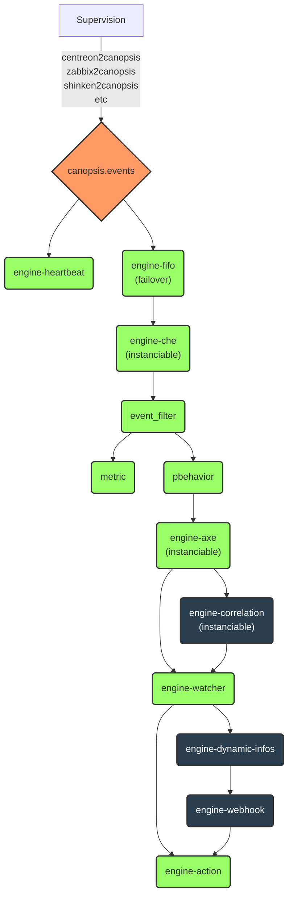
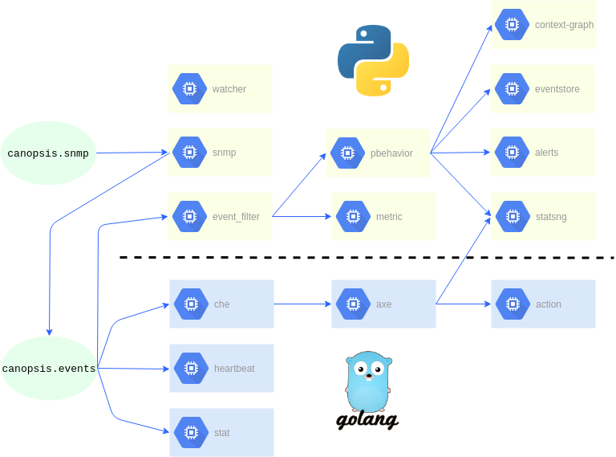

# Enchaînement des moteurs Canopsis

## Enchaînement des moteurs Go

L'enchaînement des moteurs Go de Canopsis se configure à leur lancement via l'option `-publishQueue`.

## Enchaînement des moteurs Python

L'enchaînement des moteurs Python de Canopsis se configure dans le fichier `/opt/canopsis/etc/amqp2engines.conf`.

De façon générique sur un moteur Python, on aura :
```ini
[engine:nom_du_moteur]
event_processing = canopsis.[nom_du_moteur].process.event_processing
beat_processing = canopsis.[nom_du_moteur].process.beat_processing
next = [moteur_suivant],[moteur_suivant2]
```

Dans le fichier `amqp2engines.conf` il y a `event.processing` et `beat.processing` : le premier permet de lire les évènements, le second permet de configurer leur traitement périodique.

## Représentation de l'enchaînement des moteurs

Lorsqu'un évènement entre dans le processus de traitement, il passe par la première vague de moteurs qui vont traiter et renvoyer l'information vers une seconde série de moteurs et ainsi de suite.

Le schéma suivant représente un *exemple* de configuration d'enchaînement de moteurs dans Canopsis.


```mermaid
graph TD
%% graph LR -> décommenter pour passer en paysage et commenter la ligne du dessus
linkStyle default interpolate basis
%% sup[Supervision] -- snmp2canopsis --> exch.snmp{canopsis.snmp}
%% exch.snmp --> snmp(snmp)
%% snmp --> exch.events{canopsis.events}
sup[Supervision] -- centreon2canopsis<br>zabbix2canopsis<br>shinken2canopsis<br>etc--> exch.events{canopsis.events}
exch.events --> heart(engine-heartbeat)
exch.events --> fifo(engine-fifo<br />&#40failover&#41)
fifo --> che(engine-che<br>&#40instanciable&#41)
che --> filter(event_filter)
filter --> metric(metric)
filter --> pbh(pbehavior)
pbh --> axe(engine-axe<br>&#40instanciable&#41)
axe --> correl(engine-correlation<br>&#40instanciable&#41)
axe --> watcher(engine-watcher)
correl --> watcher
watcher --> info(engine-dynamic-infos)
watcher --> action
info --> webh(engine-webhook)
webh --> action(engine-action)

click snmp "http://doc.canopsis.net/guide-administration/moteurs/moteur-snmp/"
click heart "http://doc.canopsis.net/guide-administration/moteurs/moteur-heartbeat/"
click fifo "http://doc.canopsis.net/guide-administration/moteurs/moteur-fifo/"
click che "http://doc.canopsis.net/guide-administration/moteurs/moteur-che/"
click filter "http://doc.canopsis.net/guide-administration/moteurs/moteur-che-event_filter/"
click metric "http://doc.canopsis.net/guide-administration/moteurs/moteur-metric/"
click pbh "http://doc.canopsis.net/guide-administration/moteurs/moteur-pbehavior/"
click axe "http://doc.canopsis.net/guide-administration/moteurs/moteur-axe/"
click correl "http://doc.canopsis.net/guide-administration/moteurs/moteur-correlation/"
click watcher "http://doc.canopsis.net/guide-administration/moteurs/moteur-watcher/"
click info "http://doc.canopsis.net/guide-administration/moteurs/moteur-dynamic-infos/"
click webh "http://doc.canopsis.net/guide-administration/moteurs/moteur-webhook/"
click action "http://doc.canopsis.net/guide-administration/moteurs/moteur-action/"

classDef core-green fill:#9f6,stroke:#333,stroke-width:2px;
classDef cat-blue fill:#2b3e4f,color:#fff,stroke:#333,stroke-width:2px;
classDef rabbit-orange fill:#f96,stroke:#333,stroke-width:2px;
class heart,fifo,che,filter,metric,pbh,axe,watcher,action core-green
class snmp,kpi,correl,info,webh cat-blue
class exch.snmp,exch.events rabbit-orange
```



Le détail du rôle des différents moteurs est dans [la liste des moteurs](index.md#liste-des-moteurs).
