# La remédiation et les jobs dans Canopsis

## Introduction


Comme précisé dans le [guide d'utilisation](../../guide-utilisation/remediation), une opération de consigne peut être liée à un ou des jobs.  
Le diagramme suivant vous présente cette possibilité.

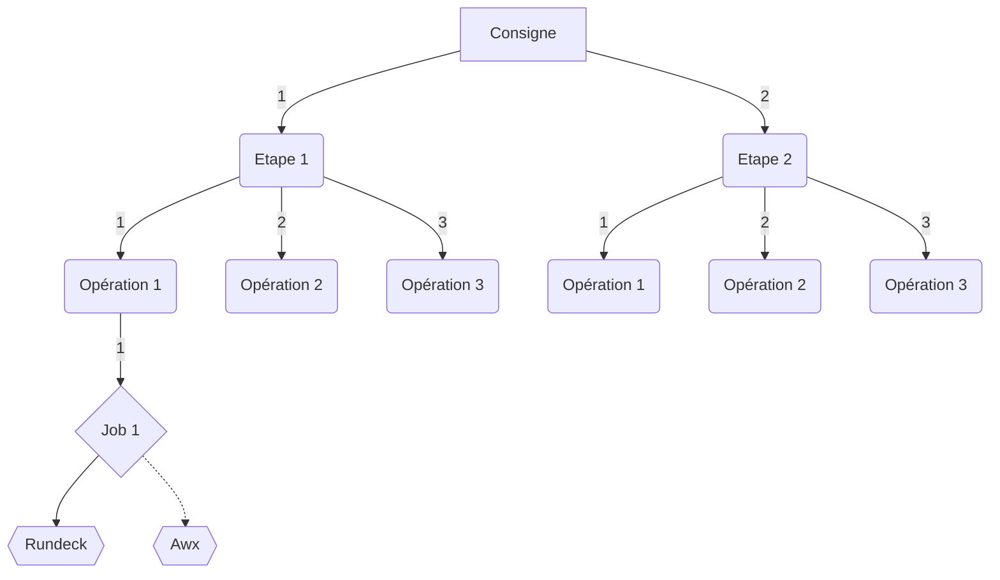

Le `job1`, selon sa configuration sera distribué à l'ordonnanceur `rundeck` ou `awx`.

## Architecture

Lorsqu'un job est déclenché depuis une consigne dans Canopsis, il est placé dans une file d'attente.  
Cette file d'attente est parcourue par un exécuteur de job, `external-job-executor`.

```sh
# ./external-job-executor -h
Usage of ./external-job-executor:
  -c string
    	Configuration file path (default "/opt/canopsis/share/config/external-job-executor/externalapi.yml")
  -d	debug
```

C'est ce process qui va se charger de déclencher l'exéxution du job auprès des ordonnanceurs de tâches selon les différentes configurations définies.

## Ordonnanceurs supportés

### Configuration pour Rundeck

#### Création d'un token d'authentification Rundeck

Dans le menu `profile` de Rundeck, vous avez accès à la création d'un token.  

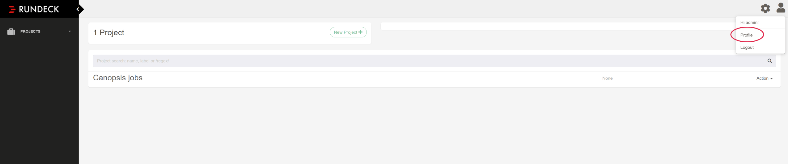

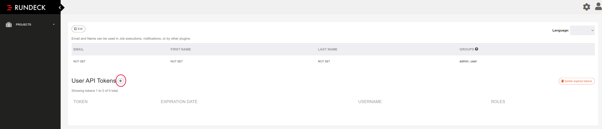

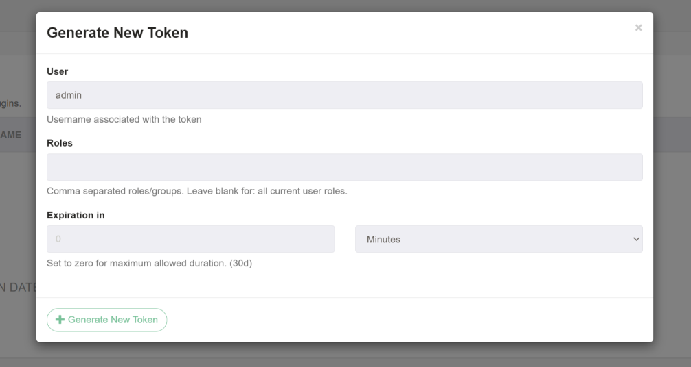

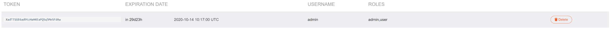

Vous disposez maintenant d'un token qui sera utilisé dans la configuration de la remédiation un peu plus tard.

#### Création d'une configuration associée dans Canopsis

Dans le menu d'administration de la remédiation, onglet `CONFIGURATIONS`, cliquez sur "+" et renseignez les différents champs.

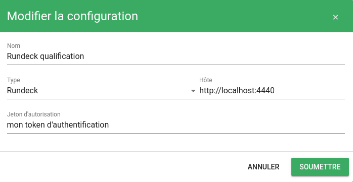

#### Création d'un job dans rundeck et association de celui-ci dans Canopsis

Coté Rundeck, dans le menu `Jobs`, créez un job et récupérez son identifiant

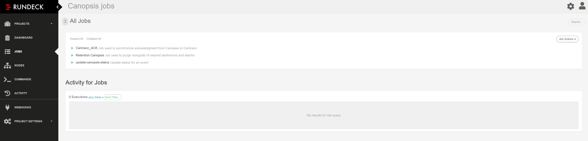

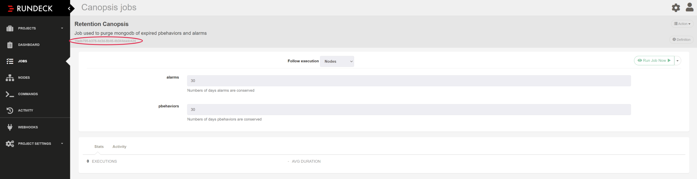

Coté Canopsis, dans le menu d'administration de la remédiation, onglet `JOBS`, cliquez sur "+" et renseignez les différents champs.

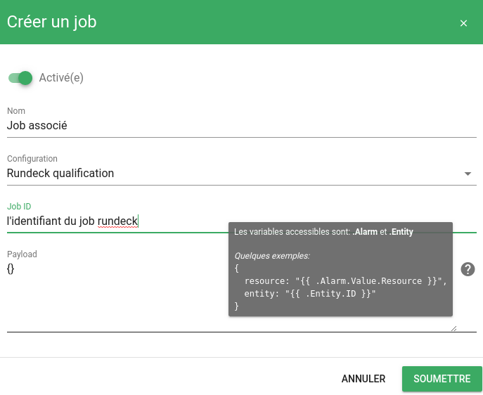

Le job est maintenant prêt à l'emploi. La section [Payload](#utilisation-des-payload) vous explique comment passer des variables à votre job.

### Configuration Awx

#### Création d'un token d'authentification Awx

Dans le menu `Users` d'Awx, vous avez accès à la création d'un token.  

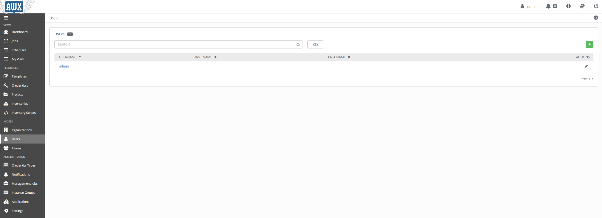

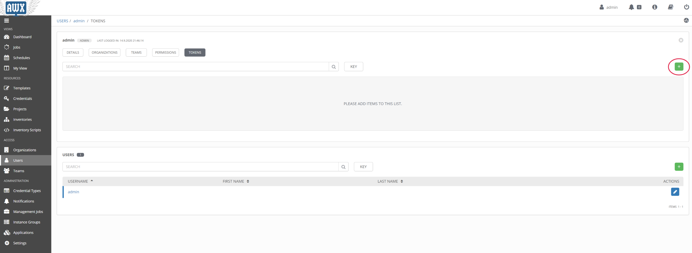

Le scope à sélectionner est `WRITE`.

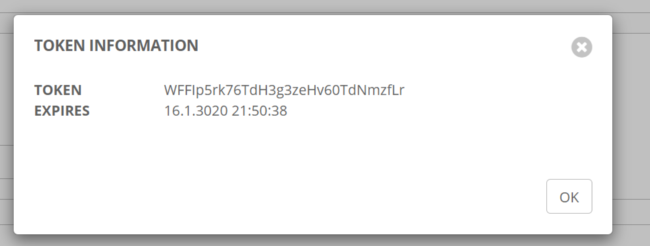

Vous disposez maintenant d'un token qui sera utilisé dans la configuration de la remédiation un peu plus tard.

#### Création d'une configuration associée dans Canopsis

Dans le menu d'administration de la remédiation, onglet `CONFIGURATIONS`, cliquez sur "+" et renseignez les différents champs.

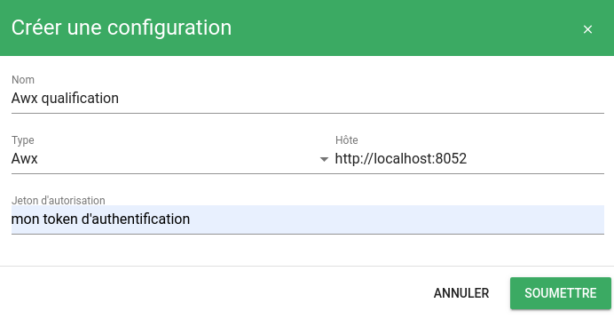

#### Création d'un job dans awx et association de celui-ci dans Canopsis

Coté Awx, dans le menu `Job templates`, créez un job et récupérez son identifiant dans l'URL

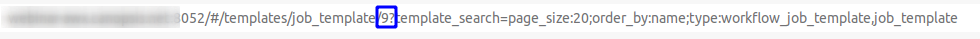

Coté Canopsis, dans le menu d'administration de la remédiation, onglet `JOBS`, cliquez sur "+" et renseignez les différents champs.

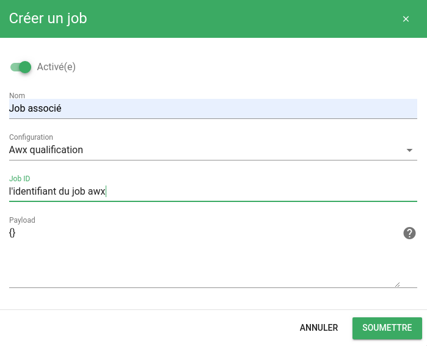

Le job est maintenant prêt à l'emploi. La section [Payload](#utilisation-des-payload) vous explique comment passer des variables à votre job.


## Utilisation des `payloads`

Le module de remédiation de Canopsis permet de transmettre des variables à l'ordonnanceur au moment de l'exécution d'un job.

!!! Note
    Vous avez accès aux variables `.Alarm` et `.Entity` dans ce payload.

    Les différentes valeurs sont [documentées ici](../architecture-interne/templates-golang/)

Ce paragraphe décrit la manière de procéder pour `Rundeck` et `Awx`.

### Rundeck

L'ordonnanceur attend des `variables` pour un job dans une structure qui doit être appelée `options`.
Ainsi, lorsque vous paramétrez le contenu du payload dans un job Canopsis, vous pouvez préciser 

```json
{
  "options": {
    "variable1" : "valeur1",
    "variable2" : "valeur2"
  }
}
```

Du coté de Rundeck, vous pourrez exploiter ces variables grâce aux notations suivantes : 

* `@option.variable1@`
* `$RD_OPTION_VARIABLE2`

Voici un exemple complet de passage de variables de Canopsis vers Rundeck

**Payload Job Canopsis**

```json
{
  "options": {
    "component": "{{.Alarm.Value.Component}}",
    "resource": "{{.Alarm.Value.Resource}}",
    "service_name": "{{.Alarm.Value.Resource}}"
  }
}
```

**Exploitation des variables dans un job Rundeck**

```sh
#!/bin/bash

echo "Demande d'exécution de job reçue par Canopsis"
echo "Alarme concernée :"
echo -e "\tComposant : @option.component@"
echo -e "\tResource : @option.resource@"
echo "Service à redémarrer : $RD_OPTION_SERVICE_NAME"
echo "Terminé"
```
