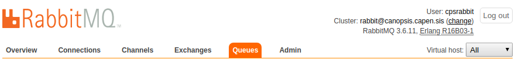
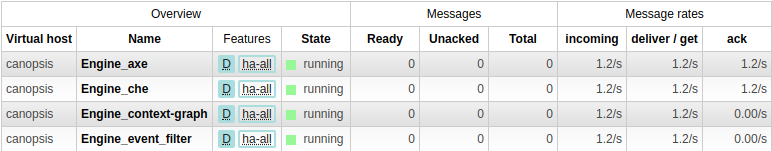

# UI RabbitMQ

Dans le contexte d'une utilisation de Canopsis, RabbitMQ va vous servir à avoir une vision globale sur le bon fonctionnement de vos moteurs.
Vous pourrez y voir plusieurs informations utiles mais nous allons nous concentrer dans cette documentation à la section "Queues" qui nous montre le nombre de messages
en cours de traitement sur les diférents moteurs de Canopsis.

**Rappel :**
L'interface de RabbitMQ est accessible via l'URL ```http://localhost:15672/```

## Queues

Rendez-vous ici :



Vous y retrouverez un tableau comme celui ci :



La première colonne *Overview* vous présente plusieurs informations tel que :

- **Virtual host :** Nom de la machine sur laquelle le moteur est présent.  
- **Name :** Nom du moteur.  
- **Feature :** Montre si l'architecture est en HA ou non.  
- **State :** Etat du moteur, peut être *running* ou *idle* (fontionnement dégradé).  

La seconde, *Messages*, vous présente :

- **Ready :** Nombre de messages près à être ack.
- **Unacked :** Nombre de messgaes qui ne sont pas encore ack.
- **Total :** Nombre de message total.

La troisème, *Message rates* permet d'avoir une idée sur les performances du moteur à gerer les files arrivantes. Trois stats permettent de juger l'efficacité en messages/secondes :

- **Incomming :** Nombre de messgae arrivants dans le moteur.
- **Deliver / get :** 
- **ack :**

Le but étant d'avoir une section "Messages" remplie de 0. Si ce n'est pas le cas, cela veut dire qu'un des moteurs de Canopsis est dans un état dégradé et n'assure plus sa gestion de files.  
Dans ce cas plusieurs pistes de résolutions sont possibles : 

## Plus de détails

Pour en savoir plus sur la configuration et l'état de santé d'un moteur, il vous suffit de cliquer sur le nom du moteur concerné.  
   
Vous pourrez y retrouver l'*Overview* des **messages en files** ainsi que le **taux de messages** par secondes que le moteur traite sous forme de tableau.  
  
Les *Consumers* montrent les canaux connectés à la file d'attente, les *Bindings*, quant à eux, montrent les liaisons entre les exchanges et une file d'attente, vous avez aussi la possibilitée d'ajouter des *bindings*.  
  
*Publish message* permet de publier manuellement un message dans la file d'attente.  
  
Afin de recevoir un message l'option *get messages* permet  d'inspecter manuellement un message situé dans la file d'attente. Il est possible de le réintégrer dans la file d'attente.  
  
*Delete* permet de supprimer la file d'attente, *Purge* permet de la vider.  


## Policy

Afin d’éviter de remplir inutilement les queues de RabbitMQ, il est possible de mettre en place une policy.

La procédure est la suivante :


Ensuite, vous devez voir apparaître votre policy sur les queues dans l’onglet Queues.


## Aller plus loins

[Cette documentation](https://www.cloudamqp.com/blog/2015-05-27-part3-rabbitmq-for-beginners_the-management-interface.html#overview) peut vous permettre d'avoir plus de détails sur le foncitonnement général de l'UI de Rabitmq.
