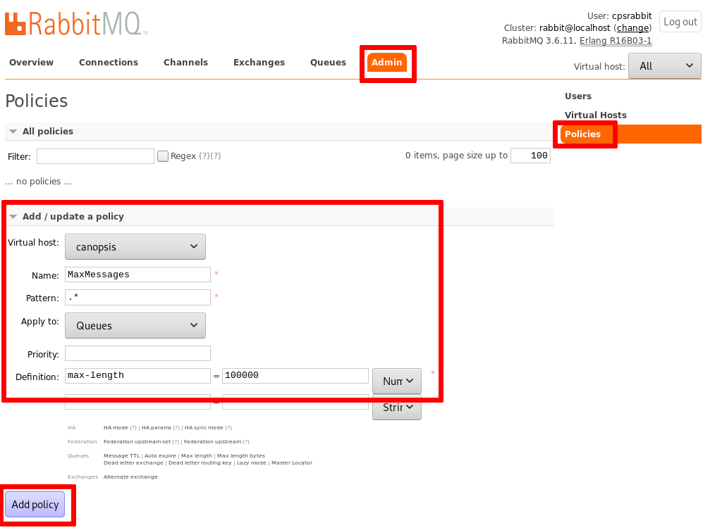

# UI RabbitMQ

Dans le contexte d'une utilisation de Canopsis, RabbitMQ va vous servir à avoir une vision globale sur le bon fonctionnement de vos moteurs.
Vous pourrez y voir plusieurs informations utiles mais nous allons nous concentrer dans cette documentation à la section "Queues" qui nous montre le nombre de messages
en cours de traitement sur les diférents moteurs de Canopsis.

**TODO (DWU) :** aller plus loin avec DWU.

L'interface de RabbitMQ est accessible via l'URL ```http://localhost:15672/```

## Queues


## Policy

Afin d’éviter de remplir inutilement les queues de RabbitMQ, il est possible de mettre en place une policy.

La procédure est la suivante :



Ensuite, vous devez voir apparaître votre policy sur les queues dans l’onglet Queues.


## Aller plus loins

[Cette documentation](https://www.cloudamqp.com/blog/2015-05-27-part3-rabbitmq-for-beginners_the-management-interface.html#overview) peut vous permettre d'avoir plus de détails sur le foncitonnement général de l'UI de Rabitmq.