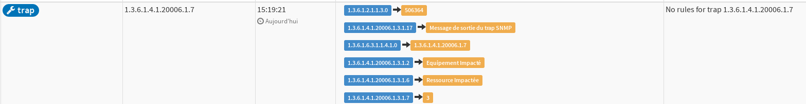
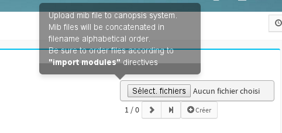
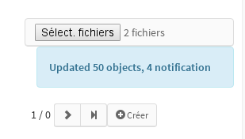
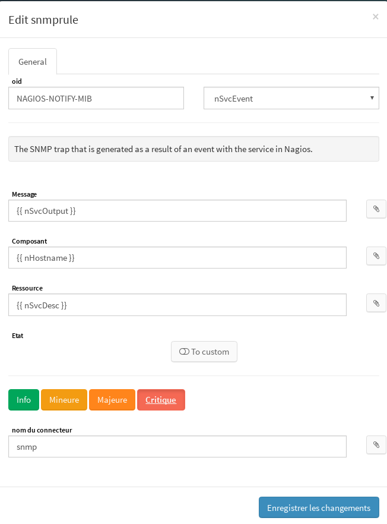

# snmpTrap

## Introduction

Ce guide décrit la réception et de la traduction de traps SNMP au sein de Canopsis.

Bon nombre d'équipements émettent des traps, Canpsis est en mesure de :

*  les réceptionner ;
*  les traduire grâce à un jeu de règles ;
*  et les convertir en alarmes.

Ce document vous guide pas à pas dans cette mise en œuvre.

## Schéma de fonctionnement

Ce schéma présente le cycle de vie d'un trap SNMP depuis son émission jusqu'à sa conversion en alarmes Canopsis.


## Émission des traps SNMP

L'émission des traps SNMP n'est pas traitée dans ce guide dans la mesure où cela concerne les équipements en eux mêmes.

Il vous faut configurer dans les émetteurs l'adresse du récepteur SNMP ainsi que son port.  

Dans notre cas, il s'agit de l'adresse du connecteur `snmp2canopsis` sur le port 162 (port par défaut d'un récepteur SNMP).

## Connecteur snmp2canopsis

Le connecteur `snmp2canopsis` porte 3 missions :

1. Réceptionner les traps
2. Parser les traps et les tansformer en JSON
3. Publier les messages JSON obtenus dans un exchange AMQP dédié sur Canopsis

### Réceptionner les traps

Dans le fichier de configuration du connecteur, vous devez indiquer l'adresse IP et le port d'écoute du récepteur.

Les informations se situent dans la section `snmp`

```ini
[snmp]
ip = 127.0.0.1
port = 162
```

Pour que les équipements qui émettent des traps SNMP puissent communiquer avec le récepteur, vous pouvez indiquer :

```ini
[snmp]
ip = 0.0.0.0
port = 162
```

Le port 162 est le port par défaut des traps SNMP.

### Parser les traps

Une fois réceptionnés, les traps sont décodés puis transformés en JSON.

Exemple :

```json
{'component': '127.0.0.1',
 'connector': 'snmp',
 'connector_name': 'snmp2canopsis',
 'event_type': 'trap',
 'snmp_timeticks': '2350066',
 'snmp_trap_oid': '1.3.6.1.6.3.1.1.5.3',
 'snmp_vars': {'1.3.6.1.2.1.2.2.1.1': '1',
               '1.3.6.1.2.1.2.2.1.7': '2',
               '1.3.6.1.2.1.2.2.1.8': '2'},
 'snmp_version': '1',
 'source_type': 'component',
 'state': 3,
 'state_type': 1,
 'timestamp': 1440075343.725282}
```

Étant donné que le connecteur ne possède aucune MIB, le tableau `snmp_vars` embarque directement les ID des objets (OID) sans traduction.

Les messages seront directement traduits par Canopsis.
 
### Publier les messages

Une fois les traps transformés en JSON, ils sont publiés dans le bus AMQP de Canopsis dans un exchange dédié (`canopsis.snmp`).

La section de configuration à observer est `amqp`

```ini
[amqp]
host = DNS_BUS_AMQP_Canopsis
port = 5672
user = cpsrabbit
password = canopsis
vhost = canopsis
exchange = canopsis.snmp
```

À ce stade, le connecteur a terminé son travail.

## Traduction des traps

Comme observé sur le schéma de cycle de vie, les traps SNMP `bruts` sont traduits par un moteur grâce à un jeu de règles à définir.

Pour rappel, le résultat de la traduction doit se concrétiser par la génération d'un message compréhensible par Canopsis.

Ce message doit comporter à minima les informations suivantes :

*  connector
*  connector\_name
*  component
*  resource
*  state
*  output

Le principal objectif est donc de déduire ces attributs à partir du tableau `snmp_vars` présent dans les traps bruts.

Pour cela, on utilise des règles de transformations.

### Mise en route du connecteur

Pour faciliter les intégrations, nous utilisons des conteneurs `Docker` pour cette étape.

```sh
$ sudo docker run -v snmp2canopsisdata:/connector-snmp2canopsis/etc canopsis/canopsis-cat-connector-snmp:2.4
 
[2017-06-20 13:18:06.700607] INFO: snmp2canopsis: Read configuration from /connector-snmp2canopsis/etc/snmp2canopsis.conf
[2017-06-20 13:18:06.701409] DEBUG: amqp: Thread started
[2017-06-20 13:18:06.702131] INFO: amqp: Connecting to cpsrabbit@172.17.0.1, on canopsis
[2017-06-20 13:18:06.701857] INFO: snmp: Start SNMP listener on 0.0.0.0:162
[2017-06-20 13:18:06.707382] DEBUG: amqp: Read the snmp queue
```

La configuration associée est la suivante :

```ini
[snmp]
ip = 0.0.0.0
port = 162
 
[amqp]
host = 172.17.0.1
port = 5672
user = cpsrabbit
password = canopsis
vhost = canopsis
exchange = canopsis.snmp
```

### Génération d'un trap SNMP

Nous allons générer un trap SNMP en nous appuyant sur la MIB Nagios.

Nagios fournit un fichier MIB embarquant les différentes notifications possibles ainsi qu'un fichier de dépendance qui contient les objets basiques.

Puisqu'il s'agit de traps SNMP, il faut s'intéresser au type `NOTIFICATION TYPE` présent dans les MIB.

Voici l'objet que nous allons utiliser pour générer un trap :

```
 nSvcEvent  NOTIFICATION-TYPE
   OBJECTS { nHostname, nHostStateID, nSvcDesc, nSvcStateID, nSvcAttempt,
             nSvcDurationSec, nSvcGroupName, nSvcLastCheck, nSvcLastChange,
             nSvcOutput }
   STATUS  current
   DESCRIPTION
     "The SNMP trap that is generated as a result of an event with the service
     in Nagios."
   ::= { nagiosNotify 7 }
```

Pour générer le trap adéquat, voici la ligne de commande utilisée :

```sh
/usr/bin/snmptrap -v 2c -c public IP_RECEPTEUR_SNMP '' NAGIOS-NOTIFY-MIB::nSvcEvent nSvcHostname s "Equipement Impacte" nSvcDesc s "Ressource Impactee" nSvcStateID i 3 nSvcOutput s "Message de sortie du trap SNMP"  
``` 

Une fois cette commande exécutée, le connecteur recevra le trap, le convertira en JSON et le transmettra à Canopsis dans l'exchange `canopsis.snmp`.

Étant donné que le moteur ne possède pour le moment pas de règle de transformation, le trap brut sera affiché.



### Règle de transformation

Une règle de transformation consiste à convertir des `OID` en valeurs compréhensibles et associer les attributs nécessaires à un message Canopsis.

Dans l'exemple précédent, nous souhaitons obtenir le message suivant :

```json
{
  "connector" : "snmp",
  "connector_name" : "snmp",
  "component" : "Equipement Impacte",
  "resource" : "Ressource Impactee", 
  "output" : "Message de sortie du trap SNMP",
  "state" : 3
}
```

Pour cela, nous devons :

*  Envoyer les MIB Nagios dans Canopsis
*  Créer une règle de transformation
*  Constater les résultats

**Envoi des MIB**

On sélectionne les fichiers.



On vérifie que le traducteur a bien trouvé des objets de type `notification`



**Création de la règle**



**Vérification**

On exécute à nouveau l'émisson du trap SNMP :

```sh
/usr/bin/snmptrap -v 2c -c public IP_RECEPTEUR_SNMP '' NAGIOS-NOTIFY-MIB::nSvcEvent nSvcHostname s "Equipement Impacte" nSvcDesc s "Ressource Impactee" nSvcStateID i 3 nSvcOutput s "Message de sortie du trap SNMP"  
```

On contrôle le bac :


## Informations complémentaires

TRAP-TYPE et NOTIFICATION-TRAP
