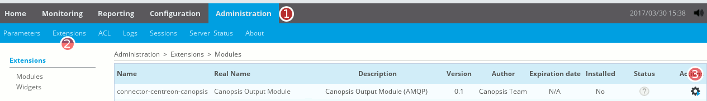
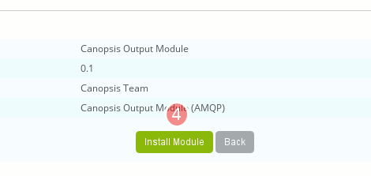
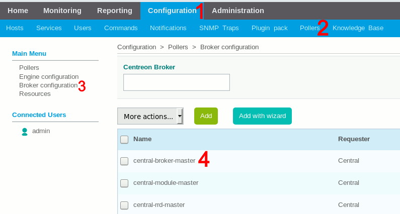
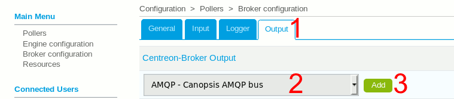
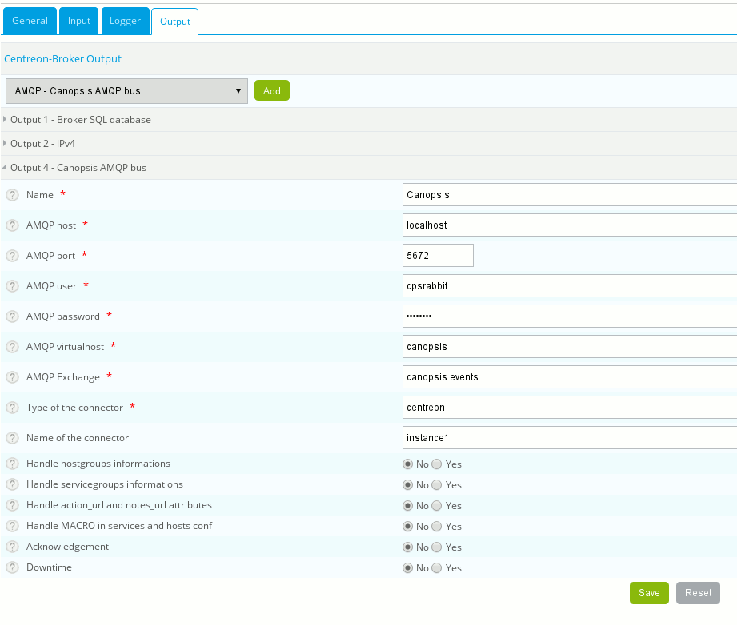
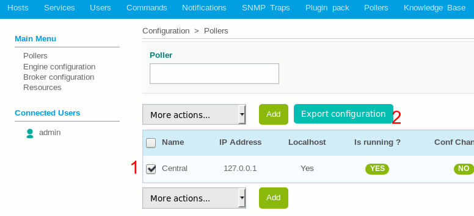
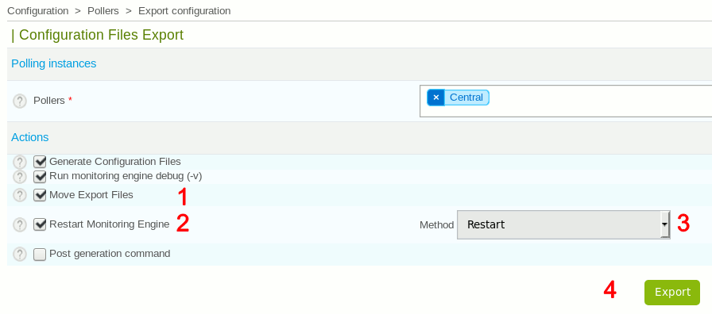

# connector-centreon-engine : module (Event Broker) Centreon pour Canopsis

!!! note
    Ce module est maintenant disponible dans l'édition open-source de Canopsis.

## Description

Le connecteur `connector-centreon-engine` est un module Broker permettant l'envoi d'évènements de Centreon vers Canopsis. Il est écrit en C++, et des modules pré-compilés sont disponibles pour certains environnements. Ce module est open-source et disponible sous la licence Apache 2.0.

Ce module vient s'ajouter dans une instance Centreon existante, et doit ensuite être configuré depuis l'interface web de Centreon afin de rediriger le trafic vers Canopsis.

!!! attention
    **Pré-requis réseau :** la transmission de flux réseau doit être permise entre Centreon et l'instance RabbitMQ de Canopsis (port TCP `5672` par défaut).

## Installation

!!! note
    Toutes les manipulations suivantes doivent être réalisées sur le nœud Centreon que vous souhaitez relier à Canopsis.

### Récupération du connecteur

Vous devez récupérer la dernière version du connecteur, disponible à l'adresse suivante : https://git.canopsis.net/canopsis-connectors/connector-centreon-engine.

Vous pouvez pour cela cloner le dépôt Git, ou lancer la commande suivante pour récupérer une archive :

```sh
wget https://git.canopsis.net/canopsis-connectors/connector-centreon-engine/-/archive/master/connector-centreon-engine-master.tar.bz2 && tar xjf connector-centreon-engine-master.tar.bz2
```

Le reste de cette procédure part du principe que vous disposez de ce contenu dans un répertoire `connector-centreon-engine*/`.

Il faut ensuite installer deux composants : le module `.so` et l'extension web.

### Installation du module `.so`

Des modules pré-compilés sont disponibles dans le répertoire `precompiled/` de ce dépôt Git.

Il faut, pour cela, connaître votre environnement (CentOS 6, CentOS 7…) et votre version du Centreon Broker sur le système cible :

```sh
cat /etc/centos-release
CentOS Linux release 7.4.1708 (Core)

cbd -v
[1513786864] info:    Centreon Broker 3.0.11
```

Dans cet exemple, on est sur une CentOS 7 avec un Centreon Broker (CBD) 3.0.11. Le module qui nous intéresse est donc `precompiled/Centos7/85-amqp-cbd-3.0.11.so`.

Il faut ensuite l'envoyer dans le répertoire d'installation des modules Centreon (attention : le nom `85-amqp.so` est attendu en destination) :

```sh
# À adapter en fonction du système cible !
sudo cp precompiled/Centos7/85-amqp-cbd-[VOTRE-VERSION-CBD-ICI].so /usr/share/centreon/lib/centreon-broker/85-amqp.so
```

### Installation de l'extension web

Il faut ensuite ajouter l'extension `centreon-extension/connector-centreon-canopsis` sur le nœud Centreon, afin de pouvoir finaliser l'installation du module.

```sh
sudo cp -r centreon-extension/connector-centreon-canopsis/ /usr/share/centreon/www/modules/
sudo chown -R apache:apache /usr/share/centreon/www/modules/connector-centreon-canopsis
```

Il faut ensuite installer ce module depuis les menus suivants de l'interface web Centreon (Administration > Extensions > Modules > connector-centreon-canopsis et cliquer sur le bouton Action, sur la droite du tableau) :



Puis, valider l'installation de ce module en cliquant sur « Install Module » :



Le module est maintenant installé, mais vous devez obligatoirement le configurer.

## Configuration du module

### Configuration

Aller dans Configuration > Pollers > Broker Configuration > central-broker-master.



Puis, dans la nouvelle page qui apparaît, aller dans l'onglet Output, choisir le module « AMQP - Canopsis AMQP bus » dans le menu déroulant, et cliquer sur le bouton « Add ».



Des options de configuration « Canopsis AMQP bus » apparaissent alors en bas de page. Il faut alors renseigner les informations de connexion à l'instance RabbitMQ de Canopsis (adresse, port, identifiants, nom de l'Exchange et du Virtual Host...). Valider ces changements avec le bouton « Save ».



### Redémarrage obligatoire pour charger la configuration

!!! attention
    **Attention :** les redémarrages suivants occasionnent une interruption de service le temps du redémarrage du Broker et des Engines Centron.

On redémarre ensuite le service pour s'assurer du bon chargement de la nouvelle configuration.

Cette étape est **OBLIGATOIRE**, votre connecteur Centreon ne fonctionnera **PAS** dans Canopsis tant que vous n'effecturez pas cette procédure de redémarrage.

Pour cela, aller dans Configuration > Pollers > cocher les éléments concernés > cliquer sur « Export configuration ».



Sur la nouvelle page qui s'affiche, il faut ensuite cocher les cases « Move Export Files » et « Restart Monitoring Engine », puis choisir la méthode « Restart » dans le menu déroulant, et enfin cliquer sur le bouton « Export ».



**ATTENTION :** Il faut bien faire un `restart` et non pas un simple `reload` ! Sans quoi vous risquez des problèmes de cohérence sur les évènements échangés avec Canopsis.
