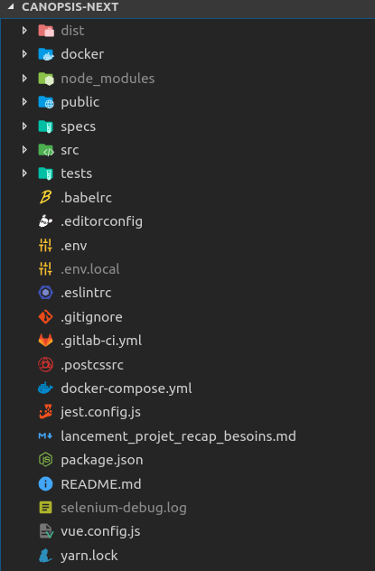

# Structure du projet

## Général



### Les dossiers

#### /dist

Ce dossier contient les fichiers compilés.
Il peut ne pas exister lors d'une nouvelle installation.

Ce dossier n'est pas utilisé au moment du développement.

#### /docker

Ce dossier contient le DockerFile permettant de construire une image Docker de l'interface.

Ce dossier n'est pas utilisé au moment du développement.

#### /node_modules

Ce dossier contient toutes les dépendances du projet.

Celui-ci n'est jamais modifié directement durant le développement.

#### /public

Ce dossier contient le fichier html 'racine' du projet, ainsi que les polices utilisées.

#### /src

Ce dossier contient la quasi totalité du code du projet.

C'est le dossier dans lequel se fera le développement.

#### /tests

Ce dossier contient les tests unitaires ainsi que les tests fonctionnels.


### Les fichiers de configuration

#### Générale

##### Configuration de Vue

Le fichier ```vue.config.js``` contient des éléments de configuration de VueJS. Par exemple, de la configuration de Webpack, ou encore du serveur de développement.

Pour plus d'informations concernant ce fichier, rendez-vous dans la [documentation officielle](https://cli.vuejs.org/config/#vue-config-js)

##### Configuration des tests unitaires

Le fichier ```jest.config.js``` contient des éléments de configuration de Jest. Jest étant une librairie utilisée dans la réalisation des tests unitaires de l'interface.

Pour plus d'informations concernant ce fichier, rendez-vous dans la [documentation officielle](https://jestjs.io/docs/en/configuration.html)

##### Divers

- Le fichier ```.eslintrc``` contient des éléments de configuration pour la librairie ESLint. Pour plus d'informations concernant ce fichier, rendez-vous dans la [documentation officielle](https://eslint.org/docs/user-guide/configuring)
- Le fichier ```.babelrc``` contient des éléments de configuration pour la librairie Babel. Pour plus d'informations concernant ce fichier, rendez-vous dans la [documentation officielle](https://babeljs.io/docs/en/config-files)
- Le fichier ```.editorconfig``` contient des éléments de configuration utiles à l'éditeur de code. Pour plus d'informations concernant ce fichier, rendez-vous dans la [documentation officielle](https://editorconfig.org/)

#### Environnement

Un fichier ```.env``` est présent dans le dossier ```src``` de canopsis-next.

Ce fichier contient des exemples des variables d'environnement nécessaires à l'application.

Afin de surchargé une ou plusieurs de ces variables, une bonne pratique consiste à créer un fichier ```.env.local``` dans le même dossier. Les variables présentes dans ce fichiers surchargeront celles présentes dans le fichier ```.env```.

#### Gestion des dépendances

Un fichier ```package.json``` est présent dans le dossier ```src``` de canopsis-next.

Celui-ci liste les dépendances du projet, ainsi que quelques éléments de configuration.

#### Docker-compose

Le fichier ```docker-compose.yml``` présent dans le dossier de canopsis-next permet de lancer un conteneur basé sur l'image docker ```uiv3```.

## Le dossier 'src'

Comme vu précedemment, le dossier ```src``` contient le code du projet.

### main.js

Ce fichier créé une nouvelle instance ```Vue``` en lui intégrant les différentes options et librairies, puis lance l'application en montant le composant racine (```app.vue```).

### app.vue

Ce fichier contient le composant racine de l'application.

Il intégre les barres latérales, les modales, les popups, ainsi que le composant nécessaire, en fonction du routage.

### bootstrap.js

Ce fichier tire parti de la librairie ```webfontloader``` pour charger les polices utilisées dans le projet.

### config.js

Ce fichier contient les variables de configuration de l'application.

Exemple: 

- ```API_ROUTES```: Contient les routes utilisées pour effectuer des requêtes à Canopsis.
- ```DEFAULT_LOCALE```: Langage par défaut à utiliser dans l'interface

### constants.js

Ce fichier contient toutes les constantes utilisées dans le projet.

### event-bus.js

Ce fichier n'est plus utilisé et devra être supprimé prochainement.

### router.js

Ce fichier contient la configuration du routage du projet.

Une variable ```routes``` est d'abord définie. Elle contient la liste des routes disponibles.

Puis une nouvelle instance de ```Router``` (de la librairie ```vue-router```) est créée. Celle-ci utilise les routes définies au dessus.

### /assets

Ce dossier contient les feuilles de style globales du projet, ainsi que les images utilisées.

### /components

Ce dossier contient les composants du projet.

Il est divisé en sous-dossier permettant de trier les composants en fonction de leur utilisation.

### /filters

Ce dossier contient les différents filtres utilisés dans les templates.

Ces filtres permettent d'appliquer une fonction Javascript sur une/des valeur(s), dans un template.

### /helpers

Ce dossier contient les différents helpers utilisés dans les templates.

Les helpers sont des fonctions Javascript, destinées à êtres utilisées à plusieurs reprises dans le code.

### /i18n

Ce dossier contient les traductions.

Le fichier ```index.js``` ajoute ces traductions à l'instance courante de ```Vue```.

Les traductions elles-mêmes se situent dans le dossier ```messages```. Chaque fichier correspond ici à une langue.

### /mixins

Ce dossier contient les différents mixins.

Les mixins permettent de réutiliser des fonctionnalités dans plusieurs composants.

### /services

Ce dossier contient des fonctions utilitaires, utilisées à différents endroits du code.

Par exemple, le fichier ```request.js``` contient l'instance d'axios (librairie utilisée pour les requêtes HTTP), avec sa configuration.

### /store

Ce dossier contient l'ensemble du store Vuex de l'application.

### /views

Ce dossier contient les différentes vues de l'application.
