# Comportements périodiques

Vous avez la possibilité, dans Canopsis, de définir des périodes pendant lesquelles des changements de comportements sont nécessaires :

* Plage de service d'une application : vous souhaitez repérer visuellement les applications qui doivent rendre un service à un moment donné.
* Maintenance : vous souhaitez déclarer en maintenance des entités pour que leurs alarmes ne remontent pas visuellement.
* Pause : vous souhaitez mettre en *pause* une application pour un temps indéterminé.

Pour cela vous allez utiliser des comportements périodiques (ou *pbehaviors*, pour *periodical behaviors*).

!!! Note
    Avec la v4 de Canopsis le fonctionnement des comportements périodiques à été complètement revu.
    Les informations qui figurent sur cette page ne sont donc valables que pour cette version.

Les cas d'usage détaillés dans cette documentation vous permettront de :
* Définir la plage de service d'une application
* Mettre en maintenance une entité

## Contexte

Considérons l'application `ERP` (sous forme d'observateur) composée de différentes entités.

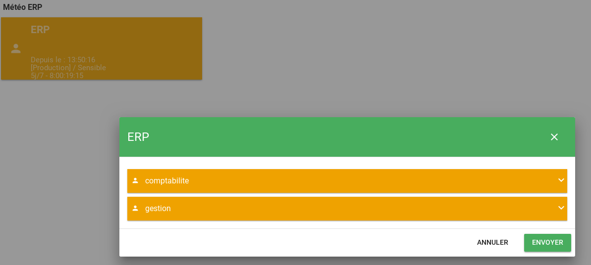

## Comportements périodiques

### Définition de la plage de service

Rendez-vous dans l'explorateur de contexte et recherchez votre observateur `ERP`.

Ajoutez lui ensuite un comportement périodique en cliquant sur ce bouton.

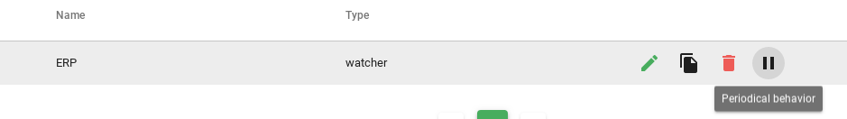

Pour créer une plage, du lundi au vendredi, de 19h15 à 8h, vous devez :

* Sélectionner sur le calendrier, le premier jour de la première occurrence de votre plage.

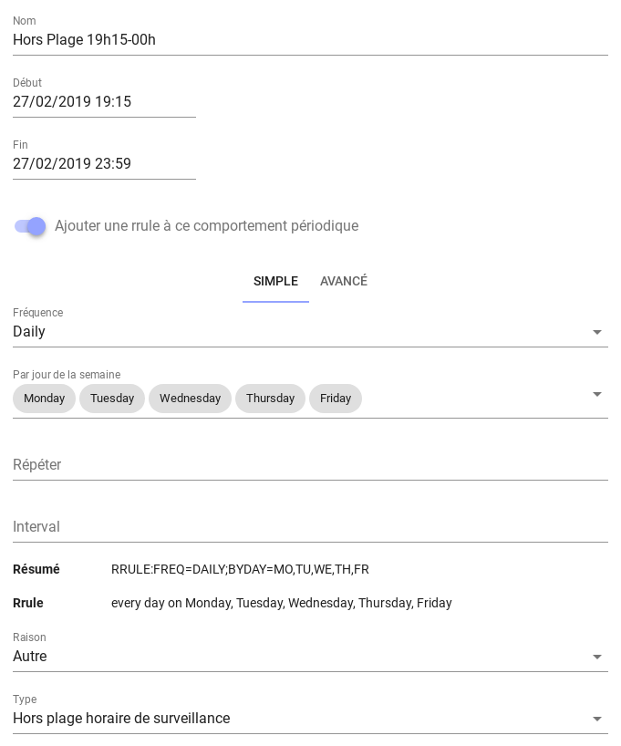  

* Une plage récurrente de 00h à 08h

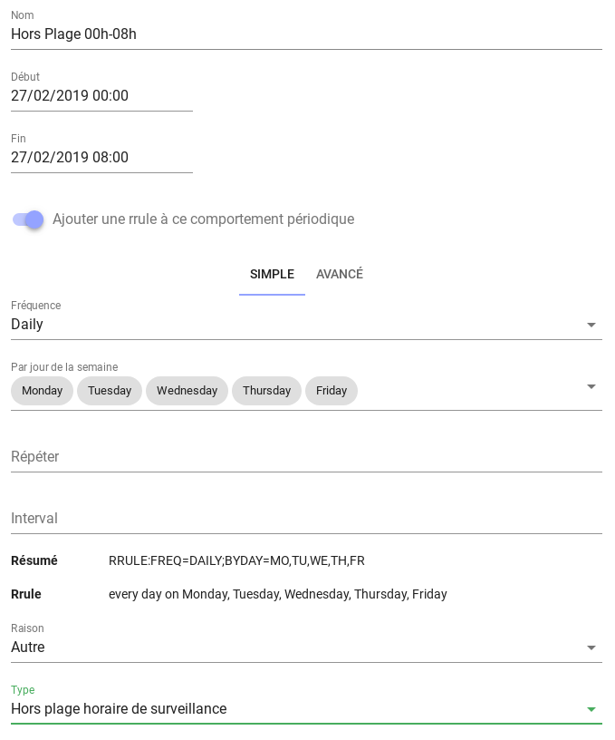  

### Rendu visuel

En dehors des comportements périodiques, la tuile de météo se comporte ainsi :

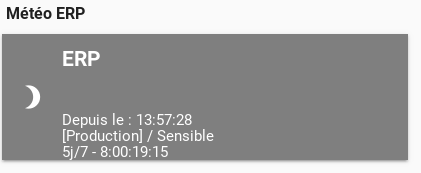

## Maintenance d'une entité

En parallèle des plages de services, vous pouvez déclarer des entités en maintenance ou en pause par exemple.

Vous avez la possibilité d'effectuer ces opérations :

* **Depuis le Bac à alarmes** : dans ce cas, la mise en maintenance se fait de manière unitaire (En sélectionnant individuellement la ou les alarmes concernées).
* **Depuis l'Explorateur de contexte** : dans ce cas, la mise en maintenance se fait de manière unitaire sur des entités quelconques
* **Depuis le panneau d'exploitation des comportements périodiques** : dans ce cas, la mise en maintenance s'effectue à partir d'un filtre

Dans les 2 premiers cas un filtre sera généré automatiquement lors de la création du comportement périodique. Nous allons donc commencer par détailler le 3ème cas qui implique la création manuelle d'un filtre.

### Depuis le panneau d'exploitation

Pour cela, rendez-vous dans le menu Exploitation puis dans Comportements périodiques et ajoutez un comportement avec un filtre qui sélectionne les entités de *ERP*.

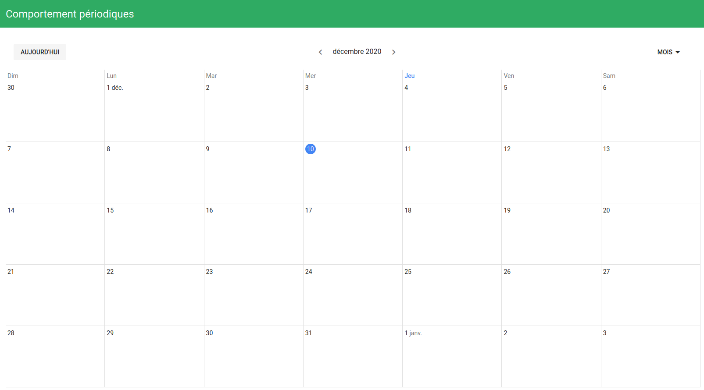

Sélectionnez une date ou un intervalle de temps pendant lequel vous souhaitez que le comportement périodique soit actif. Vous pouvez sélectionner plusieurs dates en maintenant le bouton de la souris enfoncé et en la faisant glisser depuis la date de début jusqu'à la date de fin. Lorsque vous relâchez le bouton de la souris la fenêtre de création s'affiche.

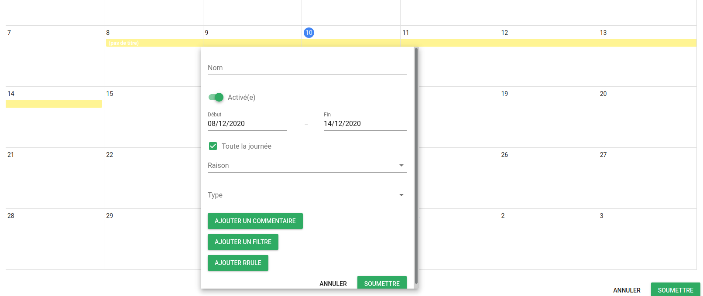

Remplissez les champs du formulaire puis cliquez sur le bouton Ajouter un filtre.

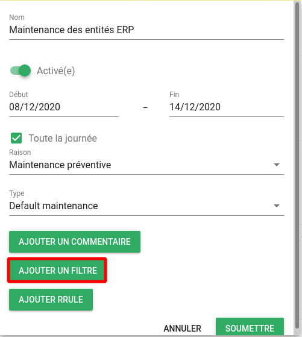

Créer ensuite votre filtre en fonction des variables des entités que vous souhaitez inclure.

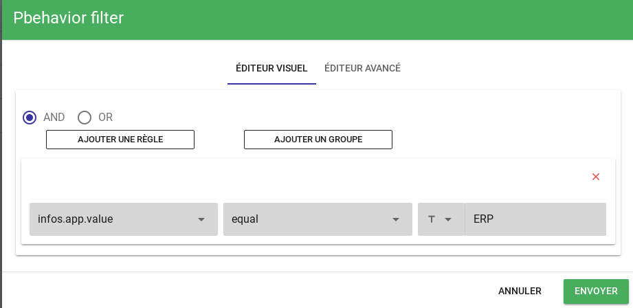  

Validez votre filtre avec le bouton Soumettre pour revenir au formulaire de création du comportement.   
Vous pouvez alors afficher votre filtre au format `JSON` en passant le curseur sur l’icône `infos` apparue à coté du bouton pour ajouter un filtre.

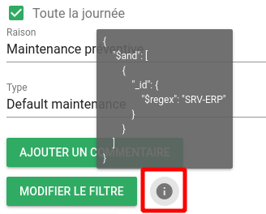

Validez ensuite le formulaire de création avec le bouton Soumettre et validez également le calendrier des comportements périodiques.

Les entités inclues dans votre filtre sont à présent en maintenance.  

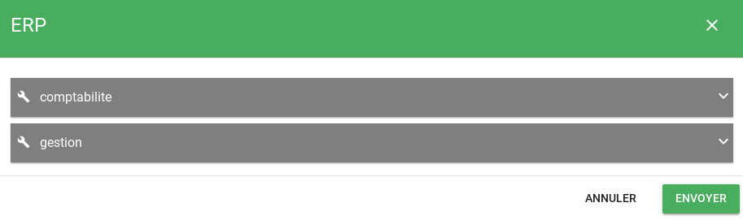  

Étant donné que ces entités constituent de manière exhaustive l'application *ERP*, l'application elle-même est considérée comme en maintenance.  

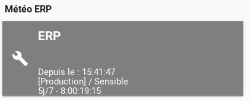  

### Depuis le Bac à alarmes

Détaillons maintenant les impacts des comportements périodiques sur le bac à alarmes.  

Il est possible d'appliquer des filtres sur les comportements périodiques, actifs ou non.  

Sur un Bac à alarmes, vous pouvez ajouter un filtre comme suit (dans les propriétés du widget) :

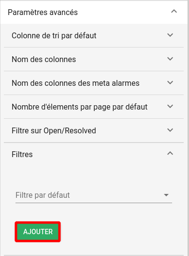  

Le point important concerne l'attribut *virtuel* `has_active_pb` qui est un booléen.

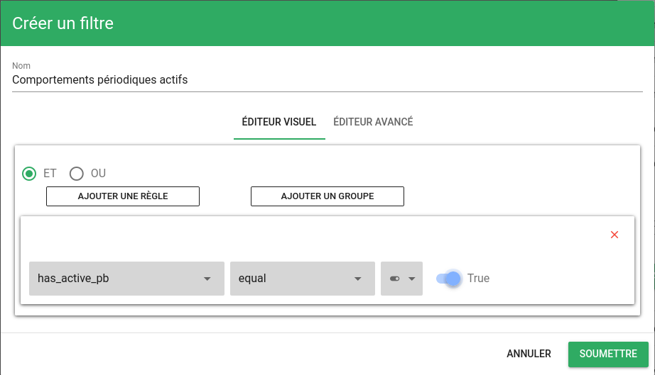  

Puis dans le widget bac à alarmes, sélectionnez le filtre nouvellement créé :

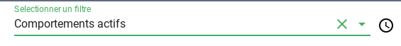  

Par ailleurs, la colonne *extra_details* embarque un picto de représentation d'un comportement périodique.  

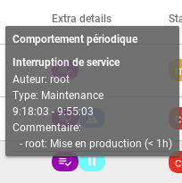  

## Quelques filtres courants

Voici une liste de filtres utiles dans des situations de pilotage au quotidien compatibles avec les comportements périodiques.

**Une ressource**

```json
{
    "$and": [
        {
            "name": "une_ressource"
        },
        {
            "type": "resource"
        }
    ]
}
```

**Un ensemble de ressources**

```json
{
    "$and": [
        {
            "type": "resource"
        },
        {
            "$or": [
                {
                    "name": "une_ressource_1"
                },
                {
                    "name": "une_ressource_2"
                }
            ]
        }
    ]
}

```

**Un composant**

```json
{
    "$and": [
        {
            "name": "un_composant"
        },
        {
            "type": "component"
        }
    ]
}
```

**Un ensemble de composants**

```json
{
    "$and": [
        {
            "type": "component"
        },
        {
            "$or": [
                {
                    "name": "un_composant_1"
                },
                {
                    "name": "un_composant_2"
                }
            ]
        }
    ]
}
```

**Un composant et ses ressources**

```json
{
    "$or": [
        {
            "$and": [
                {
                    "type": "component"
                },
                {
                    "name": "un_composant"
                }
            ]
        },
        {
            "$and": [
                {
                    "type": "resource"
                },
                {
                    "impact": {
                        "$in": [
                            "un_composant"
                        ]
                    }
                }
            ]
        }
    ]
}
```

**Une application**

```json
{
    "$and": [
        {
            "impact": {
                "$in": [
                    "une_application"
                ]
            }
        }
    ]
}
```
