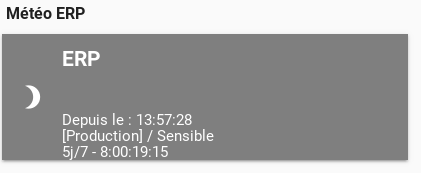
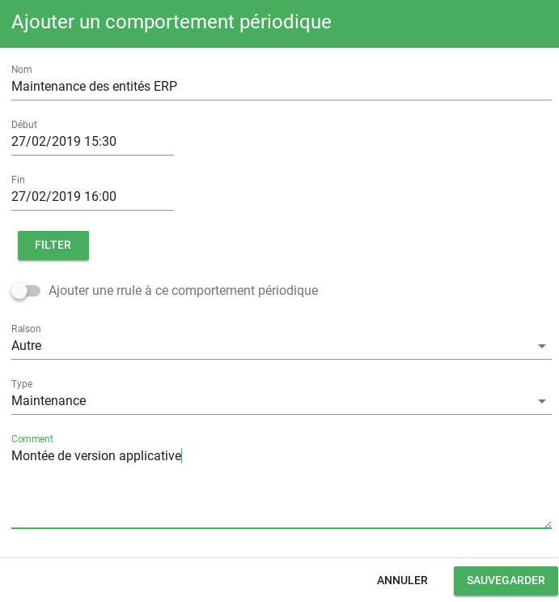
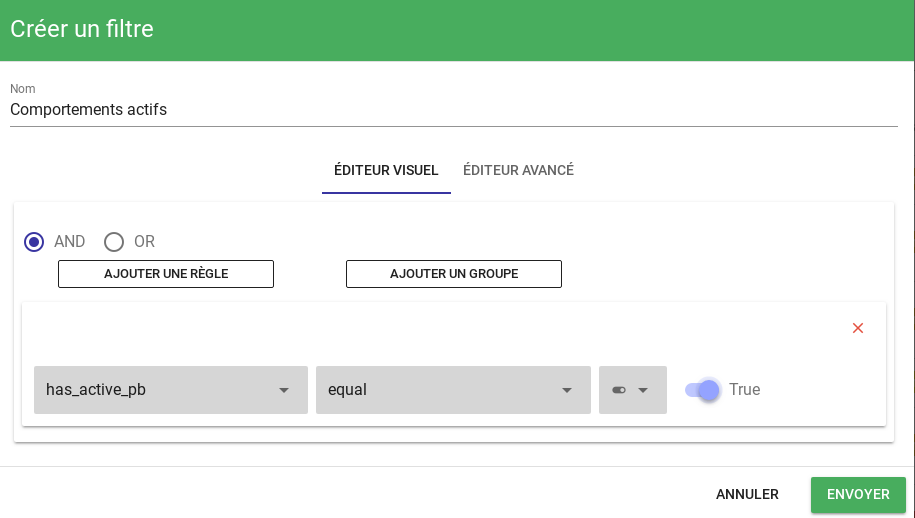

# Comportements périodiques

Vous avez la possibilité dans Canopsis de définir des périodes de temps pendants lesquelles des changements de comportements sont nécessaires : 

* Plage de service d'une application : vous souhaitez repérer visuellement les applications qui doivent rendre un service à un moment donné
* Maintenance : vous ne souhaitez pas montrer aux pilotes d'exploitation des alarmes qui concernent des entités déclarées en maintenance
* Pause : vous souhaitez mettre en *pause* une application pour un temps indeterminé

Cette fonctionnalité porte le nom de `periodic behavior`.

!!! note
    Voici une méthode vous permettant de 

    * définir la plage de service d'une application
    * mettre en maintenance une entité

### Au préalable

Nous considérons l'application `ERP` (sous forme d'observateur) composée des entités *Comptabilite* et *Gestion*.

  

## Plages de services

### Définition de la plage de service

Dans l'explorateur de contexte, vous recherchez votre observateur ERP.  
Vous ajouter un comportement périodique   

Pour définir une plage de service, Canopsis utilise le mécanisme inverse. Il est donc nécessaire de définir les plages hors service.  
Pour fabriquer une plage 5 jours/7 de 8h à 19h15, vous devez créer :

* Une plage récurrente de 19h15 à 00h

  

* Une plage récurrente de 00h à 08h

  

### Rendus visuels

En dehors des plages de services, la tuile de météo se comporte ainsi : 

  

## Maintenance d'une entité

En parallèle des plages de services, vous pouvez déclarer des entités en maintenance ou en pause par exemple.  
Vous avez la possibilité d'effectuer ces opérations :

* Depuis le bac à alarmes : dans ce cas, la mise en maintenance se fait de manière unitaire (ou en muli mais ciblé) sur des alarmes existantes
* Depuis l'explorateur de contexte : dans ce cas, la mise en maintenance se fait de manière unitaire sur des entités quelconques
* Depuis le panneau d'exploitation des comportements périodiques : dans ce cas, la mise en maintenance s'effectue à partir d'un filtre

!!! note
    Vous souhaitez mettre en maintenance les entités qui composent l'application ERP

Pour cela, RDV sur le panneau d'exploitation *Comportement périodiques*  
Vous ajoutez un comportement avec un filtre qui sélectionne les entités de *ERP*

  
  

Ainsi, de 15h30 à 16h, les entités *comptabilite* et *gestion* sont en maintenance.  

  

Etant donné que ces entités constituent de manière exhaustive l'application *ERP*, l'application elle-même est considérée comme en maintenance.  

  

Dans le cas ou toutes les entités d'une application en sont pas en maintenance, le picto suivant est présenté :

  

## Coté bac à alarmes

Les points ci-avants font un focus sur la météo de service.  
L'idée de ce paragraphe est de montrer les impacts des comportements périodiques sur le bac à alarmes.  

Pour le moment il n'existe pas de *renderer* sur l'interface graphique pour montrer un picto des alarmes dont l'entité est en maintenance.  
Cependant, il est possible d'appliquer des filtres sur les comportements périodiques actifs ou non.  

Sur un bac à alarmes, vous pouvez ajouter un filtre comme suit (dans les propriétés du widget) : 

  

Puis au niveau exploitation :

  

