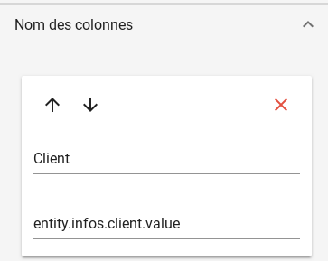
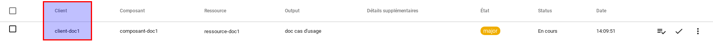
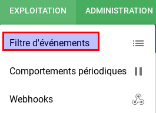
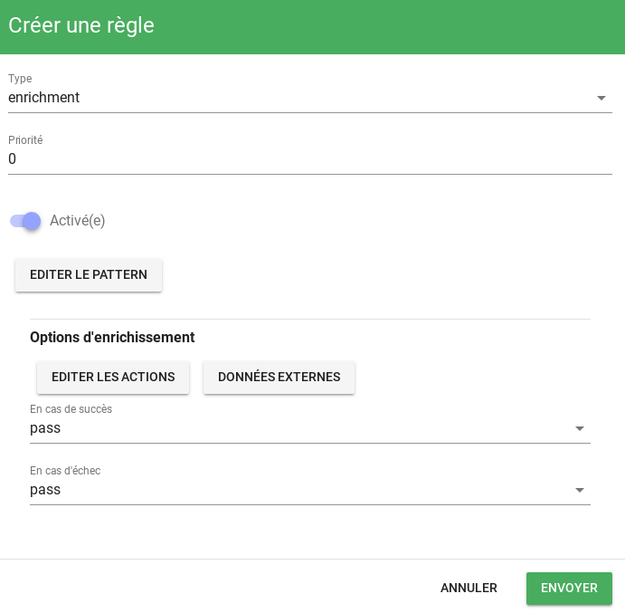
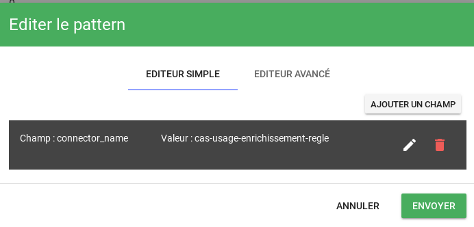
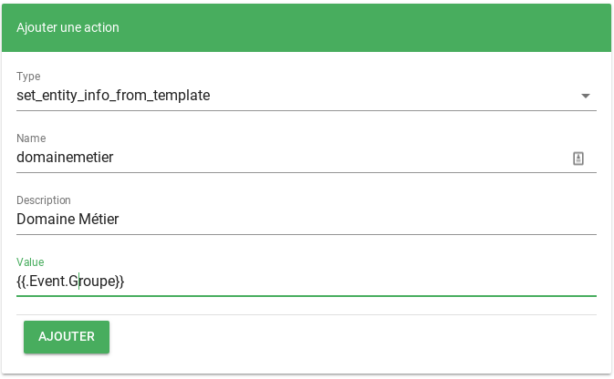
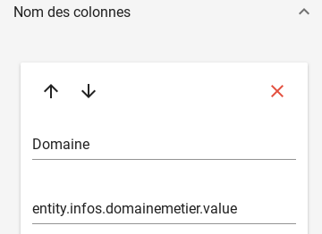
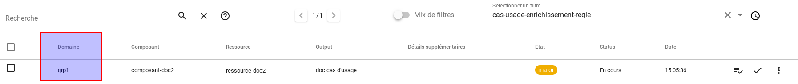
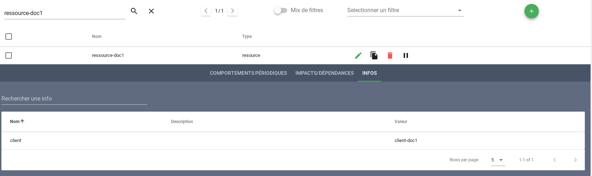
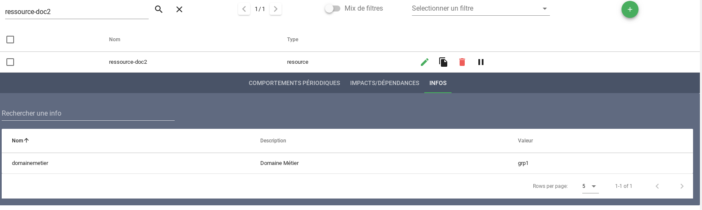

# L'enrichissement

Canopsis étant un hyperviseur, une des fonctions attendues concerne l'enrichissement de données.  
Nous pouvons considérer que les informations transmises par les sources de données et notamment les superviseurs, sont des informations *pauvres*.  

Elles sont pauvres dans le sens où elles nous signifient dans la majeure partie des cas qu'il y a une alarme (ou une mise à jour d'alarme) concernant une entité.  

!!! note "Une entité ?"
    Une entité est un composant typé (composant, ressource, observateur)

Pour aider les pilotes des centres d'opérations, il est indispensable d'enrichir ces informations et ainsi de qualifier au plus juste les alarmes à traiter.  

L'idée est donc de classer les alarmes, apporter de l'information objective sur des météos de services, afin de faciliter la prise de décision.  

Plusieurs possibilités sont offertes dans Canopsis : 

* Enrichissement systématique depuis les événements
* Enrichissement conditionné par des règles de gestion appliquées aux événements (CAT)
* Enrichissement par l'intermédiaire de référentiels externes (CAT)


!!! Warning
    Dans tous les cas, ces possibilités ne sont offertes que par l'utilisation des moteurs GO. 

## Enrichissement depuis les événements

Vous avez paramétré des connecteurs de données qui transmettent des événements à Canopsis.  
Un événement est constitué d'attributs, certains sont mandataires, d'autres facultatifs.  

Considérons l'événement suivant :

````json
{
  "resource": "ressource-doc1", 
  "event_type": "check", 
  "component": "composant-doc1", 
  "connector": "cas-d-usage", 
  "source_type": "resource", 
  "state": 2, 
  "connector_name": "cas-usage-enrichissement-evenement", 
  "output": "doc cas d'usage",
  "client": "client-doc1"
}

````

En publiant cet événement, l'attribut **client** ne sera pas interprété car il ne participe pas à la spécification d'un événement.  
Vous souhaitez néanmoins que cette information soit disponible pour l'entité **ressource-doc1/composant-doc1**.  

Une option du moteur **che** va vous permettre de systématiser cette prise en charge.  

````
-enrichInclude "client"
````

Ainsi, l'attribut **client** sera ajouté dans la champ **infos** de l'entité correspondante.  
Cette valeur est rendue disponible sur l'interface graphique de Canopsis grâce à cette notation : 

* Plus d'infos / Info popup / Template de manière générale : **{{ entity.infos.client.value }}**
* Colonne d'un bac à alarmes : **entity.infos.client.value**

 



## Enrichissement via des règles de gestion

Dans Canopsis, il existe la possibilité de définir des règles **event-filter** dont le but est de 

* manipuler les attributs d'un événement, d'une alarme, d'une entité
* d'enrichir les entités
* d'enrichir les entités à partir d'une collection de données externe (CAT)

La documentation complète se trouve [sur cette page](../../../guide-administration/event-filter/)

Prenons le cas d'usage suivant : 

!!! note ""
    Si l'événement contient un attribut *"groupe" : "grp1"* alors l'entité appartient aus domaine métier "Logistique"

Considérons l'événement suivant :

````json
{
  "resource": "ressource-doc2", 
  "event_type": "check", 
  "component": "composant-doc2", 
  "connector": "cas-d-usage", 
  "source_type": "resource", 
  "state": 2, 
  "connector_name": "cas-usage-enrichissement-regle", 
  "output": "doc cas d'usage",
  "groupe": "grp1"
}
````

Chose importante, les attributs pris en charge sont inscrits [ici](../../../guide-administration/event-filter/#champs-des-evenements).  
Dans notre cas, l'attribut **groupe** est personalisé et sera donc positionné *automatiquement* dans un dictionnaire *extrainfos*.  

On commence à ajouter une règle via le menu adéquat

  

  

Ensuite on définit sur quels événements seront exécutés cette règle. 
Dans notre cas, nous utilisons un critère tel que **connector_name**.  



Dernière étape, nous allons récupérer le contenu de l'attribut **groupe** et le positionner dans un nouvel attribut d'entité **domainemetier**.  


!!! Warning
    Pour manipuler l'entité comme nous venons de le faire, une opération préalable est nécessaire.  
    Une règle de [copie d'entité](../../../guide-administration/event-filter/#ajout-dinformations-a-lentite) doit être présente

Le résultat pourra être observé sur un bac à alarmes par exemple :  






## Enrichissement via référentiels externes

## Annexes

### Consulter le contexte

De manière générale, vous pouvez consulter le contenu de la base de données qui porte les entités, le `contexte`.  
Pour cela, vous devez instancier un widget **Explorateur de contexte** et effectuer une recherche sur l'entité voulue.  

Voici un exemple avec **ressource-doc1**.  



Puis avec **ressource-doc2**.  



