# Météo des Services

La météo des services permet de représenter des états agrégés de services selon différentes règles.  
La documentation complète est disponible [ici](../../../guide-utilisation/interface/widgets/meteo-des-services/)


L'interface Canopsis utilise des *tuiles* pour représenter ces états.  
Une tuile correspond à l'état d'un *observateur*, qui est calculé selon des règles.  

!!! note
    Nous souhaitons représenter l'état de l'application *E-Commerce* sur une météo des services.
    Cette application est dépendante de 3 scénarios applicatifs :

    * Accès plate-forme
    * Workflow commande
    * Mon compte utilisateur

## Entités à prendre en compte

La première étape consiste à créer un observateur E-Commerce qui va regrouper les sous-éléments constituants.  
D'un point de vue "structuration de données", nous allons utiliser un critère de parentalité entre les sous-éléments constituants et l'observateur.  

L'observateur est une entité du contexte de Canopsis qui porte un filtre de sélection d'éléments.  
Dans notre cas il s'agit de :

````
"entity.infos.app.value" : "E-Commerce"
````

Autrement dit, chaque entité de Canopsis qui portera un attribut **infos.app.value = E-Commerce** sera incluse dans l'observateur E-Commerce.  
Le critère de sélection est laissé à votre discrétion, vos manières de représenter les données, les modèles utilisés dans vos référentiels.

!!! Warning
    La réflexion autour de ce sujet est extrêmement importante, ne la négligez pas.

Voici les étapes de création de l'observateur.  
Utilisez un widget **explorateur de contexte**.  

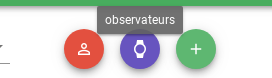  

On nomme l'observateur et on positionne son filtre de sélection.  

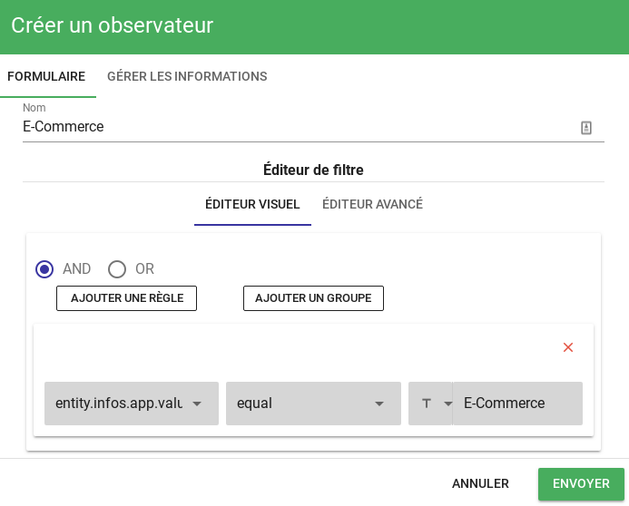  

On crée un attribut qui nous servira plus tard sur le widget météo. Ici, on a choisi de le nommer affichage_tv et d'en faire une valeur.  
On crée un attribut application_label qui nous servira plus tard à mieux repérer notre observateur. Ici, on a choisi de lui donner "Plateforme E-Commerce" comme valeur.

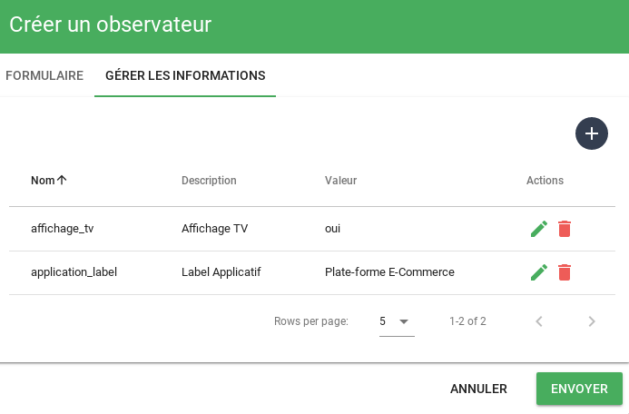  

A ce stade, une alarme portant le critère app.value = "E-Commerce" aura un impact sur l'observateur.

## Widget ServiceWeather

Visuellement, pour réprésenter une météo de service, le widget "serviceweather" est utilisé.  
Instanciez le et utilisez le critère d'affichage "affichage_tv = oui" pour filtrer les tuiles.  

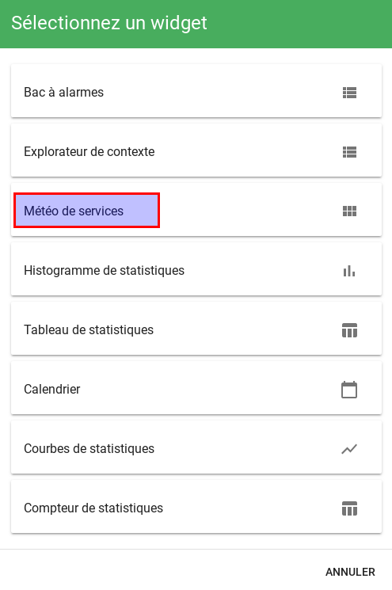  

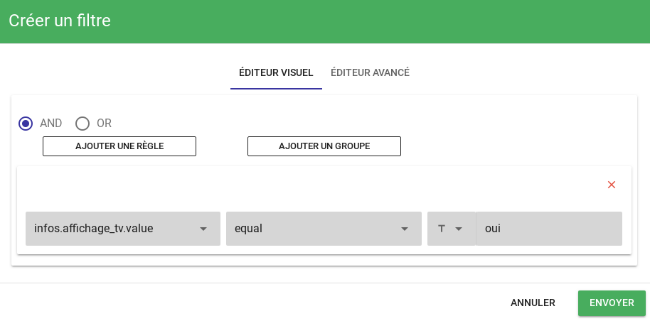  

Pour personaliser le rendu du widget, il existe 3 niveaux de templates :  

* 1 : La tuile
* 2 : La modale après clic
* 3 : La visualisation des sous éléments

Dans ces templates, vous pouvez utiliser la notation **handlebars** pour accéder aux variables de vos entités.  

La tuile :

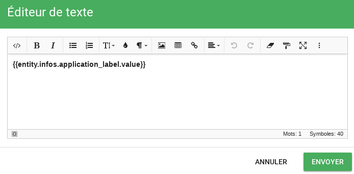  


La modale :

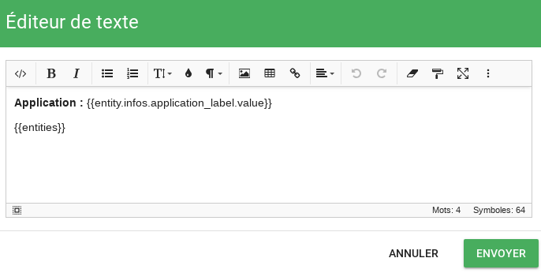  

!!! note
    Notez le helper *entities* qui est fourni directement par Canopsis et qui vous permet d'itérer sur l'ensemble des sous-éléments de l'observateur.


Le rendu final sera

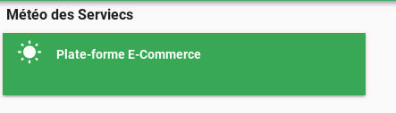  

## Scénario

La phase de préparation est terminée.  
Les éléments ont été paramétrés de manière manuelle, il est bien entendu beaucoup intéressant d'utiliser un mécanisme d'enrichissement par [synchronisation de référentiel externe](../enrichissement/#enrichissement-via-referentiels-externes) pour s'éviter ces opérations.  

Nous allons à présent simuler des alarmes sur les sous-éléments constituants et observer le comportement de la tuile de météo.  

Pour rappel, voici les éléments constituants :

* acces_plate-forme
* mon-compte-utilisateur
* workflow-commande

Le filtre de l'observateur concerne l'attribut *app* qui doit valoir "E-Commerce".  

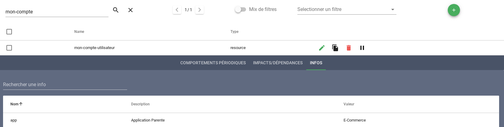  

Vous pouvez publier des événements sur ces 3 scénarios (avec par exemple le [connecteur send-event](/interconnexions/Transport/send_event/)

Les résultats observés seront alors :

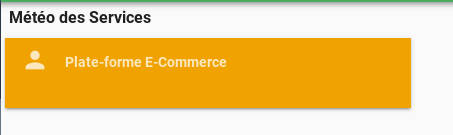  
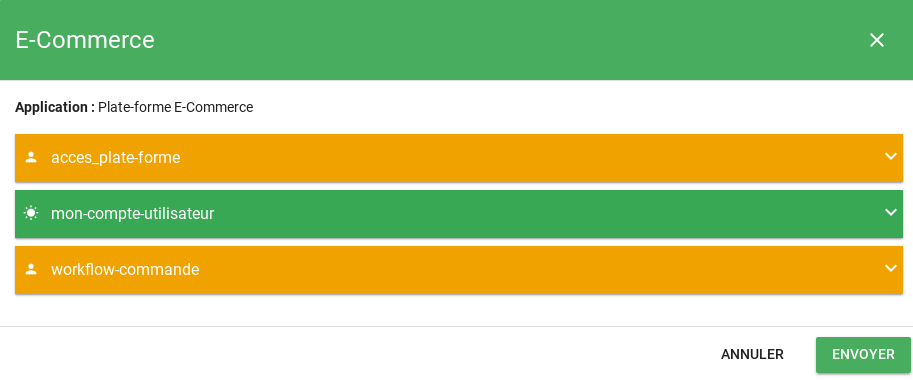  


Depuis cette modale, vous pourrez au final exécuter les [actions adéquates](/guide-utilisation/interface/widgets/meteo-des-services/#les-actions) de prise en charge des alarmes.  

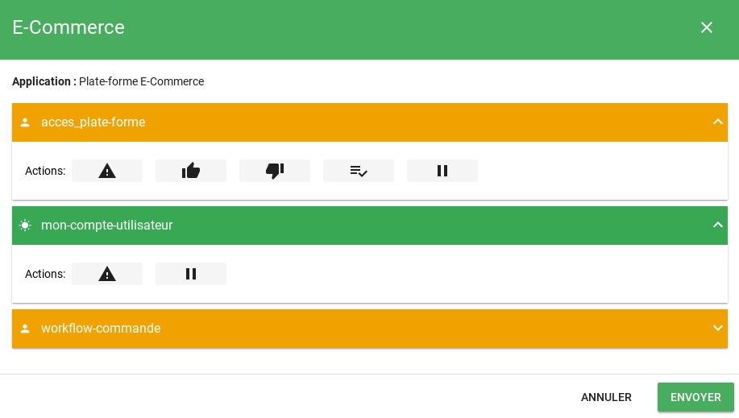  
