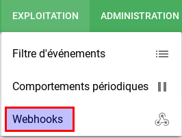
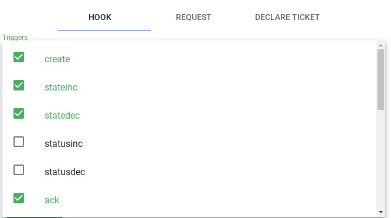
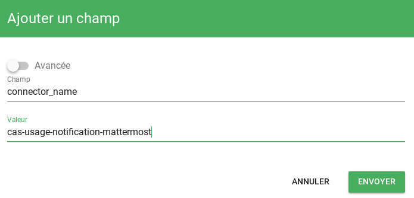
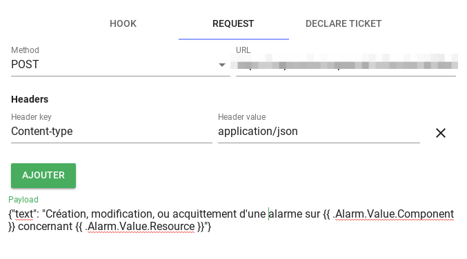
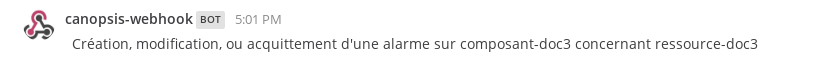
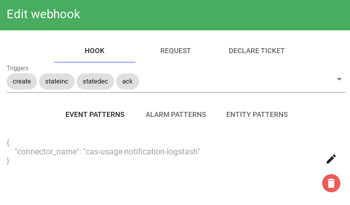
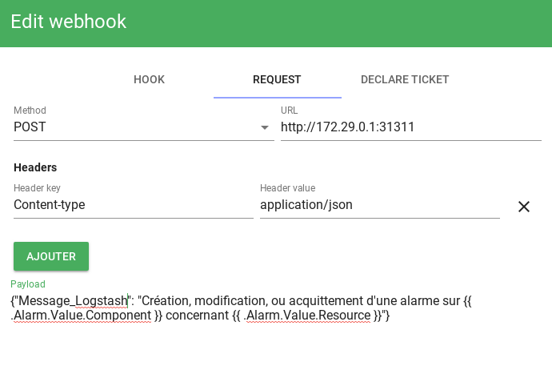

# Notifications vers un outil tiers

Canopsis est capable de *réagir* en fonction de critères objectifs afin de notifier un outil tiers en appelant une API HTTP.  
Ce guide vous propose d'interagir avec Mattermost et avec Logstash.  

!!! Warning
    Dans tous les cas, ces possibilités ne sont offertes que par l'utilisation des moteurs Go dans l'édition CAT de Canopsis.

Le moteur [`webhook`](../../guide-administration/moteurs/moteur-webhook.md) vous permettre de prendre en charge cette fonctionnalité.

Vous trouverez sa documentation complète sur [la page du moteur](../../guide-administration/moteurs/moteur-webhook.md)

## Mattermost

Nous partons du principe que vous possédez une URL Mattermost valide pour publier du contenu.  

Prenons le cas d'usage suivant :

!!! note ""
    Je souhaite notifier Mattermost depuis Canopsis dans les cas suivants :
    Création d'alarme, Mise à jour d'état, Ack d'un utilisateur

Pour cela, RDV sur le menu des **webhooks**

  


Vous devez créer un règle comme suit :

**Choix des triggers**

  

**Le pattern d'événements sur lesquels on applique la règle**

  

**La requête HTTP à exécuter**

  

Pour vérifier le résultat, nous considérons l'événement suivant :  

````json
{
  "resource": "ressource-doc3",
  "event_type": "check",
  "component": "composant-doc3",
  "connector": "cas-d-usage",
  "source_type": "resource",
  "state": 2,
  "connector_name": "cas-usage-notification-mattermost",
  "output": "doc cas d'usage"
}

````

Une fois publié, vous pourrez consulter votre canal Mattermost

  

## Logstash

Nous partons du principe que vous possédez un logstash à l'écoute.  
Pour information, voici la configuration minimaliste utilisée pour l'exemple :

````
input {
  http {
    host => "0.0.0.0"
    port => 31311
  }
}

output {
  stdout {
    codec => rubydebug
  }
}
````

Prenons le cas d'usage suivant :

!!! note ""
    Je souhaite envoyer un message HTTP à Logstash depuis Canopsis dans les cas suivants :
    Création d'alarme, Mise à jour d'état, Ack d'un utilisateur

Pour cela, RDV sur le menu des **webhooks**

  


Vous devez créer un règle comme suit :

**Choix des triggers et pattern**

  

**La requête HTTP à exécuter**

  

Pour vérifier le résultat, nous considérons l'événement suivant :  

````json
{
  "resource": "ressource-doc4",
  "event_type": "check",
  "component": "composant-doc4",
  "connector": "cas-d-usage",
  "source_type": "resource",
  "state": 2,
  "connector_name": "cas-usage-notification-logstash",
  "output": "doc cas d'usage"
}

````

Une fois publié, vous pourrez consulter le résultat sur la console de debug de Logstash

````
{
  "host" => "172.21.0.1",
  "Message_Logstash" => "Création, modification, ou acquittement d'une alarme sur composant-doc4 concernant ressource-doc4",
  "@timestamp" => 2019-02-26T16:46:38.249Z,
  "@version" => "1",
  "headers" => {
    "http_host" => "172.29.0.1:31311",
    "http_version" => "HTTP/1.1",
    "http_accept_encoding" => "gzip",
    "request_method" => "POST",
    "http_user_agent" => "Go-http-client/1.1",
    "content_length" => "122",
    "request_uri" => "/",
    "content_type" => "application/json",
    "request_path" => "/"
  }
}
````
