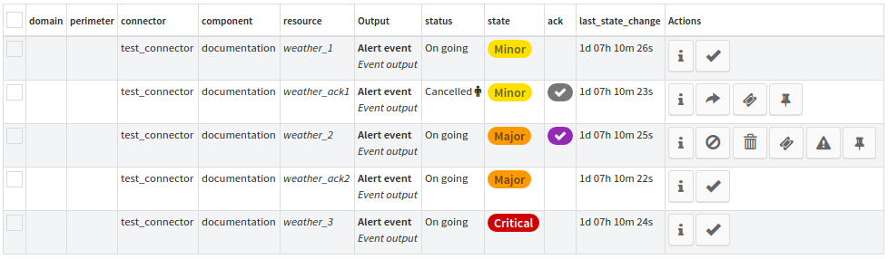

# Cycle de vie / De l'événement à l'alarme

**TODO (DWU) :** voir avec Mika ou les devs si c'est encore à jour (BàA par défaut, fonctionnement Go…).

### WorkFlow

Cette section est conçue pour comprendre l’interaction entre événements dans Canopsis.
L'interaction avec les événements peut être effectuée dans l'interface utilisateur dans une liste qui référence les événements
et qui utilise des combinaisons de droits pour activer les actions de l'utilisateur sur les alertes.

## Le flux de travail global expliqué

Lorsqu'une alerte parvient à Canopsis (une alerte est un événement dont l'état n'est pas désactivé),
les utilisateurs autorisés peuvent entrer dans le workflow de confirmation.

Chaque action contient **la date, l'auteur et les informations de motif** affichées dans la liste des événements pour les 
autres utilisateurs ayant accès à la liste.

L'image ci-dessous affiche toutes les actions possibles sur les événements. Les informations sur les actions disponibles sont affichées au survol de chaque bouton. voici une explication sur chaque ligne de ce tableau:

1. Evénement en alerte, action possible: accuser réception
2. Evénement annulé, actions possibles: déclarer un billet, un billet associé et annuler l'annulation
3. Alerte acquittée: actions possibles: supprimer un accusé de réception, annuler un accusé de réception, déclarer un ticket, modifier la criticité et associer un ticket

La première étape consiste à accuser réception de l'alerte pour indiquer à canopsis que l'événement est géré.
Les informations d'annulation sont alors disponibles dans la colonne d'accusé de réception.

Ensuite, il est possible d'effectuer les actions suivantes sur l'événement accusé de réception:

- retirer l'accusé de réception: supprime l'état "accusé de réception" de l'événement, l'événement reste le même qu'avant l'accusé de réception. Toutes les informations sont supprimées de l'événement lors de la suppression de l'accusé de réception.
- annuler l'acquittement: l'utilisateur est invité à saisir un commentaire qui a entraîné l' annulation de l'événement. Le statut de l'événement passe ensuite à "Cancelled" et l'accusé de réception est suspendu jusqu'à ce qu'un
 "off" de l'événement entrant rétablisse l'événement dans son état normal.
    - accusé de réception non annulé: ne peut être effectué que sur les états d’événement annulés. Lorsque non annulé, l'événement est remis dans le statut précédent par canopsis et son statut d'accusé de réception est restauré. Les informations d'annulation sont disponibles dans la colonne d'état où une icône représentant un œil apparaît et affiche une info-bulle contenant des informations non numérotées au passage de la souris.
- Modifier la criticité: lorsqu'une alerte est acquittée, l'utilisateur peut définir manuellement la criticité de l'événement (état) avec cette action. Il est alors demandé à l'utilisateur de remplir l'historique des actions.
- déclarer un incident: cette action envoie un courrier électronique au destinataire, ceci est configuré dans les paramètres de définition du ticket.
- ticket associé: permet à l’utilisateur de donner à l’événement un numéro de ticket permettant de l’associer aux alertes d’événement.

Lorsqu'un nouvel événement arrive dans Canopsis en état désactivé après une alerte, toutes les informations d'accusé de réception relatives à cet événement sont réinitialisées et l'historique des actions reste accessible à partir de la vue historique.

Ci-dessous le workflow d'action que les utilisateurs peuvent déclencher pour la gestion des accusés de réception.

## Ticketing et incident

## Acknowledgement et annulation 

- Toutes les actions de l'interface utilisateur sont déclenchées par des boutons d'action qui envoient l'événement approprié à canopsis. Les événements envoyés sont traités par les moteurs et permettent la gestion des accusés de réception et des annulations.
- Lorsqu'un événement se transforme en une alerte, il est possible de l'acquitter. Le moteur d'accusé de réception est chargé de définir les informations d'accusé de réception appropriées pour l'événement référencé dans le **champ d'ack**, telles que le nom de qui, le pourquoi et le moment de l'accusé de réception.
- Une fois acquitté, l’accusé de réception peut être supprimé de l’alerte. Cela mettra l'événement dans son état précédent, avant son acquittement.
- Un événement reconnu peut également être annulé. Cette action est gérée par le moteur d'annulation. L'action d'annulation stockera des informations sur qui, pourquoi et quand dans le champ d'annulation de l'événement. Une alerte annulée met l'événement en statut d'annulation.
- L'événement annulé peut être non annulé. Cette action entraîne la restauration du statut acquitté précédent et le champ d'annulation supprimé dans l'événement de référence.
- Toutes les informations relatives à l'accusé de réception et à l'annulation sont conservées dans les événements enregistrés et restent lisibles à partir du tableau d'historique.
- Si un événement dont l'état est désactivé est transmis à canopsis, l'accusé de réception est
 réinitialisé car il est considéré comme une alerte résolue. Cependant, si l'événement n'était pas en cours à ce moment, les informations relatives à l'accusé de réception ou à l'annulation sont conservées dans l'événement, car l'alerte
 reste logiquement non résolue.
