# Les vues / API

## Création d'une vue

Dans Canopsis la création d'une vue est trés simple, il vous suffit de cliquer sur   

Une fenêtre apparaît : 

Vous pourrez y rentrer plusieurs informations telle que : 

* Le nom de la vue  
* Un titre  
* Une description  
* Activer ou non cette vue  
* Un ou plusieur tags  
* Le groupe associé à la vue.

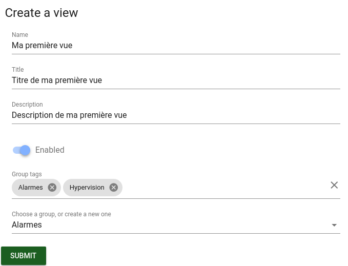  

Cliquez sur "Submit", votre vue apparaîtra sur la droite de l'interface dans le groupe associé à celui que vous avez choisi à l'étape précédente.  

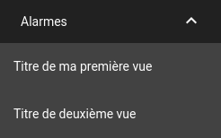  

## Configuration d'un Bac à alarme

Pour créer votre premier bac à alarme, il vous suffit de vous rendre ici : 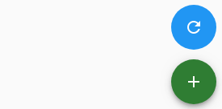  

Puis selectionner **Alarm list**

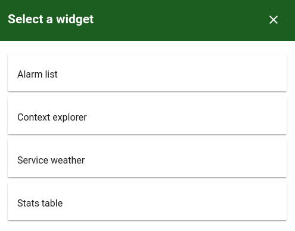  

Maintenant, il vous suffit de remplir les champs avec les informations que vous souhaitez :

* Le titre de la rangée
* La dimension des colonnes
* Le titre du widget
* Le tri par défaut du tableau (ASC / DESC)
* Le nom des colonnes, cliquez sur "ADD" puis compléter "Label" et "Value", par exemple "Composant" et "alarm.component" / "Ressource" et "alarm.resource" / ...
* La période de rafraichissement
* Le nombre d'éléments par pages
* Les filtres "Open" / "Resolved"
* Les filtres (voir [cette documentation](bac-a-alarmes/Les-filtres.md))
* La configuration des pop up

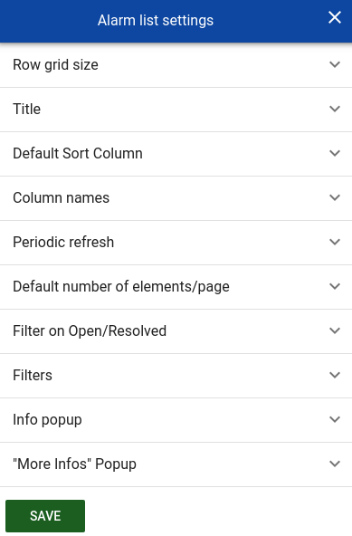  

## Suppression d'une vue

Pour supprimer une vue, cliquez sur le crayon juste ici :

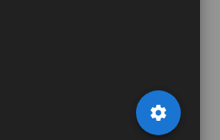  

Puis cliquer sur les croix pour supprimer ce que vous souhaitez.

## Configuration pas à pas

#### Titre et dimension de la rangée

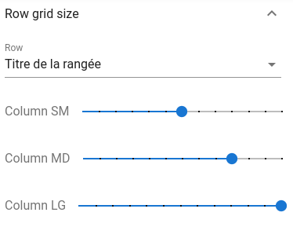  

#### Titre du Widget

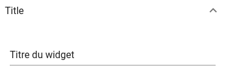  

#### Le tri par défaut du tableau (ASC / DESC)

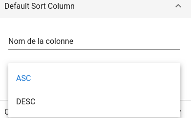  

#### Nom des colonnes

L'envoie de donner sera documenter ici : (voir [cette documatation A FAIRE](A FAIRE))

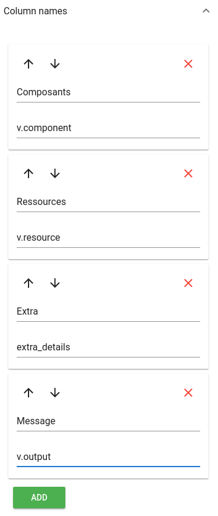

#### Période de rafraichissement

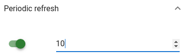   

#### Nombre d'éléments par page

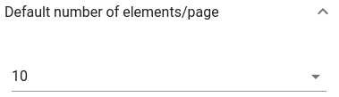   

#### Les filtres

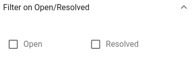   

#### Configuration des pop up

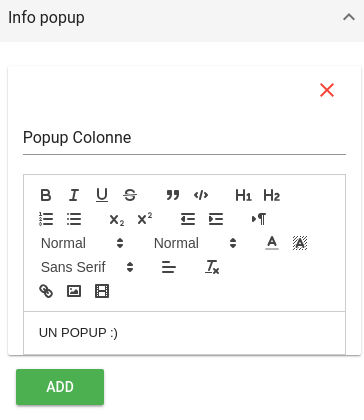   

Puis cliquez sur **"SAVE"**  

Votre Bac à alarme va alors apparaître !

## Résultat

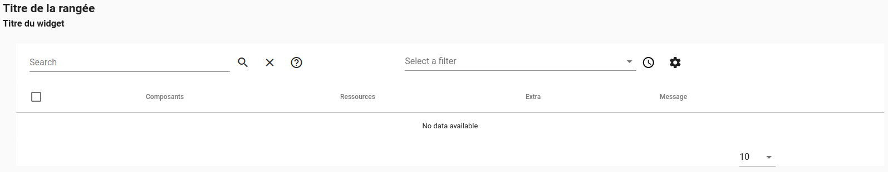   
