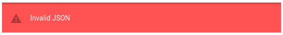

# Les filtres

Lors de la configuration d'une vue, il est possible d'appliquer des filtres à notre liste.

Pour cela, dans l'onglet "Filters"


Cliquez sur "add" pour créer votre premier filtre, une fenêtre apparaît :


Donnez un titre à votre filtre, deux méthodes de création, une pour les néophytes et une pour les utilisateurs expérimentés. Nous allons nous concentrer sur la première méthode, vous verrez dans un second temps que la méthode avancée évolue en même temps que vos actions sur l'autre méthode.

## AND / OR

Il faut maintenant choisir quel filtre prendre. Deux choix principaux s'offrent à vous sous forme d'opérateurs booléens **ET** et **OU** (AND et OR). En choisir un, puis appuyer sur "Add a rule".


Dans la première colonne, choisir de quel type sera l'objet filtré. Quatre choix :

*  component\_name
*  connector\_name
*  connector
*  resource

Dans la seconde, le filtre qui lui sera alloué :

*  equal
*  not equal
*  in
*  not in
*  begins with
*  …

Puis, dans la dernière, il vous est possible de remplir un champ qui sera "matché" avec le filtre.

Il vous est possible d'ajouter autant de filtre que vous souhaitez en cliquant sur "Add a rule".

Vous pouvez aussi séparer vos filtres en groupes. Simplement en cliquant sur "Add a group", et le supprimer en cliquant simplement sur "Delete groupe".

## Éditeur avancé

On souhaite créer un filtre appelé "Mon premier filtre !" qui récupère les composants dont le nom est égal à "composants" :

Cela va ce fait trés simplement comme suit


Maintenant, allons voir l'éditeur avancé, vous remarquerez que l'on retrouve certains éléments du dernier screen :

```
{
    "$and": [
        {
            "component_name": "composants"
        }
    ]
}
```

Compliquons les choses !

On veut maintenant ajouter le fait qu'une ressource ne doit pas être vide. Une fois la configuration réalisée via l'interface visuelle, on retrouve plusieurs éléments ajoutés à l'éditeur avancé :

```
{
    "$and": [
        {
            "component_name": "composants"
        },
        {
            "resource": {
                "$ne": ""
            }
        }
    ]
}
```

Il est bien évidemment possible de réaliser cette configuration via l'interface utilisateur avancée.

Le bouton "Parse" va vous servir à vérifier l'exactitude de votre JSON, si celui ci est invalide ce message apparaîtra :



## Résultat

Une fois votre Filtre réalisé, il apparaîtra dans le menu déroulant "select a filter".


## Exemples de filtres

### Champs basiques

Description  | Valeur pour 1° colonne de `Filtres`  | Valeur pour 2° colonne de `Filtres` | Valeur pour 3° colonne de `Filtres`
--|---|--|--
Composant  | `component`  | `equal`  | *VALEUR_DU_COMPOSANT*
Ressource  | `resource`  | `equal`  | *VALEUR_DE_LA_RESSOURCE*
Connecteur	| `connector` | `equal` | *VALEUR_DU_CONNECTEUR*
Connecteur	| `connector_name` | `equal` | *VALEUR_DU_NOM_DU_CONNECTEUR*
Message	| `v.output` | `equal` | *VALEUR_DU_MESSAGE*

### Selon la criticité

Description  | Valeur pour 1° colonne de `Filtres`  | Valeur pour 2° colonne de `Filtres` | Valeur pour 3° colonne de `Filtres`
--|---|--|--
Uniquement les alarmes Mineures  | `v.state.val`  | `equal`  | `1` (valeur de type number)
Uniquement les alarmes Majeures  | `v.state.val`  | `equal`  | `2` (valeur de type number)
Uniquement les alarmes Critiques  | `v.state.val`  | `equal`  | `3` (valeur de type number)

### Champs enrichis

Description  | Valeur pour 1° colonne de `Filtres`  | Valeur pour 2° colonne de `Filtres` | Valeur pour 3° colonne de `Filtres`
--|---|--|--
Champ enrichi	| `entity.infos.NOM_DU_CHAMP_ENRICHI.value` | equal | *VALEUR_DU_CHAMP_ENRICHI*

### ACK

Description  | Valeur pour 1° colonne de `Filtres`  | Valeur pour 2° colonne de `Filtres` | Valeur pour 3° colonne de `Filtres`
--|---|--|--
Exclure les alarmes avec ACK  | `v.ack._t`  | `not equal` | `ack` (valeur string)
Uniquement les alarmes avec ACK  | `v.ack._t`  | `equal` | `ack` (valeur string)
Uniquement les alarmes avec ACK sans champ `Note` (fast-ack basique)  | `v.ack.m`  | `is empty` | *PAS_DE_VALEUR*
Exclure les alarmes avec ACK avec un champ `Note`  | `v.ack.m`  | `is not empty` | *PAS_DE_VALEUR*
Auteur de l'ACK  | `v.ack.a`  |  `equal`  | *NOM_DE_L_AUTEUR_DE_L_ACK*
Message de l'ACK | `v.ack.m`  |  `equal`  | *CONTENU_DU_MESSAGE_DE_L_ACK*

### Ticket

Description  | Valeur pour 1° colonne de `Filtres`  | Valeur pour 2° colonne de `Filtres` | Valeur pour 3° colonne de `Filtres`
--|---|--|--
Exlure les alarmes avec Ticket (quel que soit le type)  | `v.ticket._t`  | `is null` | *PAS_DE_VALEUR*
Exclure les alarmes avec Ticket de type `assocticket`  | `v.ticket._t`  | `not equal` | `assocticket` (valeur string)
Exclure les alarmes avec Ticket de type `declareticket`  | `v.ticket._t`  | `not equal` | `declareticket` (valeur string)
Uniquement les alarmes avec Ticket  | `v.ticket._t`  | `is not null` | *PAS_DE_VALEUR*
Auteur du Ticket  | `v.ticket.a`  |  `equal`  | *NOM_DE_L_AUTEUR_DU_TICKET*

### Snooze

Description  | Valeur pour 1° colonne de `Filtres`  | Valeur pour 2° colonne de `Filtres` | Valeur pour 3° colonne de `Filtres`
--|---|--|--
Exclure les alarmes avec Snooze  | `v.snooze._t`  | `not equal` | `snooze` (valeur string)
Uniquement les alarmes avec Snooze  | `v.snooze._t`  | `equal` | `snooze` (valeur string)
Auteur du Snooze  | `v.snooze.a`  |  `equal`  | *NOM_DE_L_AUTEUR_DU_SNOOZE*

### PBehaviors

Description  | Valeur pour 1° colonne de `Filtres`  | Valeur pour 2° colonne de `Filtres` | Valeur pour 3° colonne de `Filtres`
--|---|--|--
Exclure les alarmes avec un `PBehavior` actif  | `has_active_pb`  | `equal`  | `False` (valeur booléenne)
Uniquement les alarmes avec un `PBehavior` actif  | `has_active_pb`  | `equal`  | `True` (valeur booléenne)

### Changement de criticité

Description  | Valeur pour 1° colonne de `Filtres`  | Valeur pour 2° colonne de `Filtres` | Valeur pour 3° colonne de `Filtres`
--|---|--|--
Exclure les alarmes dont on a manuellement changé la criticité  | `v.state._t`  | `not equal` | `changestate` (valeur string)
Uniquement les alarmes dont on a manuellement changé la criticité  | `v.state._t`  | `equal` | `changestate` (valeur string)

### Watchers

Description  | Valeur pour 1° colonne de `Filtres`  | Valeur pour 2° colonne de `Filtres` | Valeur pour 3° colonne de `Filtres`
--|---|--|--
Exclure les alarmes liéesdes watchers | `entity.type`  | `not equal` | `watcher` (valeur string)
Uniquement les alarmes des watchers | `entity.type`  | `not equal` | `watcher` (valeur string)
