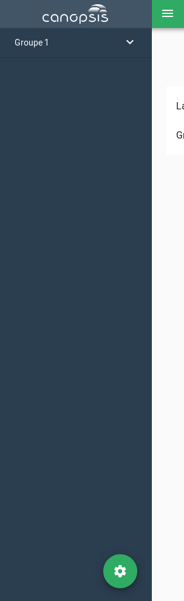
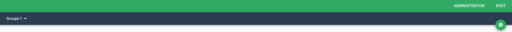

# Paramètres de l'interface

Certains aspects de l'interface de Canopsis sont personnalisables.

Pour accéder à ces paramètres, cliquez sur le bouton 'Paramètres', situé dans le menu 'Administration', dans la barre en haut de la page. 

## Sommaire 

1. Langue
2. Position du menu des vues
3. Page de connexion (avancé)

## 1. Langue

Ce paramètre vous permet de choisir la langue de l'interface.

2 langues sont actuellement disponibles : Français et Anglais.

Pour changer la langue de l'interface, choisissez simplement la langue souhaitée dans le menu déroulant 'Langage de l'interface'.

## 2. Position du menu des vues

Par défaut dans Canopsis, le menu listant les vues disponibles sur situe dans la barre latérale gauche de l'application.

  

Il est néanmoins possible de placer cette barre vers le haut de la page, juste en dessous de la barre de titre.



Pour modifier ce paramètre, sélectionnez simplement l'affichage souhaité dans le menu déroulant 'Type de navigation'.

## 3. Page de connexion (avancé)

Vous avez la possibilité de personnaliser la page de connexion de Canopsis.  
Les éléments paramétrables sont : 

1. Titre de l'application
2. Description de l'application
3. Footer du formulaire
4. Logo applicatif sur le menu de l'application


Pour cela, vous devez pour le moment écrire un jeu de configuration dans un fichier json et le soumettre à l'API `user_interface`.  
Voici un exemple de configuration (user_interface.json) : 

```json
{
  "login_page_description": "<h1 style='margin-top: 0.5em; font-size: 34px;'>Hypervisez votre SI</h1><p style='text-align: left; margin-top: 1.5em; font-size: 20px;'>Canopsis est une solution d'hypervision Open Source couvrant l'ensemble des sources de données de votre SI.<br> Avec l'hypervision Canopsis vous pouvez centraliser, traiter et présenter l'ensemble des événements de votre SI en une console unique.</p>",
  "app_title": "Canopsis",
  "footer" : "Rappels CNIL",
  "logo" : "data:image/png;base64, ..."
}
```
* Le champ **login_page_description** contient le titre et la description de l'application.  Il s'agit d'une chaine HTML.
* Le champ **app_title** contient le titre de l'application. Il s'agit d'une chaîne de caractère simple.
* Le champ **footer** contient le footer positionné en dessous du formulaire de connexion. Il s'agit d'une chaîne HTML.
* Le champ **logo** doit être une image encodée en base64.


Pour soumettre cette configuration, vous pouvez utiliser *curl* comme suit : 

````
curl -u "user:password" -X POST -H "Content-type: application/json" -d @user_interface.json 'http://IP_CANOPSIS:PORT_CANOPSIS/api/internal/user_interface'
````

Le résultat renvoyé doit être de type :

````
true
````
