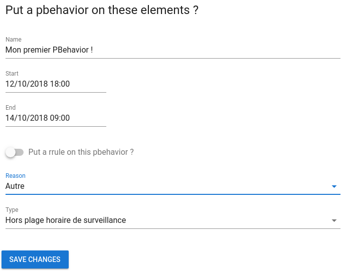

#  Les PBehaviors

Pbehaviors sont des évènements de calendrier récurrents qui arrêtent temporairement la surveillance d'une entité pendant un temps donné (pour la maintenance par exemple).

# Utiliser la vue Context

## Introduction

Dans Canopsis , chaque évènement en cours de traitement contient des informations contextuelles.
Nous extrayons ces informations afin de créer une **entité**.

La vue **Context** permet de voir toutes les entités détectées.

> L'édition et la suppression sont ignorées par le système.
> Toutes les modifications seront effacées lors du prochain évènement entrant.

## Comportement périodique

Une entité peut avoir un comportement défini, décrivant son état réel.
Le comportement spécifié sera configuré avec une periode et éventuellement une récursion.

### Downtime

Un temps d'arrêt est défini sur une entité lorsque nous savons que cette entité sera «Down». Cette situation peut se produire lorsque vous redémarrez un serveur, par exemple.
Le serveur aura un état erroné, qui sera ignoré par Canopsis pendant une courte période.

Les temps d'arrêt excluront les évènements de contrôle associés des sélecteurs l'utilisant.
Ainsi, le sélecteur ne sera pas influencé par les faux états erronés de l'entité.

Étant donné que l'évènement est exclu du sélecteur, le SLA exclut également les évènement des calculs.

## Comment l'utiliser ?

Pour instaurer un Pbehavior il vous suffit de selectionner un évènement, un boutton pause va alors apparaître :

Cliquez dessus, plusieur configuration sont disponibles :

* Le titre de ce PBehavior
* Sa durée
* La mise en place d'une récursivitée ou non
* La raison
* Le type

### Exemple

Je veux un PBehavior nommé "Mon premier PBehavior !", qui s'étend du 12/10/2018 à 18h00 au 14/10/2018 à 9h00 dont la raison est "autre" et dont le type est "hors plage horraire de surveillance".
Dans ce cas, notre fenêtre sera la suivante :

### Récursivitée

Je voudrais maintenant mettre en place une règle de récursivitée sur un PBehavior.

il vous suffit de cliquer sur "Put a rrule on this PBheavior ?"

#### Configuration basique

Nous allons tout d'abors nous concentrer sur la configuration basique. Plusieurs options sont disponibles :

* La fréquence :  Les choix possibles sont variés : Toutes les X Secondes, minutes, heures, jours, semaines, mois ou années.
* Jusqu'à : Date et heure de fin de l'activation de ce PBehavior.
* Un jour en particulier : Choisir un jour où le PBehavior va s'activer.
* Répétition : Combien de fois le PBehavior va s'activer.
* Interval : Interval de jour entre chaque activations du PBehavior.

#### Configuration Avancée

La configuration avancée est reservée aux utilisateurs les plus expérimentés.
Elle permet, comme son nom l'indique, d'appliquer des règles plus détailées comme sélectionner les jours / heures / secondes sur un laps de temps précis (mois, années, semaines) dans lesquelles le PBehavior va se déclencher.

