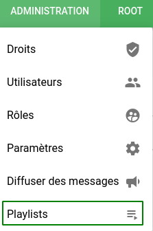
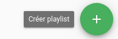
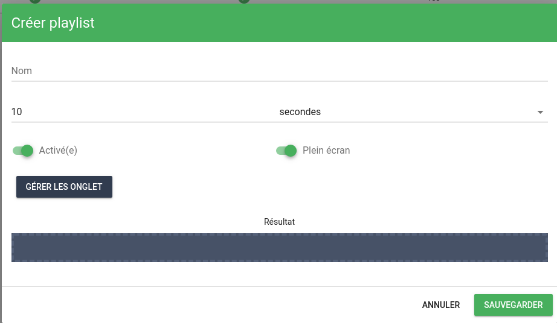
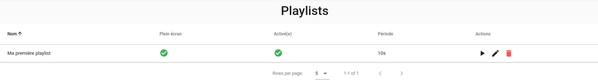
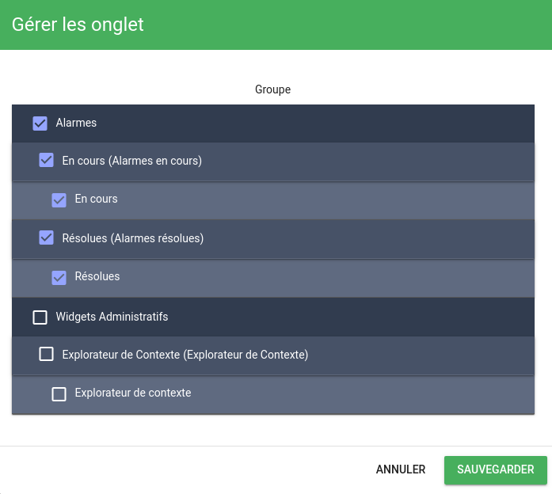
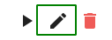
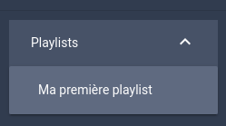

# Playlists

Les playlists sont composées de vues (plus précisément d'onglets de vues) qui sont affichées les unes à la suite des autres.

Elles peuvent être affichées en mode "plein écran" sur un téléviseur par exemple.

## Création d'une playlist

Dans Canopsis, la création d'une playlist s'effectue par le menu 'Administration' puis 'Playlists'.

Il est ensuite possible de créer une playlist en cliquant sur le bouton "+".

Une fenêtre apparaît :

Plusieurs informations concernant la playlist sont demandées :

* Nom (*requis*): Nom de la playlist
* Intervalle: Intervalle de temps entre l'affichage des vues
* Activée: La playlist doit-elle être accessible, ou non ?
* Plein écran: La playlist doit-elle être affichée en plein écran, ou non ?
* Gérer les onglets: Il s'agit de sélectionner les onglets de vues qui participent à cette playlist.

Une fois les champs renseignés, cliquez sur "Sauvegarder". Votre playlist apparaîtra dans la liste des playlists.

### Gestion des onglets

Une playlist est contituée d'un ensemble d'onglets appartenant eux-mêmes à des vues.

Le gestionnaire d'onglets permet de sélectionner et de définir l'ordre des onglets appartenant à une playlist.

Une fois les onglets sélectionnés, vous pouvez les ordonner par glisser/déposer.

## Édition/Suppression d'une playlist

Une fois la playlist créée, il est bien évidemment possible de modifier les informations la concernant (Nom, Intervalle, etc).

### Éditer une playlist

Pour modifier une playlist, utilisez le bouton d'édition .

Vous accéderez alors au formulaire d'édition.

### Supprimer une playlist

La suppression de playlists peut s'effectuer de manière unitaire avec le bouton de suppression  
ou de manière massive en sélectionnant les playslists à supprimer.

## Visualisation et exploitation d'une playlist

### Démarrer une playlist

**A partir du menu latéral**

Lorsque vous avez accès à une playlist, elle apparait automatiquement dans le menu latéral de Canopsis.

 

**A partir de l'URL directe**

Il est possible d'utiliser l'URL directe d'une playlist pour la jouer dans un navigateur.

Pour cela, il vous faut cliquer sur le bouton permettant de recopier le lien de la playlist et l'utiliser directement dans votre navigateur.
 

!!! Note
    Vous pouvez utiliser le paramètre `autoplay=true` pour que la playlist démarre automatiquement sans intervention

**A partir de la liste des playlists**

Vous pouvez démarrer une playlist à partir de la liste des playlists en cliquant sur le bouton de lecture  

### Boutons de navigation
* Temps restant avant le chargement de la vue suivante
* Vue précédente
* Démarrer la playlist / Mettre en pause la playlist
* Vue suivante
* Mode plein écran
