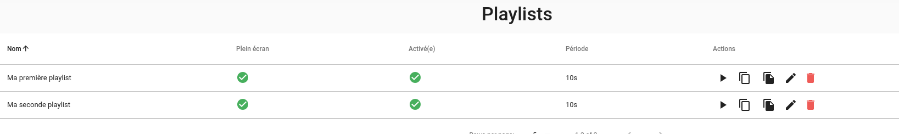

# Playlists

Les playlists sont composées de vues (plus précisément d'onglets de vues) qui sont affichées les unes à la suite des autres.

Elles peuvent être affichées en mode "plein écran" sur un téléviseur par exemple.

## Création d'une playlist

Dans Canopsis, la création d'une playlist s'effectue par le menu 'Administration' puis 'Playlists'.

Il est ensuite possible de créer une playlist en cliquant sur le bouton "+"

Une fenêtre apparaît :

Plusieurs informations concernant la playlist sont demandées :

* Nom (*requis*): Nom de la playlist
* Intervalle: Intervalle de temps entre 2 vues
* Activée: La playlist doit-elle être accessible, ou non ?
* Plein écran: La playlist doit-elle être affichée en plein écran, ou non ?
* Gérer les onglets: Il s'agit de sélectionner les onglets de vues qui participent à cette playlist.

Une fois les champs renseignés, cliquez sur "Sauvegarder", votre playlist apparaitra dans la liste des playlists.

### Gestion des onglets

Décrire le mécanisme de sélection des onglets.

## Édition/Suppression d'une playlist

Une fois la playlist créée, il est bien évidemment possible de modifier les informations la concernant (Nom, Intervalle, etc).

### Éditer une playlist

### Supprimer une playlist

## Exploitation et visualisation d'une playlist

### Menu latéral

### URL directe

### Bouton de navigation
