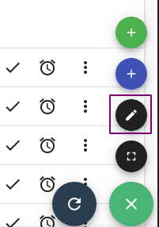
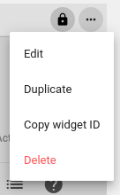
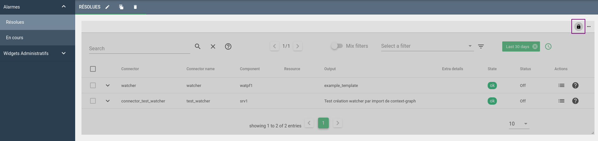
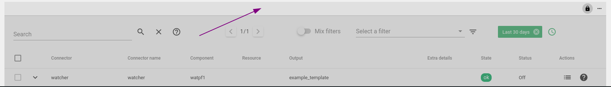
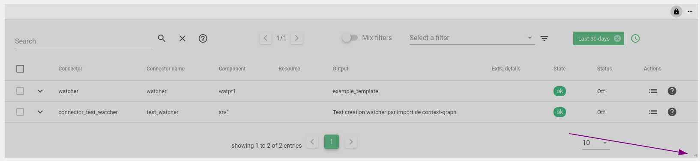
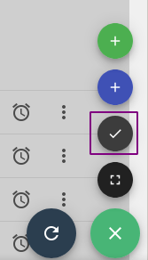

# Documentation de la grille d'édition

!!! Note
    Disponible à partir de Canopsis 3.43.1

* Premièrement il faut se diriger dans une vue comme les alarmes résolues par exemple.
On peut alors entrer en mode edition grâce à `ctrl + e` ou cliquer sur le bouton en bas à droite puis le crayon.

* Nous avons alors accès à des nouvelles options, les trois petits points en haut à droite du widget.

Vous pouvez modifier le nom, dupliquer, copier l'id du widget ou encore le supprimer.

* À côté de ces options, il y a un cadenas qui permet de calculer automatiquement la hauteur en fonction du nombre d'entités présentes dans le bac.

* Il est possible de modifier l'emplacement des widgets. Il faut maintenir le clic et déplacer la souris sur la barre supérieure au même niveau que le cadenas et les options comme indiqué.

* Enfin, il est possible de modifier la largeur du widget dès que l'on clique sur le coin à droite.

* N'oubliez pas de cliquer sur le bouton `ok` en bas à droite pour valider les modifications et sortir du mode édition.

