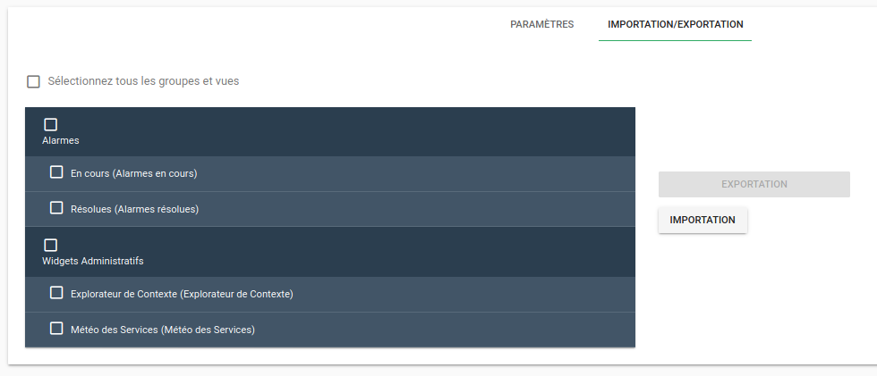
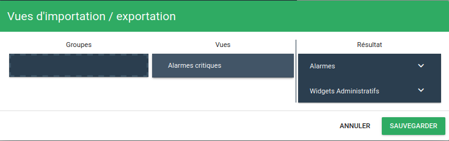

# Importation / Exportation

!!! Note
    Disponible à partir de Canopsis 3.39.0

Cette fonctionnalité vous permet d'exporter des vues ou des groupes de vues sous forme de fichiers JSON. Il sera ensuite possible de les importer dans un autre Canopsis par exemple.

Pour y accéder, passez par le menu d'administration puis rendez vous dans les paramètres. Cliquez ensuite sur l'onglet "Importation/Exportation".

Cet écran vous permet de sélectionner une ou plusieurs vues, un ou plusieurs groupes si besoin.

Le bouton "Exportation" s'active lors de la sélection d'un élément. Un clic sur ce bouton vous proposera de télécharger les éléments que vous souhaitez exporter sous forme d'un fichier JSON. Ce fichier pourra alors être importé sur une autre plateforme Canopsis par exemple.

Le bouton importation ouvre une première fenêtre vous demandant de sélectionner le fichier à importer depuis votre disque dur puis affiche l'interface d'importation.

A gauche se trouvent les éléments contenus dans le fichier d'import, à droite les groupes et les vues présents actuellement dans votre interface.

Vous pouvez déplier les groupes dans la colonne "Résultat" et y placer les éléments que vous souhaitez importer par glisser/déposer.

Le bouton "Sauvegarder" vous permettra d'appliquer ces changements.
