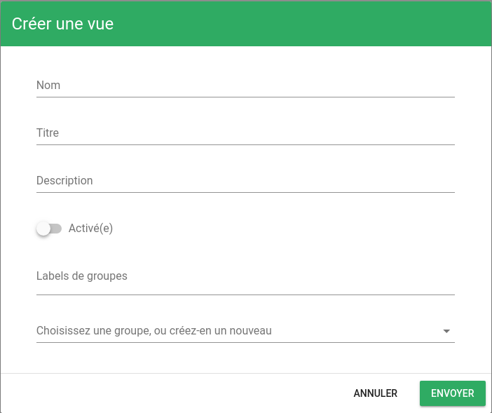
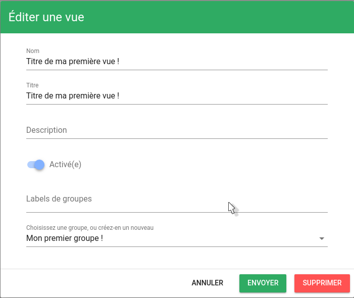
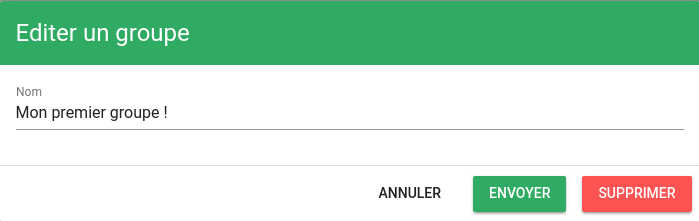

# Les vues et les groupes de vue

## Création d'une vue

Dans Canopsis la création d'une vue est trés simple, il vous suffit de cliquer sur le bouton 'Créer une vue', présent dans le menu 'Paramètres' de la barre latérale.

Une fenêtre apparaît : 

Plusieurs informations concernants la vue sont demandées :

* Nom (*requis*): Nom de la vue
* Titre (*requis*): Titre de la vue
* Description: Description de la vue
* Activée: La vue doit-elle être accessible, ou non ?
* Labels de groupes: Labels permettant la classification
* Groupe (*requis*): Groupe auquel la vue appartient. Le champ permet de rechercher parmis les groupes existant. Si aucun groupe n'est trouvé, appuyez sur la touche Entrée pour en créer un nouveau.

Une fois les champs renseignés, cliquez sur "Envoyer", votre vue apparaîtra dans la barre latérale, dans le groupe que vous avez choisi lors de la création.

## Mode édition

Afin d'accéder aux fonctionnalités d'édition/suppression des vues et des groupes de vues, il est nécessaire d'activer le mode d'édition. Celui-ci s'active en cliquant sur le bouton 'Activer/Désactiver le mode d'édition' présent dans le menu 'Paramètres' de la barre latérale
.

Pour désactiver le mode d'édition, il suffit de cliquer à nouveau sur ce bouton.

## Edition/Suppression d'une vue

Une fois la vue créée, il est bien évidemment possible de modifier les informations la concernant (Nom, Titre, Description, Groupe, etc).

### Editer une vue
Afin d'éditer une vue, il faut tout d'abord [activer le mode d'édition](#mode-edition). 

Des icones d'édition aparaissent alors à côté de chacune des vues. Cliquez sur l'icone correspondant à la vue que vous souhaitez éditer.

Une fenêtre apparait. Le formulaire présent dans cette fenêtre reprend les éléments renseignés lors de la création de la vue.

Une fois les modifications faites, cliquez sur 'Envoyer'. Un message de succès apparaît en haut à droite de la fenêtre. La vue est modifiée !

### Supprimer une vue
Afin de supprimer une vue, il vous faut ouvrir la fenêtre d'édition de la vue que vous souhaitez supprimer. Cf: [Editer une vue](#editer-une-vue)
A l'intérieur de cette fenêtre se trouve un bouton 'Supprimer'. Cliquez sur ce bouton. Une fenêtre vous demande confirmation, cliquez sur 'Oui'. Votre vue est supprimée !

## Edition/Suppression d'un groupe
Une fois un groupe créé, il est bien évidemment possible de modifier les informations le concernant (Nom)

### Editer un groupe
Afin d'éditer un groupe, il faut tout d'abord [activer le mode d'édition](#mode-edition). 
Des icones d'édition aparaissent alors à côté de chacuns des groupes. Cliquez sur l'icone correspondant au groupe que vous souhaitez éditer.

Une fenêtre apparait. Le formulaire présent dans cette fenêtre reprend les éléments renseignés lors de la création du groupe (Nom).

Une fois les modifications faites, cliquez sur 'Envoyer'. Le groupe est modifié !

### Supprimer un groupe
Afin de supprimer un groupe, il vous faut ouvrir la fenêtre d'édition de la vue que vous souhaitez supprimer. Cf: [Editer un groupe](#editer-un-groupe)
A l'intérieur de cette fenêtre se trouve un bouton 'Supprimer'. Cliquez sur ce bouton. Une fenêtre vous demande confirmation, cliquez sur 'Oui'. Votre vue est supprimée !

## La suite...

Une fois votre vue créée, il vous ai possible d'y ajouter des widgets afin de commencer à utiliser l'application.

Voir : [Widgets](../index.md)
