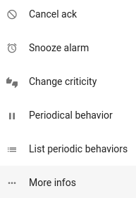
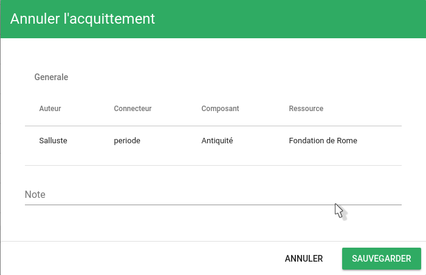

# Les action du bac à alarmes

Lorsqu'un événement arrive il est envoyé vers le bac à événements, puis traité. Il devient alors une alarme (Une alarme est le résultat de l'analyse des évènements. cf [vocabulaire](../../vocabulaire/index.md)).  

Les différentes actions possibles sur cette alarme sont :
- [Accuser réception (Ack)](#accuser-réception-ack)
- Une fois la réception faite, la gestion de l'incident:
    - [Déclarer un incident](#déclarer-un-ticket)
    - [Associer un ticket](#associer-un-ticket)
    - [Annuler l'alarme](#annuler-lalarme)
    - [Annuler l'Ack](#annuler-lack)
    - [Snooze](#snooze)
    - [Changer la criticité](#changer-la-criticité)
    - [Comportement périodique](#comportement-périodique)
    - [Lister les comportements périodiques](#lister-les-comportements-périodiques)
    - [Obtenir plus d'infos](#obtenir-plus-d-infos)

## Accuser réception (Ack)

  

Deux choix possibles : ACK et Ack rapide

L'Ack permet de voir les détails généraux de l'événement, de lier un numéro de ticket et d'écrire une note. Il permet d'accuser réception, ou d'accuser réception et de reporter un incident.

L'Ack rapide, lui, permet d'accuser réception sans pour autant remplir ces informations.

Si la colonne 'extra_details' est activée dans le bac à alarme, l'icone  apparait. Au survol de la sourie, des informations sur l'action sont disponibles (auteur, date, etc).

## Gérer l'incident

Une fois la réception faites, un nouveau menu apparait à la place des actions d'Ack et d'Ack rapide

Il permet de :

- Déclarer un ticket
- Associer un ticket
- Annuler l'alarme
- Snooze
- Changer la criticité
- Lister les comportements périodiques
- Comportement périodique
- Obtenir plus d'infos

Les actions 'Déclarer un ticket', 'Associer un ticket' et 'Annuler l'alarme' sont disponibles immédiatement sur chaque ligne d'alarme, dans le Bac à alarme

Les autres actions sont disponibles en cliquant sur les 3 points situés à droite de actions citées précedemment

### Déclarer un ticket

L'action 'Déclarer un ticket' permet de déclarer un incident, à partir d'une alarme.

Au clic sur l'action 'Déclarer un ticket', une fenêtre s'affiche :

Cette fenêtre présente quelques détails de l'évènement.

Cliquez sur 'Signaler un incident' pour valider la déclaration.
Une fenêtre 'Action effectuée avec succès !' en haut à droite de l'écran vous confirme que l'action a bien été effectuée.

### Associer un ticket

L'action 'Associer un ticket' permet d'associser un numéro de ticket à une alarme.

Au clic sur l'action 'Associer un ticket', une fenêtre s'affiche : 

Cette fenêtre présente quelques détails de l'évènement.

En dessous des détails de l'évènement, un champs de texte vous demande renseigner le numéro du ticket que vous souhaitez associer à cet évènement.

Après avoir renseigner le numéro de ticket, cliquez sur 'Sauvegarder'.
Une fenêtre 'Action effectuée avec succès !' en haut à droite de l'écran vous confirme que l'action a bien été effectuée.

Si la colonne 'extra_details' est activée dans le bac à alarme, l'icone  apparait. Au survol de la sourie, des informations sur l'action sont disponibles (auteur, date, etc)

### Annuler l'alarme

L'action 'Annuler l'alarme' permet d'annuler une alarme.

Au clic sur l'action 'Annuler l'alarme', une fenêtre s'affiche : 

Cette fenêtre présente quelques détails de l'évènement.

En dessous des détails de l'évènement, un champs de texte vous demande renseigner une note concernant l'action que vous effectuez.

Après avoir renseigner cette note, cliquez sur 'Sauvegarder'.
Une fenêtre 'Action effectuée avec succès !' en haut à droite de l'écran vous confirme que l'action a bien été effectuée.

Si la colonne 'extra_details' est activée dans le bac à alarme, l'icone  apparait. Au survol de la sourie, des informations sur l'action sont disponibles (auteur, date, etc).

### Annuler l'Ack

L'action 'Annuler l'Ack' permet d'annuler la confirmation de réception de l'alarme.

Au clic sur l'action 'Annuler l'Ack', une fenêtre s'affiche : 

Cette fenêtre présente quelques détails de l'évènement.

En dessous des détails de l'évènement, un champs de texte vous demande renseigner une note concernant l'action que vous effectuez.

Après avoir renseigner cette note, cliquez sur 'Sauvegarder'.
Une fenêtre 'Action effectuée avec succès !' en haut à droite de l'écran vous confirme que l'action a bien été effectuée.

Les actions disponibles reviennent alors à l'état dans lequel elles étaient avant l'action d'Ack (ou Ack rapide) effectuée auparavant.

### Snooze

L'action 'Snooze' permet de reporter une alarme pour une durée déterminée.

Au clic sur l'action 'Snooze', une fenêtre s'affiche :

Cette fenêtre vous demande de renseigner la durée souhaitée.

Une fois la durée renseignée, cliquez sur 'Sauvegarder'.
Une fenêtre 'Action effectuée avec succès !' en haut à droite de l'écran vous confirme que l'action a bien été effectuée.

Si la colonne 'extra_details' est activée dans le bac à alarme, l'icone  apparait. Au survol de la sourie, des informations sur l'action sont disponibles (auteur, date, etc).

### Changer la criticité

L'action 'Changer la criticité' permet de modifier l'état d'une alarme (Info, Mineur, Majeur, Critique) *Cf: [Description d'une alarme](./description-alarme.md#les-différents-états)*.

Au clic sur l'action 'Changer la criticité', une fenêtre s'affiche :

Cette fenêtre vous demande de choisir le niveau de criticité souhaité et de renseigner une note concernant l'action que vous effectuez.

Une fois la durée renseignée, cliquez sur 'Sauvegarder'.
Une fenêtre 'Action effectuée avec succès !' en haut à droite de l'écran vous confirme que l'action a bien été effectuée.

Si la colonne 'state' est activée dans le Bac à alarme, l'icone  apparait à côté de l'état de l'alarme, signifiant que celui-ci a été modifié manuellement.

### Comportement périodique

L'action 'Comportement périodique' permet d'ajouter un comportement périodique.

Pour plus de détails sur les comportements périodiques, voir : [Les comportements périodiques](../../pbehaviors/index.md).

### Lister les comportements périodiques

L'action 'Lister les comportements périodiques' permet de lister les comportements périodiques associés à un évènement.

Au clic sur l'action 'Lister les comportements périodiques', une fenêtre s'affiche :

Cette fenêtre présente une liste des comportements périodiques affectant cet évènement.

Il est possible depuis cette fenêtre de supprimer les comportements périodiques.

Pour fermer la fenêtre, cliquez en dehors de celle-ci, ou sur le bouton 'Annuler'

### Obtenir plus d'infos 

L'action 'Obtenir plus d'infos' permet d'ouvrir la fenêtre 'Plus d'infos'. Cette fenêtre personnalisable permet d'afficher toutes les informations souhaitées concernant l'alarme, ou l'entité associée à cette alarme.
