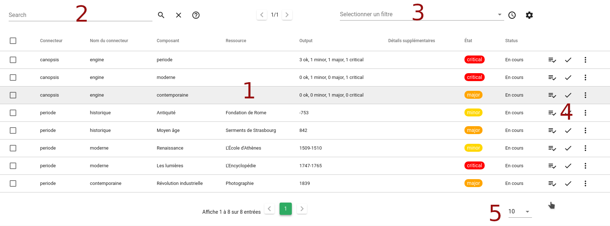
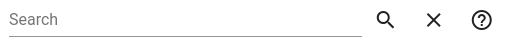

# Bac à alarmes

## Sommaire 

1. [Alarmes](#alarmes)
2. [Recherche](#recherche)
3. [Filtres](#filtres)
4. [Actions](#actions)
5. [Eléments par pages](#eléments-par-pages)

## Alarmes
## Recherche

Le champ de recherche permet d'effectuer une recherche parmi les alarmes.

Pour effectuer une recherche 'simple', il suffit d'entrer les termes de la recherche dans le champs de texte, puis d'appuyer sur la touche Entrée, ou de cliquer sur l'icone 

Dans le bac à alarmes, il est possible d'effectuer des recherches plus avancées. Une aide concernant la syntaxe à utiliser est disponible en survolant avec la souris l'icone d'aide 

Pour supprimer la recherche, cliquez sur l'icone 
 
## Filtres

Le sélecteur de filtre permet d'appliquer un filtre sur le Bac à alarmes. Seuls les alarmes correspondant aux critères du filtres seront affichées.

Pour sélectionner un filtre, il suffit de cliquer sur le champs 'Sélectionner un filtre'. Une liste des filtres disponibles apparaît.
Cliquez sur un filtre. Celui-ci est sélectionné, et directement appliqué.
Pour ne plus appliquer de filtre, il suffit de cliquer sur l'icone présent au bout du champ de sélection de filtre. Le bac à alarme se rafraichit, le champ de sélection revient dans état initial, le filtre n'est plus appliqué !

### Filtres de période

Le filtre par période permet de filtre les alarmes en ne conservant que les alarmes d'une période donnée.

Ce filtre est disponible en cliquant sur l'icone  présent à droite du sélecteur de filtre. Une fenêtre apparaît.

.

Il suffit alors de sélectionner la période souhaitée parmis les périodes prédéfinies, ou d'en créer une personalisé en sélectionnant 'Personnalisé', puis en renseignant les dates de début et de fin.
Cliquez ensuite sur 'Appliquer'.

La fenêtre se ferme, le bac à alarme se rafraichit. Votre filtre par période est appliqué.
Celui-ci est visible en haut du Bac à alarmes.

.

Afin de supprimer ce filtre, cliquez sur le bouton de fermeture présent sur le filtre (*Cf Image ci-dessus*)

## Actions

Pour chaque alarme, des actions sont disponibles.

Pour le détail de chacune des actions, voir la [liste des actions du Bac à alarmes](./actions.md).

## Eléments par pages

Le sélecteur du nombre d'éléments par page permet de configurer le nombre d'alarmes à afficher par page (5, 10, 20, 50 ou 100 alarmes). 
